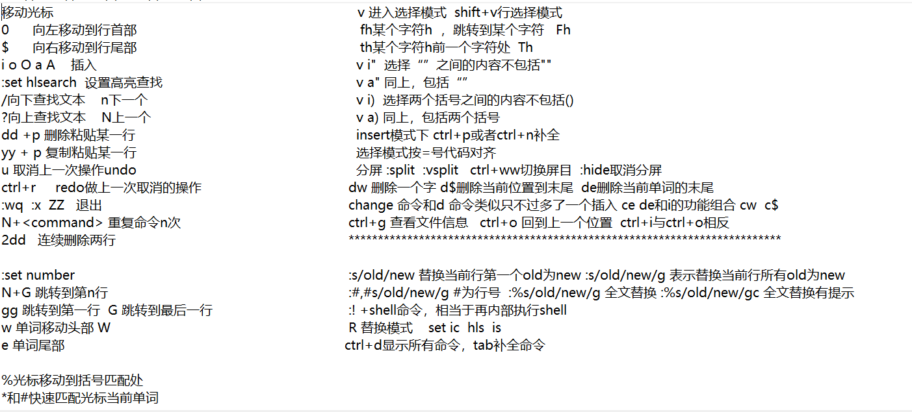
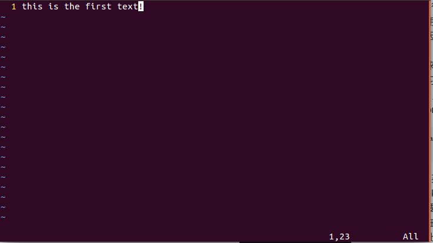
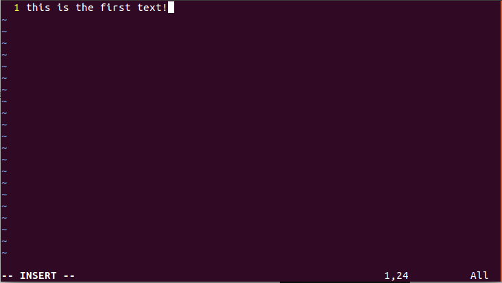
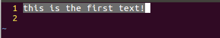

## Vim的使用    
### 写在前面   
可能会觉得vim很复杂，一开始用起来不爽，其实我是在某个小项目中，跟着作者敲代码需要vim，然后去尝试使用，后来发现这种感觉是真的好，用起来特别爽。还有一开始会觉得命令特别多，特别难记，其实是因为太急于求成，想要立马学会用的快，其实这是不可能的，对于这个种东西都是慢慢积累，多实践，用习惯了有些命令，都是下意识的使用。例如进入vim界面后想退出，我们知道有好几种方式，后来我用了一个自己最喜欢的大写**ZZ** ，搭配着**shift+zz** 键快速习惯的保存退出，以至于后来我都成为习惯了每次退出都是秒按，还有输入大写的时候不要按切换大小写键，尽量使用shift，特别是在vim里，包括你切换中英文的时候，一定要学会用shift，我觉得学习vim的最好方式还是vim自带的**vimtutor** ,    
```
sudo apt install vim    
vimtutor   
```   
进入vim后跟着英文注释边敲边学，然后自己记录下来一些常用好用的命令，汇总一下，以后忘了瞄一眼，其实就ok了，像许多常用的用多了都成自然反应了。下面我也会列一些常用的命令，并解释。当然最重要的是**实践** ，**实践**，**实践** !    
以下是我自己在学vim的一些汇总图片，精简版，只是方便自己看，许多简单的命令我都删除，大概也只有我自己比较好看，当然在你学习过程中也可以自己弄一张适合自己的命令汇总表。    
    
### vim的3种模式   
1. ESC回到的命令键入模式，以上所用的命令大部分都是在该模式下才有用的，也就是我们此时是不能向文本中通过手打一个个字敲进去，这个模式是让我们使用命令的。默认进入就是这种模式    
      
2. 插入模式，就是我们现在可以写文本了，按下字符键，能出现文本字符，正常的编辑模式。左下角会有INSERT字样     
    
3. 块模式，就是我们可以选中一部分内容，对这一部分内容进行命令操作。左下角为VISUAL BLOCK字样，同时文本被圈出来这样的效果    
    
另外装好vim后可以配置一个vimrc文件来配置你的vim,该文件为~/.vimrc，等学完这些稍微熟练了以后可以用配置文件自定义你自己的vim,包括语法高亮啊，颜色啊，背景啊等等。另外先跟着vimtutor过    
### vim命令解释   
**1.光标移动和跳行**       
```
h   #向左移动
j   #移动到下一行
k   #移动到上一行  
l   #向右移动   
0   #数字0向左移动到光标当前行首部    
$   #向右移动到光标所在行尾部   
G   #移动到整个文档最后一行   
gg  #移动到整个文档第一行   
数字+G   #移动到文档的某一行    
w   #移动到下一个单词的头部
e   #移动到当前单词或者下一个单词的尾部   
```   
以上就是常用的一些光标移动的，掌握这些已经差不多够用了。    
**2.进入插入模式命令**    
```
i  #在光标所在位置之前插入   
a  #在光标所在位置之后插入  
A  #在光标所在行最末尾插入
o  #在光标下一行插入
O  #在光标上一行插入
```   
以上命令都会进入**INSERT** 模式   
**3.删除，复制，粘贴操作**   
不管是删除还是复制，都会将最近一次内容保存到一个寄存器中，p命令就是粘贴最近操作产生的内容。另外可以数字+命令的组合，表示重复这个命令多少次 N+\<command>
```
dd #删除当前行
N(数字)+dd  #删除包括当前行在内的N行
dd+p #删除当前行并复制到下一行
yy #复制当前行到寄存器
N(数字) #复制当前行在内的N行到及存取
yy+p  #复制当前行并粘贴到下一行 
```    
```
dw #删除光标所在位置到下一个单词开头处
de #删除光标所在位置到该单词末尾
d$ #删除光标处到该行的末尾
```
**4.字符操作**   
```
x   #删除光标所在处的这个字符
r <new-char>  #将光标处的字符用一个新字符替代    
cw  #dw+i的组合，改变一个单词change 
c$  #d$+i的组合
R  #替换模式类似于一直用r <new-char>操作
```   
**5.查找文本**   
```
/文本   #从光标处及下面的文本中查找所要查找的文本（n向下移动光标到找到的文本处，N上一个）
？文本  #从光标处及上面的文本中查找需要的文本    
*      #全文快速匹配光标处单词
#      #向上快速匹配当前光标处单词    
%      #移动光标到匹配括号处，或者最近括号处 
```   
**6.退出命令**   
```
:q!   #不保存退出
:wq   #保存退出
:x    #保存退出  
ZZ    #保存退出  
```   
**7.取消操作**   
```
u  #undo取消上一次操作
ctrl+r   #redo做上一次取消的操作,与u相反    
```   
**8.块模式操作**   
```
v   #进入选择模式，这时候可以用光标移动来包括某些部位  
shift+v   #行选择模式
ctrl+v #进入块模式，选择的是一个矩形的块

v i"   #选择""之间的内容，但不包括这个双引号   
v a"   #选择""之间的内容，包括这个双引号   
v i)   #选择（）之间的内容，不包括（),i后面接(也是一样的      
v a)   #选择（）之间的内容，但包括（）   
=    #选择模式下按=会将选择的代码对齐  
```     
**9.分屏操作**   
```
:split   #上下分屏
:vsplit  #左右分屏   
ctrl+ww  #切换光标到某个屏上   
:hide    #取消分屏
```   
**:** 可以进入输入命令的模式，然后tab可以像终端补全命令，ctrl+d类似终端列出所以可用命令      
**10.替换文本操作**    
```
:s/old/new    #替换当前行第一个old为new    
:s/old/new/g  #替换当前行所以old为new  
:N(数字)s/old/new  #替换某行第一个old为new
:N(数字)s/old/new/g  #替换某行所有old为new   
:%s/old/new   #替换全文每一行的第一个old为new
:%s/old/new/g #替换全文的所以的old为new  
:%s/old/new/gc   #替换全文的old为new但是有提示

```
:!+shell命令 可以在vim内部使用shell命令    
**其他命令**   
```
ctrl+g   #查看文件信息   
ctrl+i  ctrl+i   #相反的命令光标回到上一次或者下一次的位置    
ctrl+n  ctrl+p   #插入模式下，代码补全（基于当前vim文本出现过的单词）   

```

----------------------------------------------------------------
### shell终端一些快捷键   
```
ctrl+alt+t   #新开一个终端   
ctrl+shift+t #在新开的终端里面在来一个终端窗口  
ctrl+PgUp/PgDown   #在上面ctrl+shift+t的多窗口中切换窗口   
ctrl+c     #中断程序
ctrl+d     #关闭终端   
ctrl+l     #清除屏幕类似于clear   
ctrl+a     #移动光标到前面
ctrl+e     #移动光标到后面   
ctrl+u     #删除光标之前输入
ctrl+k     #删除光标之后的输入
ctrl+w     #删除光标之前一个单词   
ctrl+y     #粘贴ctrl+u,ctrl+k,ctrl+w删除的文本
ctrl+p/n   #查看之前的命令
ctrl+r     #搜索历史命令   
Tab        #命令补全    
F11        #进入终端全屏 
ctrl+shift+"+"   #增大字体,本来是ctrl+"+"号但是加号要用shift键盘打出，所以就是这样   
ctrl+"-"         #减小字体   
ctrl+shift+c/v   #复制粘贴
```
