## git原理以及使用   
### 写在前面   
在网上看了很多关于git怎么使用的文章，博客，觉得看完还是懵懵懂懂，觉得不仅仅是几个命令会用那么简单，记住了也很容易忘记，其实如果懂了git到底是怎么实现版本管理，或者说内部的逻辑是怎样的这样，每次再使用命令的时候就理解不一样，感觉也不会忘记，我只是花了一个上午就感觉OK了，所以写一遍文章记录自己的所思所做。这里我也提倡一下我的学习方法：    
1. 先看看好多网上都能找到的命令大全例如这个[网址](https://blog.csdn.net/raoxiaoya/article/details/107999615)然后结合下面的图对整个git有一个大概的认识，关于tag就先不要看了，也可以试着自己弄个仓库，敲敲相应的命令试试，玩坏了大不了删除重新建一个。   
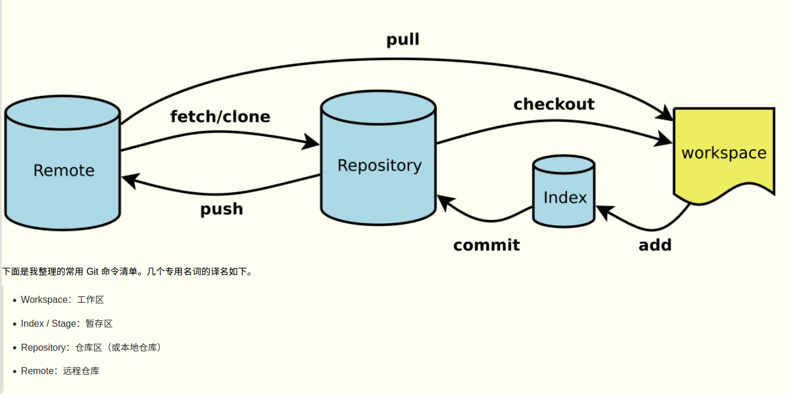   
2. 当上面看完了就可以去看看这篇文章讲解[git原理](https://www.cnblogs.com/yelbosh/p/7471979.html)，跟着上面的操作做一遍，你会发现好像有点明白git的设计思路了。   
3. 然后跟着我这篇文章的思路，我会首先对上面**git原理** 的文章做一个总结概况，然后会一边实践一边通俗的解释每个git命令的意思。也希望你能跟着实践一遍，最后当你看完这篇文章，再去回过头详细的再读一遍[git原理](https://www.cnblogs.com/yelbosh/p/7471979.html)，差不多git也就不会忘了怎么用了。     
### git原理概述    
1. git要解决的问题

   git主要解决的是大概三个问题：        
+ 如何追踪文件    
  版本通俗点就是你文件一举一动，任何的改动我都要记录下来，就是万一哪次误操作能最大避免损失。第一个需要解决的问题就是如何追踪文件。Git采用内容寻址的文件系统，就是既然你文件内容是我要追踪的我就记录每个文件SHA1校验对每一个文件进行哈希值表示这个文件，也就是git原理这篇文章看到的   
  ```
  Key = sha1(file_header + file_content)
  Value = zlib(file_content)
  ```
  也就是对应的git三个对象里面的blob对象

+ 如何记录文件名保存，目录，也就是整个文件组织   
  我们知道git是以追踪文件内容的hash值为key也就是,文件内容本身为value，来记录文件是否变更的，那么如何表示一个文件夹和文件名呢，答案就是tree对象，在git 里面每次提交都会生成一个tree对象，这个tree对象就记录了各个文件的关系。我么先看一个通俗的例子：   
  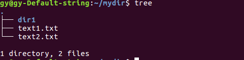    
  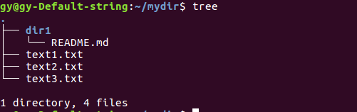   
  某个目录下开始有两个文件text1.txt,text2.txt,还有一个空目录，
  所以如果用对象来表示那么这个对象表示这个目录，也就是这个tree 对象，包括2个blob对象（分别表示text1.txt,text2.txt），和一个tree对象（表示dir1目录），如果在添加文件，那么这个tree对象就变成了，有3个blob对象（对应3个text.txt文件），然后有一个tree对象，这个tree对象又包括一个blob对象。所以可以把一个目录抽象成一个tree对象。git正是这样做的每个添加到暂存区的文件都有一个blob对象与之对应，每个目录都会有一个tree对象与之对应，这样就好像形成了一个树结构，这样就解决了文件名字和目录的问题。    
  需要注意如果是空目录，那么该目录不会变为tree对象，因为，你没文件，git没必要记录，git是以文件内容为基础记录的。   
  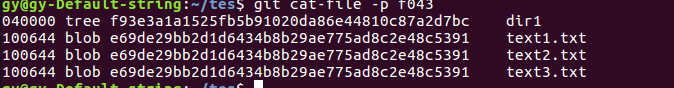    
  可以看到每次commit就是每次生成一个tree对象，记录了3个txt文件的名字，对应的文件内容的hash值，还有一个tree对象。    
+ 如何记录版本更新问   
  其实每次commit就是一个版本都会生成一个commit对象，每个commit对象也很简单，包括一个tree对象，也就是最外层目录的tree对象，还有一个指针指向上次提交的commit对象，然后包括一些其他的提交信息之类的。   
  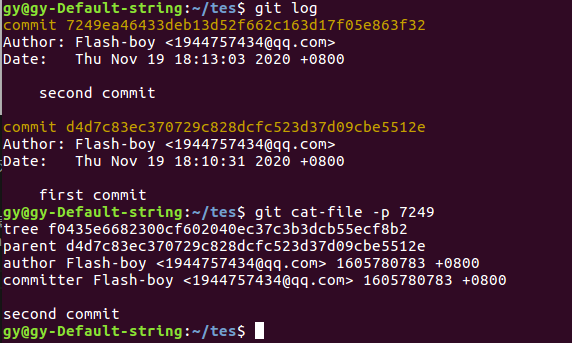    
  可以看到上面一共两次提交其实也就是两个commit对象，最近一次的对象包含一个tree，一个指向父节点的对象，还有提交的名字和说明。    
  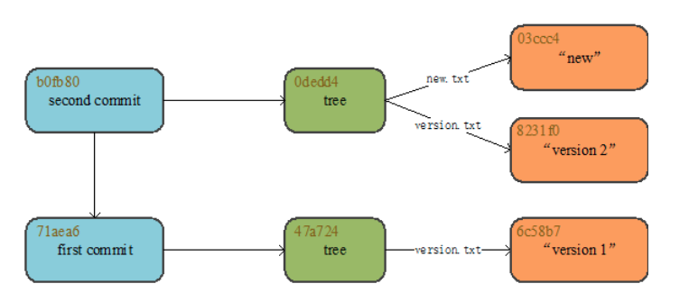   
  看这张从[git原理](https://www.cnblogs.com/yelbosh/p/7471979.html)上的图片。所以关系一清二楚。  

2. git的整个流程   
   所以从上面可以归纳出来所以除工作空间也就是用户可见的目录下的文件，git还保存着每次add，也就是我们所说的被git纳入追踪的文件，的副本，也就是我们能够从.git/object/目录下保存的副本，所以我们才能完成整个版本控制，一个commit对象对应着一次提交，也就是对应着一个文件，commit对象的内容包括一个tree对象（也对应着一个文件）和上一次提交的commit对象对应的文件，还有提交人信息等。所以这里就引出了我们经常看到的HEAD指针，版本回滚之类的，其实就是回到哪次提交，移动HEAD指针。下面只是我自己的理解关于HEAD,和分支，可能很浅显，有不对的地方，但我猜测大致是这样的。    
   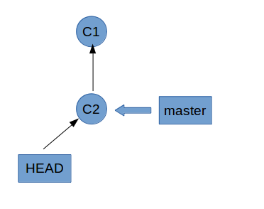       
   开始的时候我们提交了两次第一次是C1,然后C2之后我们的状态是如上图所示，一个HEAD指针指向当前分支最新提交commit对象，Master是默认分支也指向C2对象。注意HEAD是指向你当前正在的那个分支的最新一次提交。    
   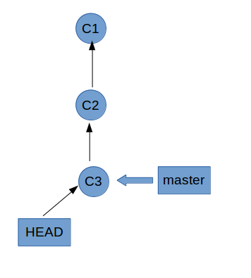     
   现在假设又有一次在master上提交，就会新生成一个commit对象C3，然后HEAD和master都会指向它。我们也可以发现现在只要控制HEAD就可以实现版本的移动和切换    
   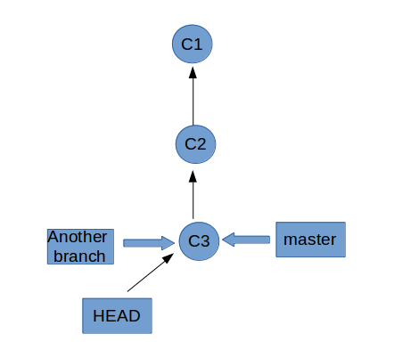   
   假设我们使用命令**git branch branchname** 就会在当前commit对象也就是C3新建一个分支。   
   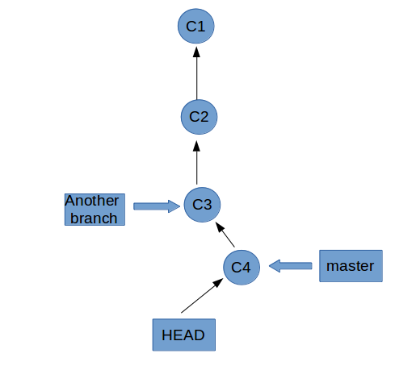    
   我们继续commit生成一个新的提交对象C4，注意我们此时还没有切换分支还是在master分支上所以生成的C4对象是由master指向的，可以看到另外的分支并不能看到这个分支。    
   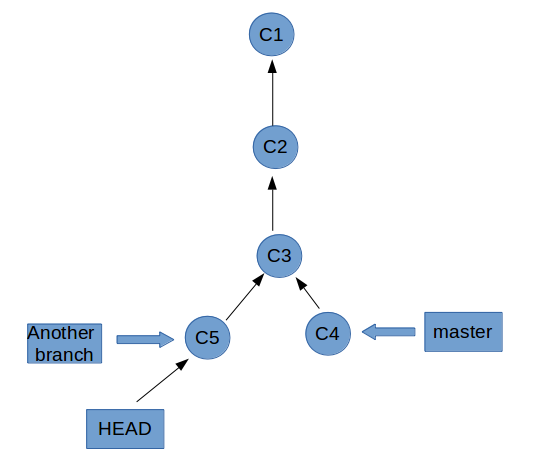   
   现在我们用命令**git checkout branchname** 切换到另一个分支上，同时commit生成一个新对象C5,可以发现这个是属于另外一个分支的，也可以看到指针指向。也就知道为什么叫分支了，我们还可以发现由最新的版本可以向上一直回回滚到旧版本。也可以发现两个分支共用一部分，其实这也是很正常的，当开发某些软件的时候，例如在window，和linux上都要能使用，但前期的某些组件是可以共同利用的，当针对特定平台时，我们新建不同分支，这样节省了开发的效率，整个代码控制也十分漂亮。以上就是我对整个git的理解。下面是一些git命令的解释     

### git常用命令解析   
我会从头开始一个git仓库，每一步都给详细解释   

- **git config**   
  git的配置指令，所有的配置都会写入配置文件，一个是全局的是整个你linux终端下都能使用的位于~/.gitconfig文件下，还有一个是位于你仓库的.git/config文件   
  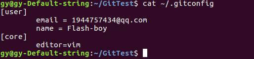   
  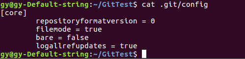    
  ```
  git config --list  # 显示所有配置信息
  git config --global # 配置全局文件夹下的配置文件，也就是~/.gitconfig文件   
  ```    
  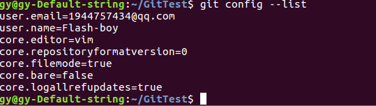    

- **git status**  
  显示你文件变更状态的命令，很常用     
  
- **git init**   
  这个命令是初始化一个文件夹为git仓库，其实说白了就是会在文件夹里创建一个.git的隐藏文件夹。   
  ```
  方式一：  
  git init DirName  
  方式二：  
  在文件夹内直接运行  
  git init  #表示把当前文件夹初始化为一个git仓库   
  ```   
  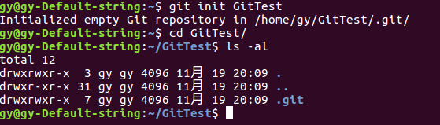   
  可以看到空仓库只有一个.git文件，这才是整个版本能够控制的核心，每次add 的文件对象都会保存在.git/object/目录下。   
- **git add**   
  把文件加入到暂存区此时添加之后，git会生成相应文件的镜像文件根据hash值存放在.git/object/目录下。    
  ```
  git add \<filename1> \<filename2> ...   #添加指定文件名文件到暂存区
  git add .    #添加当前目录下的文件到暂存区
  git add --all    #添加所有文件到暂存区   
  ```   
  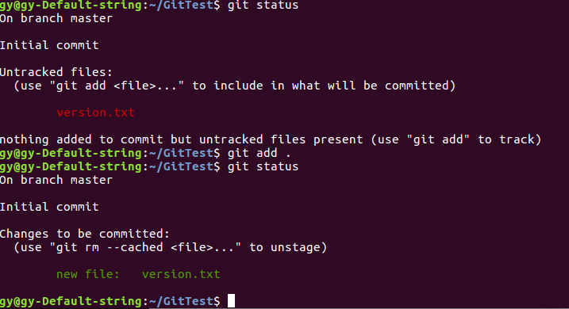    
  可以看到红色的是表示工作区文件和暂存区文件的差异，绿色的表示暂存区和仓库的差异    
  从上到下也有提示英文大概意思就是，当前我们在master分支上，未跟踪文件(也就是在.git/object/目录下并没有该文件的副本)可以使用git add \<file>命令将文件加入暂存区准备提交，下面接着我add了文件，然后可以看到状态提示，当前是一个新文件，准备提交的，可以使用命令git rm --cached \<file>将文件移出暂存区。       
- **git rm**    
  以前经常看到git rm filename移除文件，以前这个命令应该是可以用的，可以移除暂存区和工作区的文件，现在的话会提示错误    
  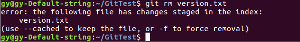   
  会提示不能建议使用--cached,或者-f强制删除，这样做应该是怕有些人误操作，现在一般搭配git rm --cached \<filename>使用，会清楚暂存区的文件，但不会改变工作区的文件   
- **git commit**  
  提交到本地仓库，其实就是生成了一个commit对象，里面的tree对象是当前暂存区的所有文件，git commit之后暂存区的文件并没有消失，（文件本来就在.git/object/目录下），只是说把当前这以瞬间状态记录下来，也就是tree对象还有父commit对象记录下来作为一个版本，也就是俗称的快照。   
  ```
  git commit -m "提交信息"  #提交的信息-m选项一定要有，不然不能提交   
  git commit -a  # 会把所有已经track的文件add进来然后提交，就是两步并成了一步，也会提示你输入提交信息，总而言之提交信息一定要有    
  ```
  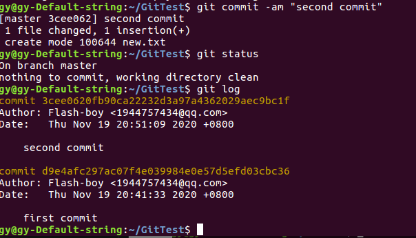    
- **git diff**   
  git diff比较两个文件的差异，所以文件的都保存着当然能比较差异，其实git把所以文件都保存着，只是很好的组织起了他们抽象出3种对象，实在是秒。   
  ```
  git diff filename  #比较工作区文件和暂存区文件的不同
  git diff --cached filename #比较暂存区和仓库文件的不同  
  git diff HEAD  #比较当前状态和上一次提交的不同，包括暂存区   
  ```    
  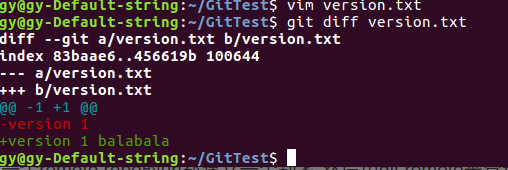    
  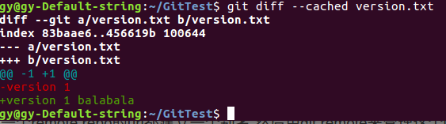   

- **git remote**   
  远程仓库的一些命令   
  ```
  git remote add <alias> <url>  # 将远程仓库名url其一个别名，并且添加到配置文件中，保存下来，这样方便下次用别名代替url     
  git remote  # 列出远程仓库url别名  
  git remote -v  # 列出远程仓库url别名和这个url信息   
  git remote rm <alias>  # 删除一个存在的远程url别名   
  git remote rename <old-alias> <new-alias> # 重命名
  git remote set-url <alias> <new-url>  # 更换url
  ```    
  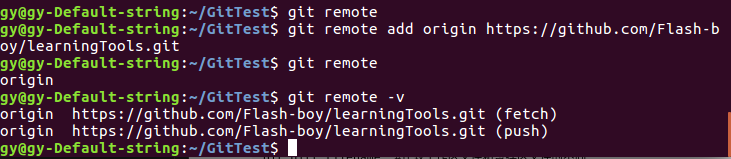   
- **git fetch**  
  git fetch就是拉取的意思，就是你拉取远程仓库的代码到本地仓库，fetch会取得所有本地没有的代码数据并且会组织成一个远程分支remote/branch,他们和本地分支一样可以(merge,log等)但你不能git checkout branchname，切换到该分支，说白了就是你本地的工作目录是不会更换为这个分支的，就是这个分支只能给你查看，合并。   
  ```
  git fetch <alias> # 拉取远程仓库别名默认分支   
  git fetch <alias> --all  # 拉取远程仓库别名的所有分支  
  ```   
  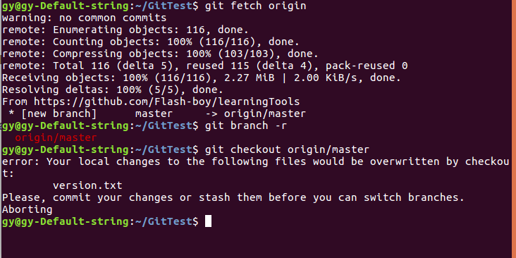     
- **git merge**  
  合并分支，其实就是将两个分支公共地方不变，将另一个分支接到另一个分支上    
  ```
  git merge branchname  # 把分支合并到当前分支
  git merge <alias>/branchname # 合并远程分支
  ```   
  合并master分支   
  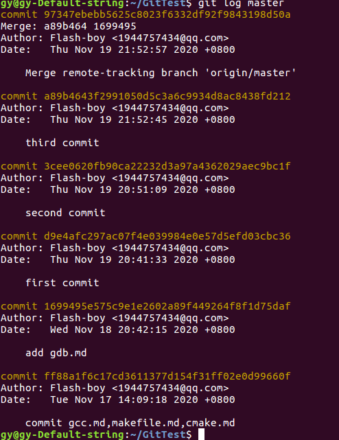     
  远程的仓库两次提交再最下面，然后依次是现在的1，2，3次提交，最后是合并会生成一次新的提交   
- **git pull**  
  其实就是git fetch和git merge的结合会先拉取分支然后合并到当前分支上    
  ```
  git pull <alias> <branchname>  # pull远程仓库别名下的某个分支不写分支默认分支    
  ```    
- **git push**   
  ```
  git push <alias> <branchname> #将当前分支push到远程分支，合并到远程分支上   
  ```    
- **git branch**  
  分支的一些命令   
  ```
  git branch  #列出本地所以分支，当前分支前面会打上*号  
  git branch -r #可以查看远程分支  
  git branch -a #可以查看所有分支   
  git branch -v #查看每个分支的最后一次提交   
  git branch <branchname>  #创建一个分支，但不切换分支   
  git branch -d <branchname> #删除一个分支
  git branch -D <branchname> #强制删除一个分支
  ```   
  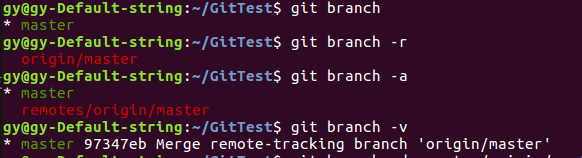    
  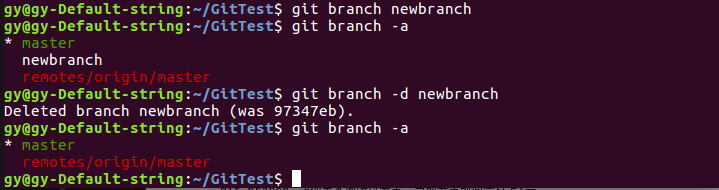 
- **git checkout**   
  ```
  git checkout <branchname> #切换当前分支
  git checkout -b <branchname> #创建分支并且切换到这个分支   
  git checkout -- <filename>  #会使用HEAD中的内容替换掉工作区的文件，暂存区文件不会改动，工作区新文件也不会改动。
  ```   
  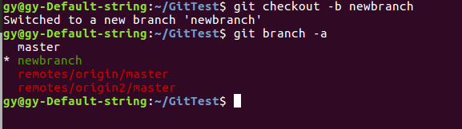    
- **git reset**  
  这个就是移动HEAD指针，切换版本的命令      
  在git中HEAD表示当前版本    
  HEAD^ 表示上一个版本   
  HEAD^^  表示上上一个版本    
  HEAD^数字  表示上几个版本    
  ```
  # 回退一个版本，不清除暂存区的改动，只是从上一次提交的仓库回退到暂存区，不影响暂存区和工作区，其实就是commit对象没了   
  git reset --soft HEAD^  
  # 回退一个版本，暂存区回到上一版本，不改变工作区(默认这种方式--mixed可以不写)        
  git reset (--mixed) HEAD^   
  # 回退版本，工作区，暂存区都被改变，完全是上一个版本   
  git reset --hard HEAD^   
  # 不会退版本，仅仅是将暂存区的改变清理掉，不影响工作区  
  git reset HEAD   
  # 不回退版本，不仅将暂存区改变清理掉，还清空工作区的修改，但保留着新增的文件和目录   
  git reset --hard HEAD    
  ```   
  需要注意的是回退版本针真的会删除本地仓库的版本记录，可以看到commit对象指针都是单向的，所以只能回退版本，要是想前进版本可以pull远程的版本库再重新操作。   
  ### 总结  
  以上就是我对git的理解，现在基本不会忘了怎么使用，体会到设计的优美，总之，看到这里有时间再去看看git原理解析，也可以去看[git中文官方文档](https://git-scm.com/book/zh/v2/)，现在应该非常清晰整个流程。   


