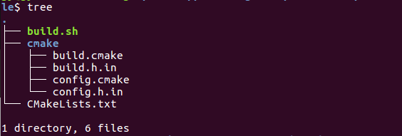

## cmake的使用
### 一、cmake简介
cmake是一个跨平台的开源的构建项目工具，它的内部使用是利用cmake解析CMakeLists.txt文件，然后生成对应的Makefile文件，再利用make进行编译  
CMakeLists.txt的语法比较简单由命令，注释，空格组成，其中命令不区分大小写，指令大小写无关，而参数和变量是大小写相关的。#号后面的被认为是注释，命令由命令名称，小括号和参数组成，参数之间用空格隔开。一般指令用小写，变量和参数用大写。
### 二、实战看指令
1. [hello-world](learning-cmake/hello-world)     
   hello-world文件夹下所包含的文件：   
          
   这是最简单的CMakeLists.txt文件一个源文件：   
   ```
   # cmake最低版本
   cmake_minimum_required(VERSION 3.0)
   # 项目名称
   project(hello-world)
   # 设置变量SOURCE_FILES的值为main.c
   set(SOURCE_FILES main.c)
   # 打印字符串消息
   message(STATUS "This is BINARY dir " ${PROJECT_BINARY_DIR})
   message(STATUS "This is SOURCE dir " ${PROJECT_SOURCE_DIR})
   # 生成可执行文件
   add_executable(hello-world ${SOURCE_FILES})
   ```
+ cmake_minimum_required(VERSION 3.0)    
  用于指定cmake的最低版本，一般开头都需要
+ project(NAME)    
  指定整个项目的名称，设置好了之后会引入两个变量NAME_BINARY_DIR和NAME_SOURCE_DIR,同时cmake自动定义了两个等价的变量PROJECT_BINARY_DIR和PROJECT_SOURCE_DIR，其中PROJECT_SOURCE_DIR是该CMakeLists.txt所在的目录，
  PROJECT_BINARY_DIR是执行cmake指令所在的目录
+ set(变量名 变量值)       
  设置变量，类似于c的宏定义，要引用该变量的值需要\${变量名}
+ message([STATUS|WARNING|FATAL_ERROR] "")     
  类似于printf()函数打印一些信息，其中STATUS表示非重要消息，WARNING表示cmake的警告，会继续执行，FATAL_ERROR表示错误会终止所以处理过程          
        
  这是该CMakeLists.txt执行cmake的结果，创建一个build文件夹然后在build文件夹里执行cmake .. 得到的结果，可以看到message显示了对应的信息，同时PROJECT_BINARY_DIR表示的是cmake执行的该build目录，PROJECT_SOURCE_DIR表示的是CMakeLists.txt所在的hello-world目录
+ add_executable(可执行文件名 源文件)      
  生成可执行文件命令，利用源文件生成可执行文件
2. [hello-world-clear](learning-cmake/hello-world-clear)     
   hello-world-clear目录下所包含的文件     
         
   hello-world-clear目录下的CMakeLists.txt
   ```
   # 最小版本要求
   cmake_minimum_required(VERSION 2.8.4)
   # 项目名称
   project(hello)
   # 查看并解析子目录下的CMakeLists.txt
   add_subdirectory(src)
   # 安装文件到某个目录下
   INSTALL(FILES COPYRIGHT README.md DESTINATION share/doc/cmake/hello-world-clear)
   # 安装可执行文件到某目录下
   INSTALL(PROGRAMS runhello.sh DESTINATION bin)
   # 安装某个目录下的文件到某目录下
   INSTALL(DIRECTORY doc/ DESTINATION share/doc/cmake/hello-world-clear)
   ```
   src目录下的CMakeLists.txt
   ```
   # 最小版本要求
   cmake_minimum_required(VERSION 2.8.4)
   # 生成可执行文件
   add_executable(hello main.c)
   # 设置变量，系统自定义的变量表示生成文件的输出目录
   set(EXECUTABLE_OUTPUT_PATH ${PROJECT_BINARY_DIR}/bin)
   # 安装目标文件到某个目录
   install(TARGETS hello RUNTIME DESTINATION bin)
   ```
+ add_subdirectory(SUBDIR [binary_dir] [EXCLUDE_FROM_ALL])         
  第一个参数是必选的表示指定一个子目录，子目录应该包含CMakeLists.txt文件，子目录可以是绝对路径，也可以是相对路径，如果相对则是相对于当前目录       
  第二个参数用于存放输出文件可以是相对也可以是绝对，如果没有指定则默认输出到子目录中    
  第三个参数,如果指定了该参数则该子目录的目标不会被父目录的目标包含进去父目录的CMakeLists.txt不会构建子目录的目标文件(指定该参数的情况下)，如果指定了该参数，但父目录依赖于这个子目录的目标文件那么子目录也会构建     
+ INSTALL()     
  install指令是为了搭配cmake和make之后的make install命令，只有用了make install才会执行INSTALL()指令，INSTALL指令可以安装文件(FILE|PROGRAMS)，目标二进制(TARGETS),目录(DIRECTORY),脚本(SCRIPT)等，经常会跟一个变量量CMAKE_INSTALL_PREFIX搭配使用用于指定安装的目录，既可以设置这个值，也可以在cmake时指定选项例如：
  cmake -DCMAKE_INSTALL_PREFIX=/tmp/usr   
  默认情况下是在/usr/local目录下   
  分析上文的INSTALL
  1.INSTALL(FILES COPYRIGHT README.md DESTINATION share/doc/cmake/hello-world-clear)      
  安装文件，FILE关键字表明的是文件后面跟一系列的文件名， DESTINATION表示安装的目的地，也就是相对CMAKE_INSTALL_PREFXI的路径  
  2.INSTALL(PROGRAMS runhello.sh DESTINATION bin)     
  同样的PROGRAMS关键字表示的是可执行文件安装到DESTINATION所指向的目录   
  3.INSTALL(DIRECTORY doc/ DESTINATION share/doc/cmake/hello-world-clear)     
  这是安装某些目录下的文件，并不安装目录本身到某个DESTINATION目录下
  4.install(TARGETS hello RUNTIME DESTINATION bin)     
  安装目标文件一般包括3种，add_library()生成的静态库(ARCHIVE)和动态库(LIBRARY),以及add_executable()生成的可执行文件(RUNTIME),括号中的是特指哪些目标文件
+ set(EXECUTABLE_OUTPUT_PATH ${PROJECT_BINARY_DIR}/bin)    
  EXECUTABLE_OUTPUT_PATH是一个系统变量表示可执行文件的输出位置，默认情况下是cmake指令所在目录所对应的源文件目录下
  可以看到编译时指定cmake -DCMAKE_INSTALL_PREFIX=/tmp/usr,则INSTALL的文件会在该目录下的bin目录和share目录下
       
  可以看到runhello.sh,hello被安装在bin目录下，COPYRIGHT,README.md,hello.txt安装在share/doc/cmake/hello-world-clear下
3. [hello-world-lib](learning-cmake/hello-world-lib)     
   hello-world-lib目录下包含的文件    
        
   hello-world-lib目录下的CMakeLists.txt
   ```
   # 最低版本要求
   cmake_minimum_required(VERSION 2.8.4)
   # 项目名称
   project(hellolib)
   # 添加子目录
   add_subdirectory(src)
   ```
   src目录下的CMakeLists.txt
   ```
   # 最低版本要求
   cmake_minimum_required(VERSION 2.8.4)
   # 设置变量LIBHELLO_SRC为hello.c
   set(LIBHELLO_SRC hello.c)
   # 生成动态库和静态库文件
   add_library(hello_dynamic SHARED ${LIBHELLO_SRC})
   add_library(hello_static STATIC ${LIBHELLO_SRC})
   # 设置动态库目标文件属性
   set_target_properties(hello_dynamic PROPERTIES OUTPUT_NAME "hello")
   set_target_properties(hello_dynamic PROPERTIES VERSION 1.2 SOVERSION 1)
   # 设置静态库目标文件属性
   set_target_properties(hello_static PROPERTIES OUTPUT_NAME "hello")
   # 设置库文件输出位置变量(系统)的值
   set(LIBRARY_OUTPUT_PATH ${PROJECT_BINARY_DIR}/lib)
   # 安装目标动态库和静态库文件
   install(TARGETS hello_dynamic hello_static
        LIBRARY DESTINATION lib
        ARCHIVE DESTINATION lib)
   # 安装文件
   install(FILES hello.h DESTINATION include/hello)
   ```
+ add_library()     
  ```
  add_library(<name> [STATIC | SHARED | MODULE]
            [EXCLUDE_FROM_ALL]
            source1 [source2 ...])   
  name,直接写名字会自动加上前缀和后缀成为完成的库名
  SHARED,动态库
  STATIC,静态库
  MODULE,在使用dyld的系统中有效，如果不支持dyld,则被当做SHARED对待。
  EXCLUDE_FROM_ALL,这个库不会被主动构建，除非有其他组件依赖这个库或者手动构建
  ```
  add_library(hello SHARED \${LIBHELLO_SRC})
  add_library(hello_static STATIC \${LIBHELLO_SRC})
  注意，一般我们使用的静态库/动态库只是后缀名不同而已，上面构建的libhello.so与libhello_static.a，显然名字不同哦。这时你会有一个想法，那我把hello_static改成hello，结果是不可行的，静态库无法构建。重名会忽略第二条指令。   
  可以利用set_target_properties()更改属性的名字   
+ set_target_properties(TARGET PROPERTIES 属性名 属性值 ...)        
  该指令可以更改目标文件的属性值像上面的将生成的动态库和静态库更改属性输出名都为hello,     
  set_target_properties(hello_dynamic PROPERTIES OUTPUT_NAME "hello")     
  set_target_properties(hello_dynamic PROPERTIES VERSION 1.2 SOVERSION 1)       
  OUTPUT_NAME为属性名，VERSION属性名指代动态库版本，SOVERSION属性指代API版本
  不管动态库版本是什么，对外总是调用libXXX.so。
+ set(LIBRARY_OUTPUT_PATH ${PROJECT_BINARY_DIR}/lib)      
  LIBRARY_OUTPUT_PATH系统变量表示生成的库文件输出的位置        
         
4. [hello-world-shared](learning-cmake/hello-world-shared)    
  hello-world-shared目录下的文件     
         

  hello-world-shared目录下的CMakeLists.txt
  ```
  # 最低版本
  cmake_minimum_required(VERSION 2.8.4)
  # 项目名称
  project(newhello)
  # 添加子目录
  add_subdirectory(src)
  ```
  src目录下的CMakeLists.txt
  ```
  # 最低版本要求
  cmake_minimum_required(VERSION 2.8.4)
  # 生成可执行文件
  add_executable(main main.c)
  # 头文件目录
  include_directories(../include/hello)
  # 到指定目录寻找库文件并给变量赋值
  find_library(HELLO_LIB NAMES hello PATHS "../lib/")
  # 打印消息
  message(STATUS "Library path HELLO_LIB is " ${HELLO_LIB})
  # 目标文件链接库文件
  target_link_libraries(main ${HELLO_LIB})
  # 设置执行文件输出位置目录
  set(EXECUTABLE_OUTPUT_PATH ${PROJECT_BINARY_DIR}/bin)
  ```
+ include_directories()     
  include_directories(../include/hello)指定要寻找的头文件目录
+ find_library(变量名 NAME 库名 PATH 库目录)     
  去指定的库目录寻找对应的库，如果找到了就把这个库的绝对路径赋给前面的变量
  这里可以看到该变量HELLO_LIB的值
         
5. [show-vars](learning-cmake/show-vars)     
  该项目是看许多系统变量的值是多少，利用message()打印出来      
  show-vars的目录下文件     
             
  show-vars下的CMakeLists.txt
  ```
  project(show_vars)
  cmake_minimum_required(VERSION 3.0)

  message("")
  message("1.PROJECT_BINARY_DIR = ${PROJECT_BINARY_DIR}")
  message("2.PROJECT_SOURCE_DIR = ${PROJECT_SOURCE_DIR}")
  message("3.CMAKE_CURRENT_SOURCE_DIR = ${CMAKE_CURRENT_SOURCE_DIR}")
  message("4.CMAKE_CURRENT_BINARY_DIR = ${CMAKE_CURRENT_BINARY_DIR}")
  message("5.CMAKE_CURRENT_LIST_FILE = ${CMAKE_CURRENT_LIST_FILE}")
  message("6.CMAKE_CURRENT_LIST_LINE = ${CMAKE_CURRENT_LIST_LINE}")
  message("7.CMAKE_MODULE_PATH = ${CMAKE_MODULE_PATH}")
  message("8.CMAKE_SOURCE_DIR = ${CMAKE_SOURCE_DIR}")
  message("9.EXECUTABLE_OUTPUT_PATH = ${EXECUTABLE_OUTPUT_PATH}")
  message("10.LIBRARY_OUTPUT_PATH = ${LIBRARY_OUTPUT_PATH}")
  message("11.PROJECT_NAME = ${PROJECT_NAME}")
  message("12.PROJECT_VERSION_MAJOR = ${PROJECT_VERSION_MAJOR}")
  message("13.PROJECT_VERSION_MINOR = ${PROJECT_VERSION_MINOR}")
  message("14.PROJECT_VERSION_PATCH = ${PROJECT_VERSION_PATCH}")
  message("15.CMAKE_SYSTEM = ${CMAKE_SYSTEM}")
  message("16.CMAKE_SYSTEM_NAME = ${CMAKE_SYSTEM_NAME}")
  message("17.CMAKE_SYSTEM_VERSION = ${CMAKE_SYSTEM_VERSION}")
  message("18.BUILE_SHARED_LIBS = ${BUILE_SHARED_LIBS}")
  message("19.CMAKE_C_FLAGS = ${CMAKE_C_FLAGS}")
  message("20.CMAKE_CXX_FLAGS = ${CMAKE_CXX_FLAGS}")
  message("21.CMAKE_SYSTEM_PROCESSOR = ${CMAKE_SYSTEM_PROCESSOR}")

  message("")
  ```  
  下面是个变量的值     
       
6. [curl](learning-cmake/curl)     
   curl目录下的文件     
        
   这个文件夹主要是弄明白模块的含义下一个项目会写自己的模块           
   curl目录下的CMakeLists.txt
   ```
   # 最低版本要求
   cmake_minimum_required(VERSION 2.8.4)
   # 项目名
   project(CURLTEST)
   # 添加子目录
   add_subdirectory(src)
   ```
   src目录下的CMakeLists.txt
   ```
   # 最低版本
   cmake_minimum_required(VERSION 2.8.4)
   # 生成可执行文件
   add_executable(curltest main.c)
   # 查找模块curl
   find_package(curl)
   # 判断语句
   if(CURL_FOUND)
    include_directories(${CURL_INCLUDE_DIR})
    target_link_libraries(curltest ${CURL_LIBRARY})
   else(CURL_FOUND)
    message(FATAL_ERROR "CURL library not found")
   endif(CURL_FOUND)
   # 设置可执行文件输出位置目录
   set(EXECUTABLE_OUTPUT_PATH ${PROJECT_BINARY_DIR}/bin)
   ```
+ find_package(模块名)      
  模块的含义其实就是一个间接的XXX.cmake文件，find_package()命令首先会在模块路径中寻找Find.cmake，这是查找库的一个典型方式。具体查找路径依次为CMake：变量\${CMAKE_MODULE_PATH}中的所有目录。如果没有，然后再查看它自己的模块目录/share/cmake-x.y/Modules/（\$CMAKE_ROOT的具体值可以通过CMake中message命令输出）。这称为模块模式。   
  为了能支持各种常见的库和包，CMake自带了很多模块。可以通过命令 cmake –help-module-list （输入cmake –help，然后双击Tab会有命令提示）得到你的CMake支持的模块的列表： 直接查看模块路径。比如Ubuntu linux上，模块的路径是 ls /usr/share/cmake/Modules/：    
  让我们以bzip2库为例。CMake中有个 FindBZip2.cmake 模块。只要使用 find_package(BZip2) 调用这个模块，cmake会自动给一些变量赋值，然后就可以在CMake脚本中使用它们了。变量的列表可以查看cmake模块文件，或者使用命令:       
        
  一旦能够找到对应的模块，那么相应的变量就会被赋值，例如：   
  BZIP2_FOUND,BZIP2_INCLUDE_DIR,BZIP2_LIBRARIES。也就是我们可以利用这个查找的模块得到的变量知道所需模块的头文件目录和库文件目录。
+ if()语句     
  ```
  if(条件表达式)
    ...
  elseif()
    ...
  else()
    ...
  endif()
  随着cmake版本的提升后面的小括号中也可以不写条件
  ```
7. [hello-module](learning-cmake/hello-module)     
   hello-modual的目录文件     
        
   其中的FindHello.cmake是自定义的模块文件          
   hello-module目录下的CMakeLists.txt
   ```
   cmake_minimum_required(VERSION 2.8.4)
   project(hello)
   # 设置模块搜索路径CMAKE_MODULE_PATH是系统变量
   set(CMAKE_MODULE_PATH ${PROJECT_SOURCE_DIR}/cmake)
   # 添加子目录
   add_subdirectory(src)
   ```
   cmake目录下的FindHELLO.cmake
   ```
   # 找到文件路径并赋予变量值
   find_path(HELLO_INCLUDE_DIR hello.h /usr/local/include/hello)
   # 找到库文件并赋予变量值
   find_library(HELLO_LIBRARY NAMES hello PATH /usr/local/lib)
   # 设置变量值
   if(HELLO_INCLUDE_DIR AND HELLO_LIBRARY)
     SET(HELLO_FOUND true)
   endif(HELLO_INCLUDE_DIR AND HELLO_LIBRARY)
   # 判断是否查找到
   if(HELLO_FOUND)
     if(NOT HELLO_FIND_QUIETLY)
       message(STATUS "Found Hello: ${HELLO_INCLUDE_DIR} ${HELLO_LIBRARY}")
     endif(NOT HELLO_FIND_QUIETLY)
   else(HELLO_FOUND)
     if(HELLO_FIND_REQUIRED)
       message(FATAL_ERROR "Could not find hello library")
     endif(HELLO_FIND_REQUIRED)
   endif(HELLO_FOUND)
   ```
   src目录下的CMakeLists.txt
   ```
   cmake_minimum_required(VERSION 2.8.4)
   # 查找模块
   find_package(HELLO)
   # 判断是否找到
   if(HELLO_FOUND)
     add_executable(hello main.c)
     include_directories(${HELLO_INCLUDE_DIR})
     target_link_libraries(hello ${HELLO_LIBRARY})
   else(HELLO_FOUND)
     message(FATAL_ERROR "HELLO library not found")
   endif(HELLO_FOUND)
   # 设置执行文件输出位置目录
   set(EXECUTABLE_OUTPUT_PATH ${PROJECT_BINARY_DIR}/bin)
   ```
+ set(CMAKE_MODULE_PATH ${PROJECT_SOURCE_DIR}/cmake)     
  设置系统变量CMAKE_MODULE_PATH是为了find_package()查找的指定模块的搜索路径
+ find_package(HELLO)     
  这里明显能找到这个模块，然后进入这个模块，FindHELLO.cmake会根据查找的结果设置相应的变量的值包括HELLO_FOUND,HELLO_INCLUDE_DIR,HELLO_LIBRARY等。这些值其实都是FindHELLO.cmake中定义的，会传递到调用find_package()的CMakeLists.txt。总的来说就是find_package()会去查找对应的模块，如果找到了会执行对应的文件，该文件里面设置的变量可以传递到find_package()中。
+ find_path(变量名 文件名 查找目录)      
  到指定目录去查找文件如果找到了会返回该文件所在的目录路径。FindHELLO.cmake中的HELLO_FIND_QUIETLY,和HELLO_FIND_REQUIRED对应的外部find_package()可选的参数。所以这里没有就会执行  message(STATUS "Found Hello: \${HELLO_INCLUDE_DIR} ${HELLO_LIBRARY}")这一句。     
     
8. [config-file](learning-cmake/config-file)     
   config-file目录下的文件    
        
   build.sh是一个shell脚本，主要是新建一个build文件夹然后在build里面执行cmake 和make进行项目编译    
   config-file目录下的CMakeLists.txt
   ```
   cmake_minimum_required(VERSION 2.8)
   project(config)
   # 设置模块搜索目录
   set(CMAKE_MODULE_PATH ${CMAKE_SOURCE_DIR}/cmake)
   # 加载config模块并执行
   include(config)
   # 加载build模块并执行
   include(build)
   # 拷贝文件到另一个文件
   CONFIGURE_FILE(${CMAKE_MODULE_PATH}/build.h.in ${CMAKE_BINARY_DIR}/build.h)
   CONFIGURE_FILE(${CMAKE_MODULE_PATH}/config.h.in ${CMAKE_BINARY_DIR}/config.h)
   ```
   cmake文件夹下面的四个文件：     
   1.build.cmake     
    ```
    # 查找程序
    find_program(APP_DATE date)
    if(NOT APP_DATE)
	    message(FATAL_ERROR "Unable to find program 'date'")
    endif(NOT APP_DATE)

    find_program(APP_UNAME uname)
    if(NOT APP_UNAME)
	    message(FATAL_ERROR "Unable to find program 'uname'")
    endif(NOT APP_UNAME)
    # 执行程序并给相应变量赋值
    execute_process(COMMAND ${APP_DATE} RESULT_VARIABLE RETVAL OUTPUT_VARIABLE
	    BUILD_DATE OUTPUT_STRIP_TRAILING_WHITESPACE)
    execute_process(COMMAND ${APP_UNAME} -srm RESULT_VARIABLE RETVAL
	    OUTPUT_VARIABLE BUILD_ARCH OUTPUT_STRIP_TRAILING_WHITESPACE)
    ```
   2.build.h.in    
     ```
     #ifndef BUILD_H_
     #define BUILD_H_

     // build info

     #cmakedefine BUILD_DATE "@BUILD_DATE@"
     #cmakedefine BUILD_ARCH "@BUILD_ARCH@"

     #endif // BUILD_H_
     ```
   3.config.cmake       
     ```
     # OPTION( VARIABLE "Description" Initial state)
     # OPTION是给变量初始值如果没有设置默认为OFF
     OPTION( WITH_FOO "Enable FOO support" ON )
     OPTION( WITH_BAR "Enable BAR component" OFF )
     SET( BAZ 18 )
     set(VERSION "1.0")
     set(NUMBER 3)
     ```
   4.config.h.in          
     ```
     #ifndef CONFIG_H
     #define CONFIG_H

     #cmakedefine WITH_FOO 1
     #cmakedefine WITH_BAR 1

     #cmakedefine BAZ @BAZ@

     /*
      * These values are automatically set according to their cmake variables.
     */
     #cmakedefine VERSION "${VERSION}"
     #cmakedefine NUMBER ${NUMBER}

     #endif // CONFIG_H
     ```
+ CMAKE_SOURCE_DIR      
   这些变量之间有差异. CMAKE_SOURCE_DIR确实是指定义了顶级CMakeLists.txt的文件夹.但是, PROJECT_SOURCE_DIR是指包含最近的project()命令的CMakeLists.txt的文件夹. 
   例如,假设你有一个名为Outer的顶级项目,它包含一个子目录,其自己的项目叫做Inner.外面的CMakeLists.txt有：
   ```
   project(Outer)
   add_subdirectory(Inner)
   ```
   和内在的：
   ```
   project(Inner)
   ```
   然后在这两个CMakeLists文件中,CMAKE_SOURCE_DIR将引用Outer的源目录.但是外部PROJECT_SOURCE_DIR也是同一个目录,而Inner并不是这样. Inner的PROJECT_SOURCE_DIR是包含其CMakeLists.txt的子目录.
   该差异适用于所有PROJECT_< var> vs CMAKE_< var>变量.
+ find_program(APP_DATE date)      
  查找程序的路径如果找到就赋值给变量APP_DATE，这里保存的是date这个日期程序的路径
+ execute_process(COMMAND \<cmd1> [args1...]     
                [COMMAND \<cmd2> [args2...]]     
                [...]       
                [WORKING_DIRECTORY \<directory>]     
                [TIMEOUT \<seconds>]     
                [RESULT_VARIABLE \<variable>]     
                [OUTPUT_VARIABLE \<variable>]    
                [ERROR_VARIABLE \<variable>]     
                [INPUT_FILE \<file>]    
                [OUTPUT_FILE \<file>]     
                [ERROR_FILE \<file>]     
                [OUTPUT_QUIET]     
                [ERROR_QUIET]     
                [OUTPUT_STRIP_TRAILING_WHITESPACE]    
                [ERROR_STRIP_TRAILING_WHITESPACE])              
  执行程序按指定的先后顺序运行一个或多个命令，每个进程的输出通过管道连接作为下一个进程的输入。所有的进程使用单个的标准错误输出管道。如果指定了RESULT_VARIABLE变量，则最后命令执行的结果将保存在该变量中，它是最后一个子进程执行完后的返回值或描述某种错误信息的字符串。如果指定了OUTPUT_VARIABLE或ERROR_VARIABLE变量，则该变量会分别保存标准输出和标准错误输出的内容。    
  这里就是将data,和uname程序执行的结果保存在变量BUILD_DATE,BUILD_ARCH中，已提供给configure_file()指令使用。
+ OPTION( VARIABLE "Description" Initial state)      
  OPTION是为了脚本传递参数使用的，是一个开关选项，ON为开，OFF为关表示不能传递给其他脚本使用，向这里定义的config.cmake定义的WITH_FOO,可以为下面调用configure_file()指令使用也就是该变量有定义可见，而WITH_BAR则为OFF表示被configure_file()调用则不可见这个变量。
+ include(\<file|module> [OPTIONAL] [RESULT_VARIABLE \<VAR>] [NO_POLICY_SCOPE])     
  include指令用来载入并运行来自于文件或模块的CMake代码。如果选用了OPTIONAL选项，如果被包含的文件不存在，则不会报错。如果指定了RESULT_VARIABLE选项，那么VAR会被设置为被包含文件的完整路径，如果没找到则会设为NOTFOUND。如果指定的是模块，则会去查找\<name>.cmake文件名。
+ CONFIGURE_FILE(\<input> \<output> [COPYONLY] [ESCAPE_QUOTES] [@ONLY])     
  将文件\<input>拷贝到\<output>然后替换文件内容中引用到的变量值。如果\<input>是相对路径，它被评估的基础路径是当前源码路径。\<input>必须是一个文件，而不是个路径。如果\<output>是一个相对路径，它被评估的基础路径是当前二进制文件路径。如果\<output>是一个已有的路径，那么输入文件将会以它原来的名字放到那个路径下。   
  该命令替换掉在输入文件中，以\${VAR}格式或\@VAR@格式引用的任意变量，如同它们的值是由CMake确定的一样。 如果一个变量还未定义，它会被替换为空。如果指定了COPYONLY选项，那么变量就不会展开。如果指定了ESCAPE_QUOTES选项，那么所有被替换的变量将会按照C语言的规则被转义。该文件将会以CMake变量的当前值被配置。如果指定了\@ONLY选项，只有\@VAR@格式的变量会被替换而\${VAR}格式的变量则会被忽略。这对于配置使用${VAR}格式的脚本文件比较有用。任何类似于\#cmakedefine VAR的定义语句将会被替换为\#define VAR或者/* #undef VAR */，视CMake中对VAR变量的设置而定。任何类似于#cmakedefine01 VAR的定义语句将会被替换为#define VAR 1或#define VAR 0，视VAR被评估为TRUE或FALSE而定。
  这里是将cmake下的build.h.in,config.h.in文件输出为\${CMAKE_BINARY_DIR}下的build.h和config.h       
  输出文件build.h
  ```
  #ifndef BUILD_H_
  #define BUILD_H_

  // build info
  #define BUILD_DATE "2020年 11月 17日 星期二 12:51:04 CST"
  #define BUILD_ARCH "Linux 4.15.0-118-generic x86_64"

  #endif // BUILD_H_
  ```
  输出文件config.h
  ```
  #ifndef CONFIG_H
  #define CONFIG_H

  #define WITH_FOO 1
  /* #undef WITH_BAR */
  #define BAZ 18
  /*
   * These values are automatically set according to their cmake variables.
   */
  #define VERSION "1.0"
  #define NUMBER 3

  #endif // CONFIG_H
  ```
  从两个输出文件build.h,和config.h中可以看到，@BUILD_DATE@和@BUILD_ARCH被替换，还有WITH_BAR的OPTION选项为OFF所以输出的config.h中没有该定义，而@BAZ@,\${VERSION},\${NUMBER},被相应的替换掉。总结就是顶层CMakeLists.txt加载的两个build.cmake,config.cmake,执行定义了一些变量，传递到CONFIGURE_FILE()中被在这个复制文件并替换中使用，最后输出了需要的文件build.h,config.h。
  
