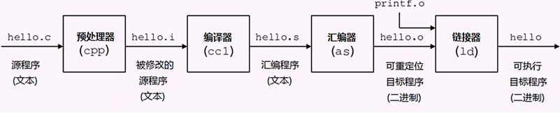

## gcc的简单使用
### gcc的介绍
gcc是GNU Compiler Collection的缩写，可以支持多种语言包括c,c++,java等。gcc其实是一个工具链组合，把一个源代码，经过各个步骤组合最终变成一个可执行文件。    
g++其实是为了gcc在编译c++程序时不会主动去链标准c++库而去使用的一个编译c++工具。其实g++内部是调用了gcc然后去链接c++库的。gcc也可以实现编译c++，gcc -lstdc++,加上这个链接c++标准库的命令就行。后缀为.c的文件gcc认为时c文件，g++认为时c++文件，后缀为.cpp的gcc和g++都认为时c++文件。      
### gcc编译过程

- 预处理（pre-processing）E:插入头文件，替换宏
- 编译（Compiling）S:编译成汇编
- 汇编（Assembling）c:编译成目标文件
- 链接（Linking）:链接到库中，生成可执行文件
以一个可执行文件hello.c为例   
gcc -E hello.c -o hello.i   
gcc -S hello.i -o hello.s
gcc -c hello.s -o hello.o
gcc hello.o -o hello  
以上四部就是一个编译的整个过程等价于一步    
gcc hello.c -o hello   
### gcc常用选项
| 选项名 | 作用 |
| ----- | :----|
| o | 生成目标文件包括（.i,.s,.o和可执行文件）|
| E | 只运行预处理器（头文件，宏展开）|
| S | 生成汇编语言后停止编译(.s文件)|
| c | 取消链接步骤，生成目标文件（.o文件）|
| Idir | 增加inclued文件目录路径 |
| Ldir | 增加库文件链接目录路径 |
| llib | 链接某个库文件例如链接libmath.a 静态库文件，-lmath |
| Wall | 打开编译警告信息 |
| g | 嵌入调试信息，方便gdb调试 |
### 静态库（.a）
> 程序在编译链接的时候把库的代码链接到可执行文件中。程序运行的时候不需要静态库，生成的可执行文件大，每个文件都会加载一份拷贝到内存。例如利用到某个库文件中的某个函数被某10个程序都用到了，那么这10个程序生成的可执行文件都会有一份该函数的代码拷贝，当运行多个程序时会消耗内存。  

+ 静态库生成（libxxx.a）
  首先生成.o文件然后通过.o文件生成.a文件，其实就是封装了某个函数或者类的功能   
  例如:  
  gcc -c fun.c -o fun.o  
  ar rcs libfun.a fun.o  
  (ar生成静态库命令。r将目标文件加入静态库，有同名的就删除。c表示创建新的静态库文件)    
+ 静态库使用
  gcc main.c libfun.a -o main (直接使用这个库)   
  gcc -L. main.c -o main -lfun (到库文件中链接该库，-L表示库在哪个目录，-lfun表示在库目录中链接libfun.a文件)
+ 静态库路径搜索
  1. 编译使用-L指定搜索库目录
  2. 设置环境变量 LIBRARY_PATH
  3. 将lib放入系统指定的目录（默认库寻找目录），例如/usr/lib/等
### 共享库（.so或.sa）
> 程序运行的时候才去链接共享库代码，多个程序共享使用，使用的时候内存中只加载一份

+ 动态库生成
可以直接通过.c或者.o文件生成.so文件   
例如：gcc -shared -fPIC fun.o -o libFun.so    
shared:生成共享库格式   
fPIC:产生位置无关代码，允许在任何位置加载（否则只能从指定位置加载，无法控制，一般就用这个选项）   
+ 动态库使用
gcc main.o -o main -L. -lFun   
从当前目录中搜索libFun.so库文件
+ 动态库路径搜索      
1.拷贝.so文件到/usr/lib/目录中    
2.更改LD_LIBRARY_PATH,也是系统变量export LD_LIBRARY_PATH=$LD_LIBRARY_PATH:"目录名"      
3.配置/etc/ld.so.conf;并使用ldconfig命令更新    
### 总结
整个gcc是后面写makefile的基础，makefile其实就是利用gcc的命令去构建大型的多文件编译，最后生成可执行文件，makefile提供了很多许多方便，makefile的编写是在gcc基础上的，make的使用是在makefile已经写好的基础上的

