## gdb的使用
### gdb的简单介绍
gdb是GNU Debugger是在linux下调试C/C++程序的利器，许多VS,或者IDE里都是直接或者间接使用了这个程序，gdb遵循GNU GPL开原协议，如果想在Linux上搞C/C++开发这个是绕不过去的，其实也很简单，功能强大，但我们只需要用到常见的命令就行，同时有了GDB对去学习许多开源代码很有帮助，实际运行可以看到程序运行流程。
### 基础知识
1. 调试基本概念     
   通过前面的[gcc.md](gcc.md),[makefile.md](makefile.md),[cmake](cmake.md)的学习我们知道不管是使用makefile还是cmake工具链最后都是调用gcc工具链。一般编译某个程序我们是编译成可执行程序就行，但调试的本质其实就是在源程序编译的过程中牺牲空间去换取更多的调试信息，也就是加入许多**调试符号**，包括代码的堆栈信息，变量名，函数名，函数的行号等等，其实就是在编译的时候指定了-g选项，还有一个就是-O(大写的o)选项，表示编译器gcc会不会优化你的代码，-O0~-O4分别表示优化的程度，一般进行调试的时候生成的都是采用-O0也就是不优化，因为优化了可能有些代码就不符合函数源码执行逻辑，不符合一般的流程思考。例如生成一个调试程序：   
   ```
   gcc -g -O0 -o hello_service hello_service.c -lstdc++
   ```
   运行gdb hello_service可以看到    
   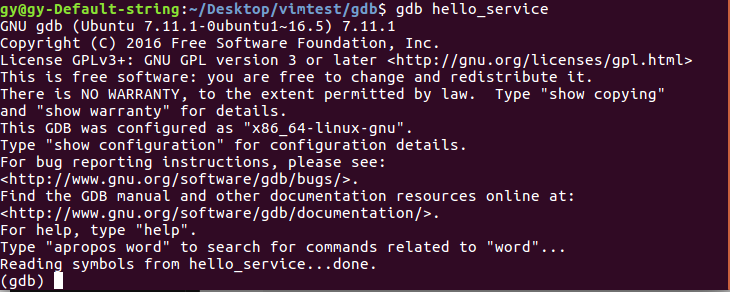       
   可以看到最后一行 **Reading symbols from hello_service...done.** 表明有调试符号信息也就是-g选项提供的。     
   例外一个不加-g选项的    
   ```
   gcc -O0 -o hello_service2 hello_service.c -lstdc++
   ```
   运行gdb hello_service2可以看到：    
   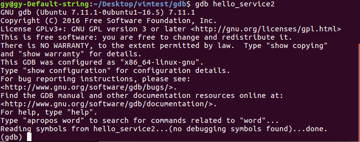   
   可以看到最后一行 **Reading symbols from hello_service2...(no debugging symbols found)...done.** 说明没有调试符号信息被找到。    
   同时我们也可以看看两个同样的源程序，指示编译的时候有没有指明-g选项生成的可执行文件大小：    
   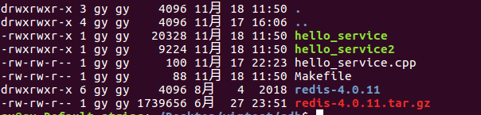    
   可以看到加了调试符号-g选项的hello_service比hello_service2大了许多。    
   同时也可以使用 **strip** 命令把带有调试符号的可执行程序的调试符号去掉，变成release版本的可执行程序。    
   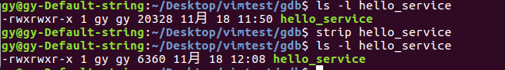   
   可以看到strip之后大小变为了6360明显小了很多    
2. 如何启动GDB调试    
   首先GDB调试程序并不是直接运行程序，而是先将GDB调试器和这个程序进行绑定，附加（attach）到该程序上，程序并没有正在的运行起来。一般有3种调试程序启动GDB的方式：

   - gdb \<filename>   
   - gdb attach \<pid>     
   - gdb \<filename> \<corename>     

   对应着3种方式为：    
   - 直接调试可执行程序
   - 附加到某个程序（通过pid）
   - 调试core文件（也就是崩溃产生的信息）    

   1.**直接调试可执行程序**    
     可以直接使用**gdb filename** 直接启动这个程序的调试，但是并没有运行该程序，只是把调试器gdb附加到这个程序上，真正的调试需要在gdb里面执行相应的命令。例如调试一开始的hello_service文件：    
     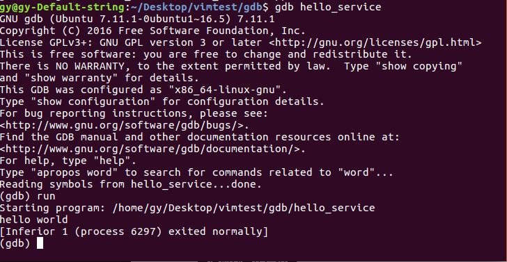    
     可以看到启动调试的时候并没有运行当在gdb中使用**run** 命令时，程序才真正的执行，由于没有断点程序直接运行到结束，正常退出。**run** 及时gdb内部命令表示开始运行程序。
   2.**附加某个程序** 
     在某些情况下，某些程序已经启动了，我们想调试正程序，但又不想重启这个程序，更多的时候是程序已经在运行，但不知道什么bug导致程序有些小问题但并没有崩溃，我们此时想要调试这个状态下的该程序，但又不能重启这个程序，不然该状态就消失了也就找不到这个状态下的bug,可以使用**gdb attach PID** 的方式将dbg附加到这个程序上，当gdb attach上这个目标程序时，调试器会暂停在程序本身运行过程的暂停状态，例如redis-server程序是一个服务器程序会一直等待连接，所以没有连接的时候就暂停在epoll_wait()函数处，也就是    
     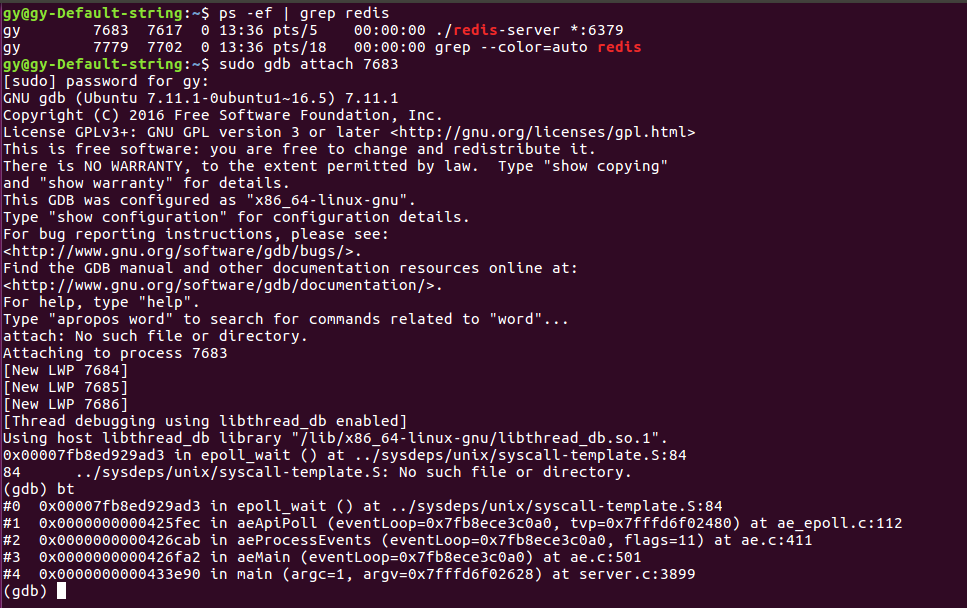    
     可以看到先启动redis-server程序，然后通过**ps -ef | grep redis** 找到该程序运行的pid为7683，然后用sudo权限才能用gdb attach命令，去调试这个已经在运行的程序，可以看到该程序是暂停在epoll_wait()函数处，通过bt命令可以看当前暂停处的从main主函数到当前暂停位置处的所以函数调用栈帧，bt,就是back trace的缩写，往回追踪的意思。可以得出**gdb attach PID** 类似于直接暂停在该程序本身运行的暂停的位置。然后就可以进行调试，如果调试完毕，又不对当前被调试的程序有任何影响的话需要输入**detach** 命令表示gdb和该程序解除绑定，该程序正常运行。然后**quit** 退出就行了。    
   3.**调试core文件**    
     有些时候程序出问题直接崩溃掉的，此时程序就不在运行，我们也不能用attach附加到该程序上，要解决这个问题就需要用**gdb \<filename> \<corename>** 该命令,只要程序在崩溃的时候产生了core文件，就可以利用该文件来定位崩溃的原因。当然，Linux系统默认是不开启程序崩溃时产生core文件这一机制的可以用**ulimit -c** 来查看是否开启了该机制    
     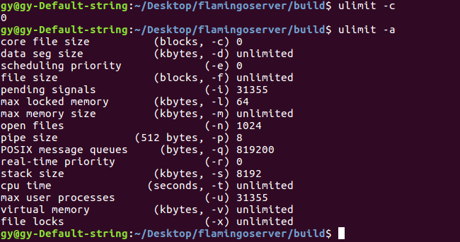     
     可以看到系统默认设置core file size大小为0，意味着不开启程序崩溃产生core文件机制，可以通过命令**ulimit -c unlimited** 开启该机制。这样修改之后只是对这个shell以及其子进程有用。一旦该shell关闭了该项的值又会变为0，服务器程序一般在后台运行，如果关闭了这个shell那么一旦后台程序没有在shell开启的这个时间段崩溃，其实是不能产生core文件，所以我们希望让这个项的值设置为永久生效。方法是将该命令加入到/etc/profile文件中，这种一般需要sudo权限修改系统文件。/etc/profile修改的环境变量对Linux下所以用户都有效。    
     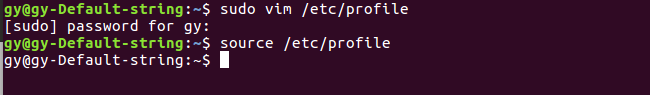    
     然后运行source /etc/profile让该文件立即生效。     
     生成的core文件默认命名是core.pid,当多个程序崩溃的时候如果找不到自己程序的PID,那么可以自定义core文件的命名，    
     > /proc/sys/kernel/core_uses_pid可以控制生成的core文件文件名是否添加PID为扩展，1则为添加，0 则为不添加。/proc/sys/kernel/core_pattern则为控制输出core文件的命名格式   
   
3. GDB常用命令概述    
   先看一个常用命令的表格概述：   
   |命令名称|命令缩写|命令说明|
   |---|:------:|--------|
   |run|r|运行一个程序|
   |continue|c|让暂停(中断)的程序继续运行|
   |next|n|运行到下一行|
   |step|s|如果有调用函数进入函数内部，相当于step into|
   |until|u|运行到指定的行|
   |finish|fi|结束当前调用函数(正常运行完当前函数)，到上一层函数调用处|
   |return|return|结束当前函数调用并返回指定值，到上一层函数调用处|
   |jump|j|将当前函数执行流跳转到指定行或者地址(结果不可预知)|
   |print|p|打印变量或者寄存器的值|
   |backtrace|bt|查看当前线程暂停处调用堆栈|
   |frame|f|切换到当前调用线程的指定堆栈处，具体堆栈通过堆栈序号确定|
   |thread|thread|切换到指定线程|
   |break|b|添加断点|
   |tbreak|tb|添加临时断点|
   |delete|del|删除断点|
   |enable|enable|启用某个断点|
   |disable|disable|禁用某个断点|
   |watch|watch|监视某一个变量或者内存地址的值是否发生变化|
   |list|l|显示源码|
   |info|info|查看断点，线程的信息|
   |ptype|ptype|查看变量类型|
   |disassemble|dis|查看汇编代码|
   |set args||设置程序启动命令行参数|
   |show args||查看程序启动命令行参数|   
   以上只是常用的命令，对与不常用的可以不必记，需要时候再查找，也不必记录缩写，一般全称的意思知道了缩写都是首字母，理解意思大概就能记住了。    

### 常用命令    
这里主要是利用redis源码进行分析，下载对应的redis源码并进行debug版本编译使用一下命令：    
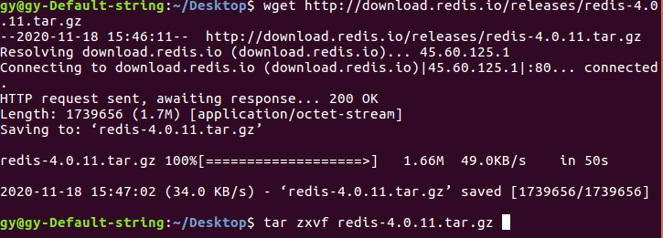    
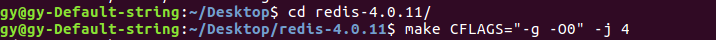   
redis是纯C项目所以CFLAGS选项，C++项目对应的是CXXFLAGS选项，选项是前面所讲的“-g -O0”编译调试信息且不优化代码。在src目录下的redis-server,redis-cli就是redis的服务器端和客户端的可执行程序。        
**1.常用命令详解（上）**     
  
- **run**
  run命令是是启动程序，如果程序已经启动了那么run就是重新启动这个程序    
  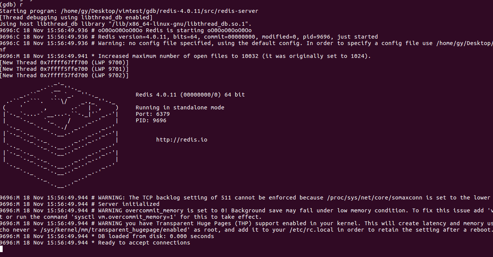    
  程序一直在运行，没有终止，这是因为还没有设置任何断点，就相当于没有开gdb,运行程序一样，Ctrl+C中断程序，然后再次运行run，会询问我们是否要再次运行程序    
  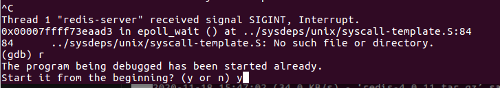    
- **continue**
  当GDB触发断点或者Ctrl+C命令中断下来，想让程序继续运行，只要输入**continue** 命令就行，如果continue命令继续触发断点，GDB会再次中断下来   
  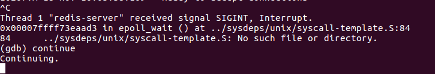    
- **break**   
  添加断点命令简写为b，一共有3种方式添加断点：    
  1.**break functionName**,在函数名处入口处添加断点     
  2.**break LineNo**,在当前文件行号为LineNo处添加一个断点     
  3.**break filename:LineNo**，在filename文件的LineNo行处添加一个断点   
  例如程序入口处为main，可以在main函数设置断点，执行run时遇到该断点会停下来，断点停下以前的代码都会执行，停下处的代码实际没有执行，同时我们知道redis-server默认端口是6379，这个端口肯定是操作系统通过调用bind()函数绑定的，通过文件搜索发现在anet.c 441行处，往这两个地方添加断点。    
  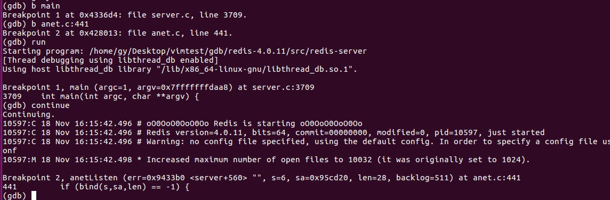    
  运行第一次停在第一个断点main处，continue停在第二个断点bind()函数处。   
- **backtrace**    
  查看当前调用堆栈，可以查看上面的bind()断点处，可以知道当前停在的是anet.c:441 行可以452行添加个断点查看当前位置的堆栈：   
  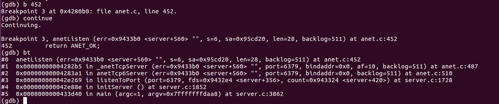   
  可以看到在第三个断点anet.c:452行停下来，同时查看堆栈，可以看到从该断点处一直回溯到main主函数的函数调用。    
- **frame**    
  可以看到上面一共有6层堆栈，最顶层是main()函数，最底层是anetListen()函数，堆栈编号为0~5，如果切换到其他堆栈可以使用**frame 堆栈编号(不加#)** 可以一次切换至栈顶，在切换回0号也就是最开始的位置   
  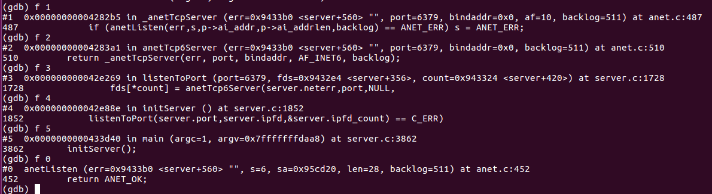    
  可以看到每个函数调用的顺序    
- **info break、enable、disable、delete**    
  查看，启用，禁用，删除断点的命令  
  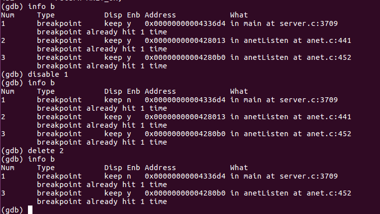    
  可以看到断点的编号，是否启用，地址，以及描述等信息。   
- **list**    
  list命令和print命令都是GDB调试中使用频率最高的命令，list列出当前暂停处默认前后10行源代码，也可以，利用list +,list - 来显示多少行代码，第一次list默认显示当前暂停处前后10行，后面的list都是只后面的10 行，只要显式用list + 或者list - 往前或者往后显示多少行代码。当然用**help list** 可以查看list的使用，还可以list FILENAME:LINENO显示某个文件某行处前后的代码。实用效果不大，只有调试的附加一般需要看源代码，GDB是一个调试工具，不是一个阅读源码工具。   
  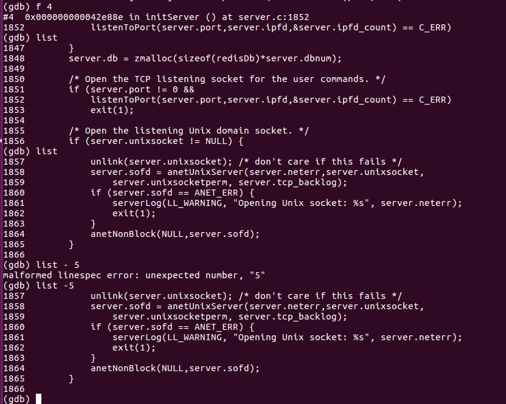    
- **print、ptype**   
  print可以方便查看变量的值，也可以修改当前内存中变量的值，切换当前断点到堆栈#4，然后打印下面3个变量的值    
  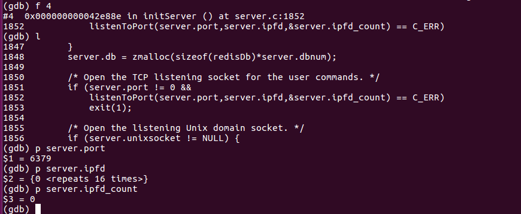    
  可以看到当前的server结构中的port值为6379，其中server.ipfd显示为{0 \<repeats16 times>},这是GDB显示字符串或者字符数据特有方式，当内存中某个数字连续重复就会以这种方式显示，节约空间。     
  print同意也可以改变内存中变量的值：    
  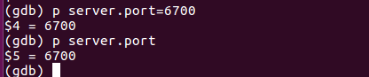    
  显示的修改端口值为6700,这个可以在调试程序时测试错误数据的时候使用，看程序是不是能正确处理这种数据。    
  ptype可以查看变量的类型    
  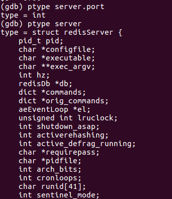     
  可以看到server是一个结构体      

**2.常用命令详解（中）**        
- **info thread、thread**    
  info可以搭配断点break和thread,查看断点和线程信息,先通过delete删除所以断点信息，然后在查看线程信息        
  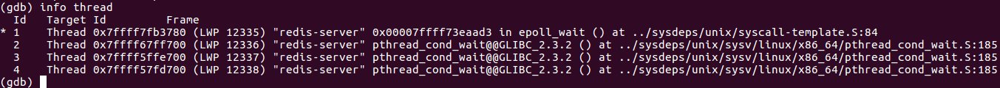    
  可以看到一共产生4个线程包括1个主线程，3个工作线程，线程编号（Id那一列）分别为1，2，3，4，三个工作线程为2，3，4分别阻塞在Linux API thread_cond_wait()处，而主线程阻塞在epoll_wait()处。虽然前面那一列叫Id的，但那并不是真正的线程id真正的是LWP后面的数字表示线程ID,早些LINUX是通过进程模拟线程实现的，也就是(Light Weight Process)轻量级进程，一直延续名字使用至今。线程前面的\*号只是表明当前工作在哪个线程，不表示是否是主线程。可以使用bt查看当前调用堆栈，有主函数的那个线程就是主线程    
  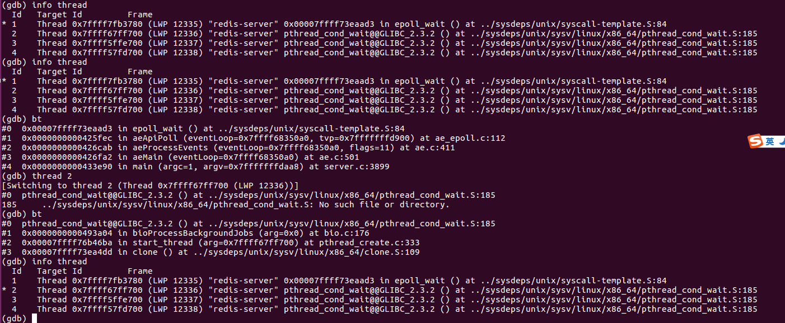    
  可以看到线程1的堆栈调用，最顶层是main函数所以线程1是主线程，可以通过**thread 线程编号** 切换线程，看到切换到2号线程，调用堆栈并没有主函数，所以不是主线程，同时可以看到线程2前面的\*号，表示当前切换到线程2。     
  info命令还可以查看当前函数的参数组合命令是**info args**    
  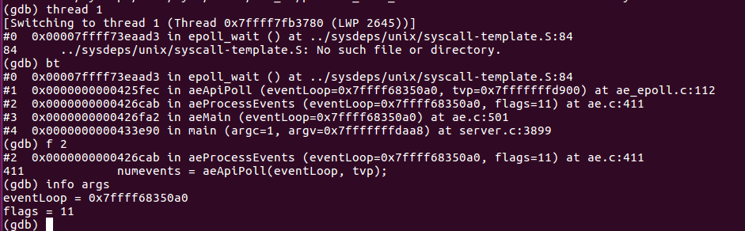    
  可以看到当前在函数aeApiPoll(eventLoop,tvp)函数中，参数值为一个地址eventLoop和一个数值11。   
- **next、step、until、finish、return、jump**    
  这几个命令是调试程序的几个控制命令流next执行到下一行并不会进入到函数内部。有一个例子：    
  ```
  int a=1;
  if(a==2){
    print("a is 2\n");
  }
  int b=10;
  print("%d\n",b);
  ```   
  如过当前程序中断在第二行，说明a=1,此时输入**next** 命令会调到int b=1和一行。next术语叫做单步步过，遇到函数，不会进入函数内部。    
  **step** 就是遇到函数也会进入函数内部，但有个细节，如果函数参数是函数，那么根据函数栈帧原理右边的参数先入栈，所以先执行右边参数函数，在向左执行，最后进入该函数。如果需要执行完该函数直接返回上一层函数调用，可以使用**finish** 命令，它会正常执行完当前函数，返回上一层函数，而**return** 则是在当前位置处直接返回，而且可以认为规定返回值，其实就是说白了，你可以自定义函数返回值，然后返回上一层调用，看产生的效果。     
  **until \<LineNo>** 命令可以执行到某一行暂停，**jump \<location>** 命令可以跳转到某个函数或者行号执行，其行为是不可控制的，可能中间某些重要变量你都没有初始化。

**3.常用命令详解（下）**   
- **disassemble**    
  当进行一些高级调试时候，可能需要去查看某段代码的汇编指令，或者调试一些没有调试信息的发布版本程序时，就需要**disassemble** 命令去看某段代码的汇编代码    
  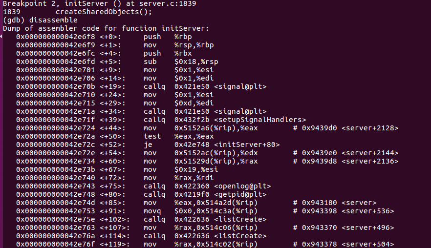    
- **set args、show args**   
  很多程序需要传递命令行参数，在GDB调试中可能在启动GDB的时候就可以输入参数形如**gdb filename args**  这样，但这是不行的，需要在使用**run** 命令之前，使用**set args 参数内容** 来设置命令行参数。如果参数本身有空格，可以用双引号括起来，如果想要清空参数set args不接任何内容就是空参数    
  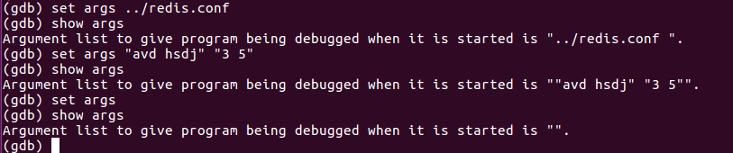    
- **tbreak**    
  临时断点，一旦该断点被触发，也就是触发一次后就会自动删除   
  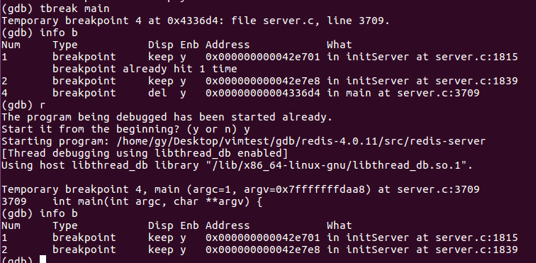     
- **watch**    
  watch命令可以监控某个变量或者内存的值，当某个变量的值或者某个内存的值发生变化，那么就会产生这个中断，被观察的变量或者内存地址处会产生一个watch point（观察点）。watch是通过添加硬件中断来实现的。    
  ```
  # 形式一
  int i;
  watch i

  # 形式二
  char* p;
  watch p和watch *p

  # 形式三 
  char buf[128];
  watch buf
  ```    
  watch p 和watch \*p是有区别的前者是\*(&p)是指针p本身，后者是p所指向的内容。    
  这里对buf的128个数据进行监视此时不是硬件断点，而是软中断实现的，用软中断去检查内存变量比较浪费内存资源，精确地址指明是硬件中断。当设置的是一个局部变量的时候，局部变量失效时候观察点也失效，GDB可能会有提示信息。     
- **display**   
  display命令监视的变量或者内存地址，每次程序中断下来都会自动输出这些值例如：   
  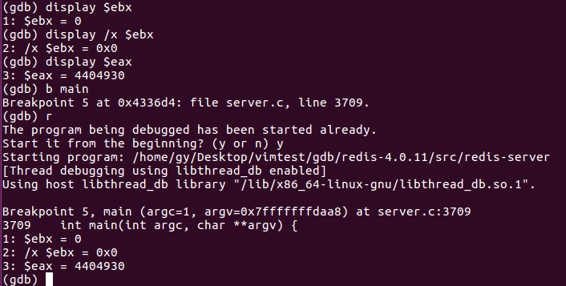     
  以十进制和16进制显示寄存器ebx的值，还有十进制显示寄存器eax的值。可以使用info display显示当前的值，**delete display** 删除全部值，也可以**delete display 编号** 删除对应的值。    

### 调试技巧
1. 调试技巧（上）
   当使用print命令打印一个字符串或者一个字符数组时，如果字符串太长，print命令默认显示不全的可以通过GDB中输入**set print element 0** 命令设置一下，这样再次使用print就可以显示该变量所有字符串。      
   有时候程序某些信号需要处理，例如Ctrl+C信号，默认会被GDB先接收，导致无法模拟程序收到这一信号可以用两种方式解决这个问题：    
  
   - 在GDB中手动利用signal函数给程序发送信号，例如**signal SIGINT**   
   - 改变GDB处理信号的设置，通过**handle SIGINT nostop print pass**命令告诉GDB收到SIGINT信号时不要停止，把信号传递给调试的目标程序。     
  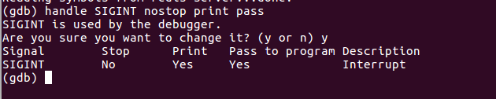     
2. 调试技巧（下）   
- **多线程下禁止线程切换**   
  假设现在有5个线程，除了主线程，工作线程都是这样的函数：    
  ```
  void thread_proc(void* arg){
    //代码1
    //代码2
    //代码3
    //代码4
    //代码5
    //代码6
    //代码7
    //代码8
    //代码9
  }
  ```   
  假设四个工作线程分别为A,B,C,D，假设GDB现在正处于工作线程A的代码2处，此时输入命令next，我们希望调到线程A的代码3处，但由于系统的线程调动，将CPU的时间片切换到线程B,C,D,所以可能GDB下一步会执行任何一行代码，为了解决这个问题可以舍得将GDB调试时的执行线程流控制在当前线程的命令:**set scheduler-locking on** ,当然也可以用命令关闭这一选项**set scheduler-locking off** 。    
- **条件断点**    
  在实际调试中一般会用到三种断点，普通断点，硬件断点，条件断点。    
  硬件断点又叫数据断点，在watch命令已经介绍，条件断点就是满足某些条件才会触发的断点，先举一个例子：   
  ```
  void do_something_fun(int i){
    i++;
    i=100*i;
  }

  int main(){
    for(int i=0;i<1000;i++){
      do_something_fun(i);
    }
    return 0;
  }
  ```   
  假如希望当变量i==500时候，进入do_something_fun()函数追踪一下，条件断点就可以在不改变代码的情况下做到，添加条件断点的命令**break [LineNo] if [condition]** ,当然这里的行号必须是合理的不然不会触发这个断点。也可以在已有的普通断点的基础上利用命令**condition 断点编号  触发条件** 来将普通断点变为条件断点。   
- **使用GDB调试多进程程序**   
  这里说的多进程是指fork()函数产生的子进程，GDB有个命令可以追踪父进程或者子进程，   
  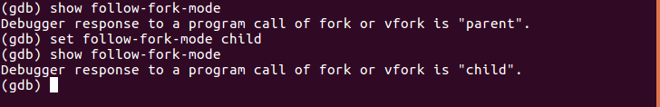    

### 基于GDB的升级调试工具     
GDB的list显示源码方式不是很友好，所以GDB为了更好的显示源码，GDB官方自带的GDB TUI可以解决这个问题     
**1.GDB TUI--在GDB中显示源码**      
   开启GDB TUI模式有两个方法    
   方法一：使用gdbtui命令或者gdb-tui命令开启一个调试。    
   > gdbtui -q 需要调试的程序名   

   方法二：直接使用GDB调试代码在需要的时候用组合键**Ctrl+X+A调出GDB TUI。   
   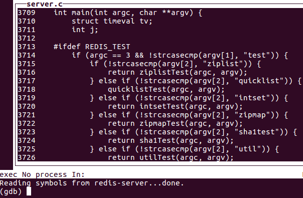    
   默认情况下，GDB TUI模式会显示command窗口和源代码窗口，还有其他窗口：   

   - (cmd)command命令窗口，可以输入调试指令   
   - （src）source源代码窗口，显示当前行，断点等信息    
   - （asm）assembly 汇编代码窗口   
   - （reg）register 寄存器窗口 
    
  可以通过**layout 窗口类型** 命令选择自己需要的窗口layout命令还可以修改窗口布局，输入**help layout** 可以获得详细使用信息。另外还可以通过**winheight 窗口类型 +|- Lines** 来改变窗口的高度大小，详情可以用**help winheight** 。   
  当我们开启GDB TUI模式的时候很多键都失去了原来的功能那是因为有多个窗口，所以提供了一个窗口焦点切换，这样我们下次输入的按键就会注入这个窗口。**focus next|prev** 可以在窗口之间切换，开启GDB TUI模式默认方向键和PageUp/PageDown都是用来控制src窗口的，所以要上下键切换命令可以通过Ctrl+N/Ctrl+P获取。**help focus** 可以了解更多关于focus命令。   
**2.GDB扩展工具-CGDB**    
  GDB TUI看起来不错，但容易造成花屏，特别是用Ctrl+X+A切换的时候，CGDB是对GDB的扩展，其实是包裹了一层GDB,DGB中的命令CGDB中也能用。可以直接去[官网](cgdb.github.io)安装，也可以直接进行二进制文件安装：   
  > sudo apt install cgdb   

  安装成功后和gdb一样直接调试代码启动界面如下：   
  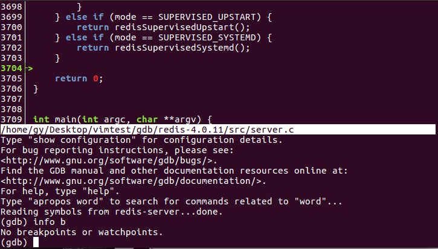   
  默认上部分为源代码窗口，显示调试过程的代码，下部分为GDB原来的命令窗口，默认焦点在命令窗口，如果想焦点切换为上部分窗口ESC,之后再按i将焦点切换回命令窗口(和vim 插入模式类似)。     
  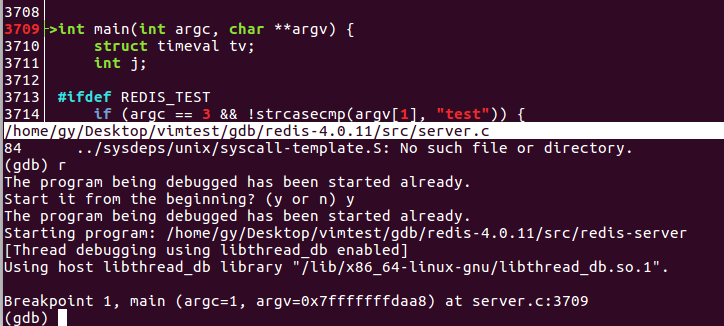    
  可以看到断点处行号会显示红色，另外绿色箭头始终指向当前执行的行。    
  GDB比原始的GDB TUI模式在代码显示方面改进了许多，但实际使用时print无法显示字符串类型中的中文，要么乱码，要么不显示。总的来说还是很不错的。   
  
   