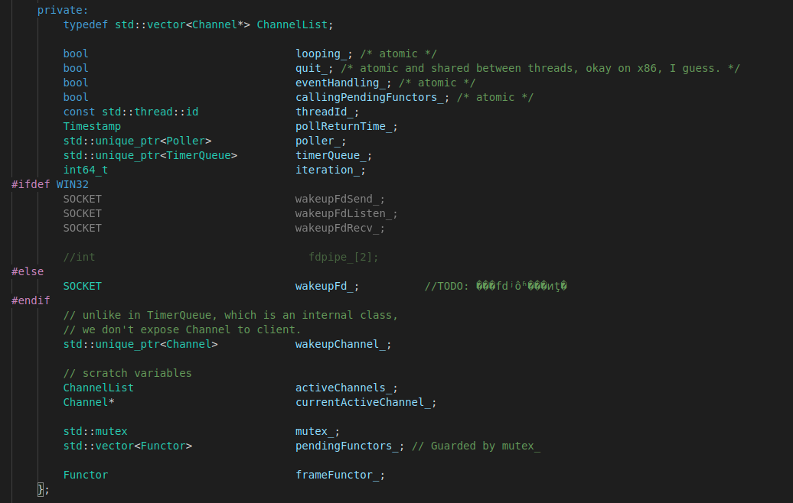
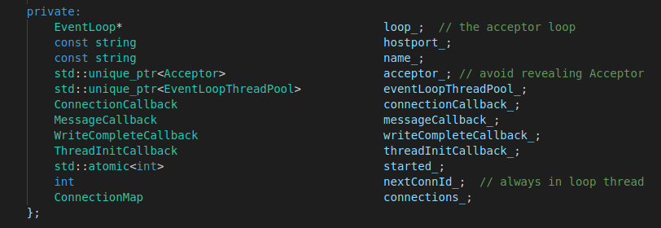

## mudou网络库解析   
### 写在前面    
mudou网络库是我当时学习某个开源项目叫做[Flamingo](https://github.com/balloonwj/flamingo)，这是一个纯c++开发的即时通讯软件，当时我并不知道mudou网络库，只是当初想要对c++服务器开发做一个深入了解，看看人家服务器端项目怎么写的，于是找到了这个项目。这个项目主要包括flamingoserver服务端,flamingoclient客户端两部分。其中flamingoserver服务端里面就包含了mudou库。其中的net和base文件夹就是属于mudou源码的大部分。我这里讲解的是mudou源码中关于整个网络库的一部分，我也去[mudou源码](https://github.com/chenshou/mudou)看过，核心这里还是讲解到的，所以我建议先看完本库的源码再去github上看陈硕老师的源码集合。     
由于当时我看flamingo源码时也不知道这块是属于mudou源码，所以也没有查资料，当时自己也花了很多时间摸索如何去看flamingo源码（第一次看一个完整的源码也没有经验），后来看反复看了很久弄通了整个服务器模块的逻辑，整个flamingo服务器端包括：    
- 网络库底层逻辑
- 数据库逻辑   
- 上层业务逻辑    
这里的网络库底层逻辑就是这里的mudou网络库，上层业务就是实现flamingo即时通讯类似qq这样功能软件所有处理的业务，数据库当然就是连接数据库这块。     
我也是通过阅读这个源码才了解到mudou库，这也是我学习到的第一个开源项目。所有写一遍文章，来记录自己对mudou库的理解，可能不是很到位，我会在给一张建议阅读mudou网络库的代码顺序，我觉得一个好的阅读顺序是学习源码的好方式。      
```
1.首先是base文件夹    
Singleton.h->Timestamp.h/cpp->ConfigFileReader.h/cpp->AsyncLog.h/cpp->Buffer.h/cpp->Endian.h->Callbacks.h->Sockets.h/cpp->InetAddress.h/cpp->    
channel.h/cpp->Poller.h/cpp->PollPoller.h/cpp->EpollPoller.h/cpp->SelectPoller.h/cpp->    
Timer.h/cpp->TimerId.h->TimerQueue.h/cpp->      

```  
以上只是个人的阅读顺序，希望你能有一个大概的网络API概念，包括套接字，bind(),listen(),connect()等函数，知道是干什么用的。然后阅读源码时候你会发现大佬写的代码都是很规范很漂亮的，文件夹的命名和文件的命名都是很规范，都能给你一定信息。我会带着上述的代码阅读顺序，逐个解析各个文件的作用，包括函数，和如何和其他连接起来的。    
### 阅读源码    
> 我觉得看懂一个类的作用和实现首先需要看的是类声明，先看类的成员变量，再看类的函数声明，再看类的成员函数的实现(细节)，最后总结归纳出该类的作用和对外接口。所以我会一次解读每个文件中每个类。每个类的分析都会有，类声明分析、重要类函数实现分析、类作用和对外接口，三个部分。    


## Singleton.h   
**1.类声明分析**    
```
template<typename T>
class Singleton
{
public:
	static T& Instance()
	{
		//pthread_once(&ponce_, &Singleton::init);
		if (nullptr == value_)
		{
			value_ = new T();
		}
		return *value_;
	}

private:
	Singleton();
	~Singleton() = default;

	Singleton(const Singleton&) = delete;
	Singleton& operator=(const Singleton&) = delete;

	static void init()
	{
		value_ = new T();
		//::atexit(destroy);
	}

	static void destroy()
	{
		delete value_;
	}

private:
	//static pthread_once_t ponce_;
	static T*             value_;
};

//template<typename T>
//pthread_once_t Singleton<T>::ponce_ = PTHREAD_ONCE_INIT;

template<typename T>
T* Singleton<T>::value_ = nullptr;
```
**2.重要类函数实现分析**    
这个是看名字就知道是个单例模式的类，准确说是个模板类，由于类声明和实现都在一起所以在这里直接看各个函数的作用。这个模板类成员函数是静态，也只有一个静态成员，指向模板类型的指针，同时构造函数是私有的也就是不能直接构造这个类的对象。只能用类的静态成员函数。对外提供了一个实例化函数**Instance()** 只会返回至始至终在内存中的某个对象，如果该对象已经存在，再次调用只会返回该对象，如果还没有该对象则会new一个新的然后返回。    
**3.类作用及对外接口总结**    
作用：当使用该类去得某个对象的时候在程序中只会出现一个该类型对象。使用的方式是直接**Signleton\<ClassType>::Instance()** 就可以取得对象。以后会再使用该方式取的对象永远是那一个。      

## Timestamp.h和Timestamp.cpp      
**1.类声明分析**    
    
该类是一个保存自1970年1月1日到某一时间的微秒数，可以计算一下足够我们使用，因为是用一个64位的数表示。
**2.重要类函数实现分析**    
构造函数默认的是一个微妙数是0的我们用来表示无效时间，还有一个显式构造函数。  
```
Timestamp& operator+=(Timestamp lhs)   # 将lhs对象的时间数加到该对象上，并返回该对象   
Timestamp& swap(Timestamp that)        # 交换该对象和that对象的时间数   
string toString() const;               # 以  "秒数：微秒数"  的字符形式返回该对象表示的时间
string toFormattedString(bool showMicroseconds = true) const; #  以 "年月日 时:分:秒:w微秒" 的形式返回该对象所表示的时间(如果参数为true则显示微秒，否则不显示)
static Timestamp now();                # 返回调用该函数时的当前时间对象
static Timestamp invalid();            # 返回一个无效的时间对象
```    
**3.类作用及对外接口总结**    
该类就是一个表示时间的类，为网络库里面的定时器事件提供对象。对外一般用该对象保存时间，作为参数使用    

## ConfigFileReader.h和ConfigFileReader.cpp       
**1.类声明分析**    
   
读取配置文件然后将配置以map的形式保存到对象中。说白了就是能够解析配置文件   
**2.重要类函数实现分析**   
```
CConfigFileReader(const char* filename)     # 构造对象的时候会自动调用loadFile()函数，加载对应的配置文件并把配置文件的配置以key,value的形式保存在该类的map中
char* getConfigName(const char* name);      # 得到配置的某个key所对应的value   
int setConfigValue(const char* name, const char*  value);   # 设置对应的key，value的值，并且会调用writeFile()写入对应的文件中   
```
**3.类作用及对外接口总结**  
这个类就是读取配置文件，把配置文件的每一行的=两步以字符串的形式读入map中，支持"#"作为注释，也支持空string左右空白，这是通过trimSpace()函数实现的。   
对外的接口就是构造对象之后通过**getConfigName()** 获取相应的配置值，和**setConfigValue()** 设置相应的key,value。支持类似下面的配置文件     
    
其中#号是注释，而且空格是忽略的向  "listenip":"0.0.0.0" 会以这样的形式保存在map中，每行只以第一个=号为分隔key，value。   

## AsyncLog.h和AsyncLog.cpp     
**1.类声明分析**   
   
    
可以看到又是一个静态类，其实静态类也是类似于单例模式，因为你只能有一组静态成员变量，可以看到里面的成员，其中m_hLogFile是一个打开文件句柄，，表示要写入日志到某个文件，m_bToFile是输出日志到文件还是控制台，m_bTruncateLongLog表示是否截断长日志，一般日志保存在文件中一行就表示写了一次日志信息，如果一行太长，这里是一行最长256个字节。m_nFileRollSize是表示一个日志文件最长为多少，这里默认为10MB如果超过了就换一个文件，m_listLinesToWrite是一个list双向链表保存着要写入的日志，因为，日志是采用异步的方式进行写入文件的，在主线程里，每条日志都是放入这个list中，然后会有一个单独的线程去将list中的日志写入文件中。init()函数需要使用前调用，然后就是3个output函数是供外部调用的。   
**2.重要类函数实现分析**   
    
我们可以看到日志分了好多级别，只有高于当前日志级别也就是m_ncurrentLevel才能正常输入，但是最高级别CRITICAL除外，外部调用的时候我们只需要使用LOGT(...)之类的函数，支持格式化，也就是%s,%d，之类的，这是因为利用了宏定义，还有va_list。   
- init()  
  初始化函数，这是我们能够正确使用LOGF(...)之前需要做的工作。在函数内部主要是如果有文件名或者正确的值，那么m_strFileName就有效，否则就是一个空的字符串。然后就是init()会保存当前的进程ID,然后就是新建一个线程用来处理m_listLinesTowrite中的日志信息写入对应的文件。新线程绑定的是writeThreadProc()内部私有函数，该函数就是不断的从m_listLinesToWrite链表中拿出数据写入对应的文件中，如果没有日志信息可写会睡眠该线程。    
- uninit()    
  结束整个日志工作的函数，一旦调用，会等待写日志线程结束，然后关闭存储日志文件句柄，整个异步日志类停止工作。    
- setLevel()   
  设置整个日志过程中的日志级别默认系统开始时日志时INFO级别     
- isRunning()    
  判断写日志线程是否工作，当进入writeThreadPrco()工作线程绑定函数时m_bRunning设为True    
- output()    
  有3种日志输出文件，一种是普通信息，另外一种是加入了调用该函数的函数文件名，和行号，最后一种是日志信息的二进制写入文件。内部首先会调用makeLinePrefix()私有函数生成日志信息前缀形如"[日志级别][生成该日志时间][调用该函数的线程ID]"这样的前缀，后面才是真正的日志信息。然后处理日志正文，是通过va_list去读取格式字符串，得到一个完整的日志正文信息，然后如果开启了日志截断，则日志正文最多256个字符，如果是写入文件末尾追加一个换行符号，也就是日志文件每一行代表一个日志信息。然后利用锁和条件变量加入该信息到m_listLinesToWrite中，同时唤醒工作线程。如果日志级别是FATAL，那么会在工作台显示该日志，然后将该日志同步写入日志文件，然后终止整个程序。   
     
  这是我写的一个demo代码，下面的结果     
      
  可以看到默认的日志等级是INFO,低于INFO的DEBUG级别并没有输出，同时截断了过长的日志。   
      
  可以看到有一个日志文件以"文件名.日期.进程ID.log"的形式保存日志文件。   
  
**3.类作用及对外接口总结**    
这就是一个普通的异步日志类文件，对外的接口就是调用init()函数，然后使用宏定义，也就是    
    
这里面的LOGI(...)等形式的函数就可以输出日志到对应的文件。里面的技术主要是一个异步日志，采用一个线程专门写日志到文件，在其他调用LOGI(...)函数中只是包装好日志信息到内存链表中，然后交给线程处理函数写日志到文件。     


## Buffer.h和Buffer.cpp        
**1.类声明分析**    
    
整个buffer其实就是由一个vector组成的空间，然后外加两个索引分别表示可读和可写     
**2.重要类函数实现分析**    
     
一个vector被readerIndex_,writerIndex_分隔成3部分，第一部分为前置保留的区域[0,readerIndex_)，然后就是[readerIndex_,writerIndex_)表示的可读部分，最后就是[writerIndex,size)可写部分。  
通过移动可读和可写索引来向buffer中写或者读数据。       
```
explicit Buffer(size_t initialSize = kInitialSize)
			: buffer_(kCheapPrepend + initialSize),
			readerIndex_(kCheapPrepend),
			writerIndex_(kCheapPrepend)   #显式构造函数，默认前置的空间大小是8字节，初始化空间为1024字节所以开始时buffer_大小为1032字节。    
const char* peek() const     #可读数据的指针   
const char* findString(const char* targetStr) const     #在可读区域查找字符串，找到返回，没找到返回nullptr    
const char* findCRLF() const     #在可读范围内查找"\r\n"    
const char* findCRLF(const char* start) const     #在start(必须在可读区域)到可读区域末尾查找"\r\n"     
bool retrieve(size_t len)     #读取一定数量字节     
std::string retrieveAsString(size_t len)    #以字符串的形式读取一定字节    
void append(const std::string& str)     #写入字符串     
void appendInt64(int64_t x)             #以网络字节序写入buffer一个Int64     
int64_t readInt64()                     #以从网络字节序读出一个Int64为主机字节序     
bool prepend(const void* /*restrict*/ data, size_t len)    #在可读区域前面写入数据    
void shrink(size_t reserve)             #调整整个buffer到合适大小   
int32_t Buffer::readFd(int fd, int* savedErrno)    #最重要的一个函数从fd中读数据到buffer中如果可写区域小于65536则开另外一个数组临时保存fd中的数据然后再写入buffer中，确保能读完不大于65536个自己的fd数据             
```
**3.类作用及对外接口总结**    
Buffer是整个mudou网络库用来存储数据的中间类，提供了很多适合网络编程的接口，向readFd()等，都是针对网络库设计的Buffer.其实也很简单就是一个vector，然后两个变量记录了索引，将整个区间可读，可写，还有前置区域都划分的很清楚。     

## Endian.h        
**1.类声明分析**    
```
inline uint64_t hostToNetwork64(uint64_t host64)    
inline uint32_t hostToNetwork64(uint32_t host32)       
inline uint16_t hostToNetwork64(uint16_t host16)    
inline uint64_t networkToHost64(uint64_t net64)     
inline uint32_t networkToHost64(uint32_t net32)          
inline uint16_t networkToHost16(uint16_t net16)        
```
**2.重要类函数实现分析**     
为不同主机和网络字节序，统一了接口，有64位，32位，16位，主机字节序和网络字节序的互换。确保网络编程数据的正常交换。    
**3.类作用及对外接口总结**    
根据不同的数据需要调用不同的函数，跟后续的Socket联合使用。    


## Callbacks.h       
**1.类声明分析**    
```
template<typename To, typename From>
inline To implicit_cast(From const& f)
{
    return f;
}                   #隐式转化函数

template<typename To, typename From>    
inline To down_cast(From* f)       #向下转化，内部是调用dynamic_cast   

emplate<typename To, typename From>
inline std::shared_ptr<To> down_pointer_cast(const std::shared_ptr<From> & f)         #指针向下转化，内部也是调用dynamic_cast    
```
**2.重要类函数实现分析**    
```

    class Buffer;
    class TcpConnection;
    typedef std::shared_ptr<TcpConnection> TcpConnectionPtr;
    typedef std::function<void()> TimerCallback;
    typedef std::function<void(const TcpConnectionPtr&)> ConnectionCallback;
    typedef std::function<void(const TcpConnectionPtr&)> CloseCallback;
    typedef std::function<void(const TcpConnectionPtr&)> WriteCompleteCallback;
    typedef std::function<void(const TcpConnectionPtr&, size_t)> HighWaterMarkCallback;

    // the data has been read to (buf, len)
    typedef std::function<void(const TcpConnectionPtr&, Buffer*, Timestamp)> MessageCallback;

    void defaultConnectionCallback(const TcpConnectionPtr& conn);
    void defaultMessageCallback(const TcpConnectionPtr& conn, Buffer* buffer, Timestamp receiveTime);
```    
主要定义了一些回调函数类型，主要是建立连接的ConnectionCallback,定时器回调函数类型TimerCallback,关闭连接回调类型closeCallback,写数据完成WriteCompleteCallback,还有最重要的收发数据回调MessageCallback,然后有两个默认的回调函数。一个是建立连接的时候需要调用，另外一个是收发数据时候需要调用。     

**3.类作用及对外接口总结**     
整个文件定义了一些回调函数别名，和一些类型转化，类型转化主要有两个，还有一些回调函数，主要是建立连接和消息处理的回调函数。    


## Sockets.h和Sockets.cpp       
**1.类声明分析**    
这个主要是对socket的封装     
```
explicit Socket(int sockfd) : sockfd_(sockfd)    #显示构造函数
SOCKET fd() const { return sockfd_; }            
bool getTcpInfoString(char* buf, int len) const; #得到Tcp连接信息 
void bindAddress(const InetAddress& localaddr)   #socketFd绑定某个地址
void listen();   							     #socket转化为监听套接字
int accept(InetAddress* peeraddr);     			 #accept()函数的包装，接收某个连接，返回连接套接字     
void shutdownWrite();                            #关闭套接字写
void setTcpNoDelay(bool on);    				 #设置连接属性
void setReuseAddr(bool on);     
void setReusePort(bool on);    
void setKeepAlive(bool on);     
private:
	const SOCKET sockfd_;           #唯一成员变量一个常量的普通socketFd
```
**2.重要类函数实现分析**    
```
SOCKET createOrDie();  #创建非阻塞fd,失败就结束进程(函数名的OrDie就是这个意思)
SOCKET createNonblockingOrDie(); #创建非阻塞fd，失败就结束进程

void setNonBlockAndCloseOnExec(SOCKET sockfd);  #设置socket属性为非阻塞和在子程序中关闭

void setReuseAddr(SOCKET sockfd, bool on);     #socket重复使用某个地址
void setReusePort(SOCKET sockfd, bool on);	   #socket重复使用某个端口    

SOCKET connect(SOCKET sockfd, const struct sockaddr_in& addr); #连接某个地址
void bindOrDie(SOCKET sockfd, const struct sockaddr_in& addr); #绑定某个地址到socket   
SOCKET accept(SOCKET sockfd, struct sockaddr_in* addr);   #接收连接到某个socket的连接   
int32_t read(SOCKET sockfd, void *buf, int32_t count);    #从套接字读数据
ssize_t readv(SOCKET sockfd, const struct iovec *iov, int iovcnt);#从套接字读数据到多个内存    
int32_t write(SOCKET sockfd, const void *buf, int32_t count);#向套接字写数据
void close(SOCKET sockfd);  #关闭套接字内部也是调用全局close()
void shutdownWrite(SOCKET sockfd); #停止套接字数据传输，内部调用shutdown()函数    

void toIpPort(char* buf, size_t size, const struct sockaddr_in& addr);#某个地址的ip和port转化为字符串    
void toIp(char* buf, size_t size, const struct sockaddr_in& addr);#某个地址的ip转化为字符串    
void fromIpPort(const char* ip, uint16_t port, struct sockaddr_in* addr);# 从字符串和port，生成一个地址     

int getSocketError(SOCKET sockfd);#得打某个套接字相关的错误   

const struct sockaddr* sockaddr_cast(const struct sockaddr_in* addr);#地址转化sockaddr和sockaddr_in之间的转化
struct sockaddr* sockaddr_cast(struct sockaddr_in* addr);
const struct sockaddr_in* sockaddr_in_cast(const struct sockaddr* addr);
struct sockaddr_in* sockaddr_in_cast(struct sockaddr* addr);

struct sockaddr_in getLocalAddr(SOCKET sockfd);#得到本地地址    
struct sockaddr_in getPeerAddr(SOCKET sockfd);#得到对端地址
bool isSelfConnect(SOCKET sockfd);#判断是不是自己连接自己   
```   
和网络Socket相关的一些函数。    
**3.类作用及对外接口总结**    
该类只是对普通socket的包装，然后就是对网络变成的bind(),listen(),connect(),accept()函数的封装。    


## InetAddress.h和InetAddress.cpp        
**1.类声明分析**     
```
explicit InetAddress(uint16_t port = 0, bool loopbackOnly = false);
InetAddress(const std::string& ip, uint16_t port);
InetAddress(const struct sockaddr_in& addr);
std::string toIp() const;
std::string toIpPort() const;
uint16_t toPort() const;
const struct sockaddr_in& getSockAddrInet() const { return addr_; }
void setSockAddrInet(const struct sockaddr_in& addr) { addr_ = addr; }

uint32_t ipNetEndian() const { return addr_.sin_addr.s_addr; }
uint16_t portNetEndian() const { return addr_.sin_port; }
static bool resolve(const std::string& hostname, InetAddress* result); 
private:
    struct sockaddr_in      addr_;
```  
该类只是sockaddr_in的包装    
**2.重要类函数实现分析**   
3种构造函数都可以构造一个网络地址，可以用本地地址，也可以从ip.port构造，也可以从一个sockaddr_in地址构造，resolve()是解析主机名然后生成一个地址。  
**3.类作用及对外接口总结**    
这个类主要是对地址的封装，方便一些接口和对象的统一使用     

------------------------------------------------------------------------ 
------------------------------------------------------------------------

------------------------------------------------------------------------
现在才是整个网络库的基础，包括一些常用概念channel,EventLoop,Poller等。   

## Channel.h和Channel.cpp       
**1.类声明分析**    
     
可以看到这里面的成员变量，其实channel是整个mudou网络库应该是最底层的一个抽象出来的类，这个类主要的是为了处理socket不同事件，例如可读，可写，或者错误之类的事件，channel，就好比一个通道，socket描述了一个连接的一方，一个channel就绑定了一个socket，然后进行相应的数据处理。      
所以可以看到某个channel肯定是绑定某个socket的，那么就必须有fd_,同时采用的是one thread,one loop 的模型，所以这个channel肯定是属于某个loop_,还有这个socket，需要加入poll，或者epoll模型中监听某个事件，所以有events_,然后就是结果所以有revents_,最后就是每个channel是要被上层功能所包含的，例如TcpConnection,那么该channel是否绑定到某个类上，就需要指针tie_,然后就是可读，可写，关闭，错误回调函数，其中可读的都是有时间戳为参数的。     
**2.重要类函数实现分析**   
```
Channel::Channel(EventLoop* loop, int fd__)    #构造函数，绑定某个fd,和属于某个loop     
update()         #在该loop中的poll模型中更新监控的事件   
enableReading()  #让该fd在poll模型中监控可读事件    
disableAll()     #让该fd移除对应的poll模型中监控事件，就是啥也不监控   
remove()         #从属于的poll模型中移除该channel绑定的事件   
handleEvent()    #根据poll模型中revent_调用对应的函数执行     
reventsToString() #把revents_转化为字符串，方便日志的记录
```
**3.类作用及对外接口总结**   
一个channel对应一个socket,属于某个loop,可以设置不同的待监控事件，根据结果，调用不同的设置的回调函数处理相应的事件发生，最主要的函数应该就是update()，它会调用loop中的poll模型中的更新channel函数去更新相应的channel,然后如果channel被激活，也就是revents_有事件，那么会调用handleEvent()函数去处理相应的事件。      

--------------------------------------------------------------------

## Poller.h和Poller.cpp       
下面提到的几个类都是以该类为基类，派生出来的，是为了常用的三种非阻塞IO模型，select,poll,epoll提供一些共同的接口函数也就是poll()函数。     
**1.类声明分析**    
     
可以看到这是一个有纯虚函数的抽象基类，是为了给后面介绍的三种IO模型做继承，然后提供了这个抽象基类的接口      
**2.重要类函数实现分析**     
```
Timestamp poll(int timeoutMs,ChannelList* activeChannels)   #主要调用函数，返回相应事件被触发的channel，也就是说最后得到的channel说明该channel对应的socketFd上有相应的事件需要处理。    
bool updateChannel(Channel* channel)   #在对应的poll模型中更新channel
void removerChannel(Channel* channel)  #在对应的poll模型中移除某个channel   
bool hasChannel(Channel* channel)      #在对应的poll模型中是否有某个channel    
```
**3.类作用及对外接口总结**     
以上是一个抽象基类，在每一个继承的类中，都会根据对应的模型重载相应的函数，最后对外的接口就是这几个函数。     

## PollPoller.h和PollPoller.cpp     
利用poll模型,和select模型类似也是轮询一些fd，然后将触发事件的fd结果保存        
**1.类声明分析**    
    
可以看到poll模型中有两个数据一个是vector,保存了polldf，还有一个是每一个fd所对应的Channel    
**2.重要类函数实现分析**     
```
PollPoller(EventLoop* loop)     #构造函数一个EventLoop含有一个poll   
fillActiveChannels(int numEvents,ChannelList* activeChannels) const #根据poll()函数中被触发的事件填充activeChannels    
updateChannel(Channel* channel)   #如果channel对应的索引是-1表明是一个新的channel,则直接加入到poll中的pollfds_和channels_中，否则就是一个存在的则更新它    
removeChannel(Channel* channel)  #移除某个已经在poll中的channel,该channel必须对应的是NoneEvent才能被移除，会在vector中将该channel与最后一个channel交换位置再移除，总是移除vector中最后一个，同时删除掉channels_中     
poll(int timeOutMs,ChannelList* activeChannels) #内部调用::poll()函数监控pollfds_中的socketFd,同时返回相应事件的通道和对应的时间     
```
**3.类作用及对外接口总结**     
Poll类是对poll模型的类的封装，其中的poll()函数正是对poll模型中的::poll()函数进行的封装处理。    

## EpollPoller.h和EpollPoller.cpp  
epoll模型是对poll模型的改进每个epoll对象控制着事件的加入和删除     
**1.类声明分析**     
       
可以看到也是有两个重要的数据成员events_,因为epoll模型是直接返回对应的事件所以相对的效率会高很多，不需要向poll那样对每一个event都要看是否触发，同样也有一个channels_,同时还有一个epollfd_，这是标识epoll对象的。    
**2.重要类函数实现分析**       
```
EpollPoller(EventLoop* loop)  #构造函数，属于某个loop，同时创建一个epoll对象  
updateChannel(Channel* channel)  # 更新某个channel
removeChannel(Channel* channel)  # 移除某个channel    
hasChannel(Channel* channel)     #epoll模型中是否有某个channel   
Timestamp poll(int timeoutMs,ChannelList* activeChannels) #调用内部epoll_wait()函数    
```
**3.类作用及对外接口总结**       
该类是对epoll模型的封装，使用和其他的模型一样，对外接口类似都是poll()函数内部执行::epoll_wait()功能     

## SelectPoller.h和SelectPoller.cpp    
select模型的封装实现        
**1.类声明分析**    
    
用的类和epoll类似只是某些细节上不一样   
**2.重要类函数实现分析**       
```
poll(int timeoutMs,channelList* activeChannels)  #内部调用select()函数轮询fd，将fd加入对应的可读，可写集合      
fillActiveChannels(int numEvents, ChannelList* activeChannels, fd_set& readfds, fd_set& writefds)    #判断可读可写事件中是否有某个channel，有就加入到激活channels中
```
**3.类作用及对外接口总结**       
利用select模型，去判断事件是否被触发，select模型是有两个可读，可写集合，轮询监控这两个集合     

--------------------------------------------------------------------

## Timer.h和Timer.cpp    
从前面我们就能推断一个loop中应该有一个poll模型，poll模型主要监控的是网络读写事件，我们还有一些其他事件同样是需要处理的，例如定时器事件，该类就表示一个定时器事件。      
**1.类声明分析**   
     
定时器类主要就是在某个时刻触发某事件，该类支持某时刻触发某事件并且间隔多少事件，触发某事件多少次     
成员主要包括一个回调函数，过期时间和一个时间间隔，重复次数，还有一个序列号表示是当前类的多少个对象
**2.重要类函数实现分析**       
```
Timer(const TimerCallback& cb, Timestamp when, int64_t interval, int64_t repeatCount = -1);    #定时器构造函数-1，表示一直重复下去     
void run();                   #实际调用函数，表示跑定时器事件函数
```
**3.类作用及对外接口总结**    
该类是一个定时器类，一个对象表示一个定时器事件，一般只用该类创建对象，加入下面要分析的定时器队列类对象中     

## TimerId.h   
**1.类声明分析**   
    
**2.重要类函数实现分析**    
通过序列号和一个定时器对象指针构造一个TimerId对象       
**3.类作用及对外接口总结**     
对Timer对象的一个封装，只是单纯的一层过渡，方便使用     

## TimerQueue.h和TimerQueue.cpp    
定时器队列类，每个loop中应当都有一个该对象,同时TimerQueue掌管着所以Timer对象的构造，析构    
**1.类声明分析**   
     
**2.重要类函数实现分析**    
```
TimerId addTimer(const TimerCallback& cb, Timestamp when, int64_t interval, int64_t repeatCount);   #添加定时器内部会new一个定时器对象，然后因为set集合的线程不安全，所以会调用addTimerInLoop()函数，在loop中insert一个对象到set中保证在线程安全    
removeTimer(TimerId timerId)   #从set中移除一个定时器内部也是调用removeTimerInLoop()     
cancelTimer(TimerId timerId,bool offf)  #将一个定时器对象设置为开/关，内部也会调用cancelTimerInLoop()     
doTimer()  #定时器事件，如果当前时间>=定时器对象定时时间，则调用Timer->run()函数做该定时器事件    
           #同时采用set是可以利用定时器事件开始时间作为set的key键，从最早时间开始直到当前时间都是要做定时器事件，加快效率
```
**3.类作用及对外接口总结**     
TimerQueue是一个定时器类，用set保存每一个定时器对象包括定时器对象，然后比较当前时间和定时器时间，判断是否做相应的事件。   
貌似remove定时器对象和定时器重复次数变为移除set的Timer没有delete？内存泄露？           

------------------------------------------------------------------------

## ProtocalStream.h和ProtocalStream.cpp    
二进制协议流读写类，用于服务器内部通讯使用         
**1.类声明分析**   
    
    
一个是编码一个是解码的类     
**2.重要类函数实现分析**     
二进制包采用“包头+包体”包头包括包体的长度，包体则是真正的数据       
```
write7BitEncodeed(uint32_t value,std::string& buf)  #将32位数字7位一个编码，从低位开始，编码后每个字节若是最高位是1表示还有数据，若是最高位为0表示没有数据     
# 例如一个uint32_t的数据0x1010101110110，4个字节的数据则会从低位开始7位拼成一个字节，所以会变成第一个字节0x11110110,第二个字节为0x00101010，只需要2个字节就可以表示一个4字节数，当然这是号情况，最坏的是最高位不是0，那么就需要5个字节来表示一个4字节数      
void read7BitEncoded(const char* buf, uint32_t len, uint32_t& value)     #同理解码这样的数据然后组成一个4字节32位的数      
```  
先看BinaryStreamWriter类，这个主要是向某个字符串对象string中写入编码过的数据   
```
BinaryStreamWriter(string* data) #构造函数清空string，然后追加一个包头和校验和长度。留给后续填入     
bool WriteCString(const char* str, size_t len); #写入C风格字符串，追加字符串长度+字符本身，字符串长度被编码过
bool WriteString(const std::string& str);		#写入string字符串，追加字符串长度+字符串本身
bool WriteDouble(double value, bool isNULL = false); #写入doubel，转化为字符串再写入
bool WriteInt64(int64_t value, bool isNULL = false); #写入64位数，转化位字符串再写入
bool WriteInt32(int32_t i, bool isNULL = false); #写入32位数
bool WriteShort(short i, bool isNULL = false);   #写入short数
bool WriteChar(char c, bool isNULL = false);     #写入一个字符   
void Flush()                 #把包体数据长度写入前面保留的包头中     
void Clear();                                    #清空包体数据
```    
BinaryStreamReader则是解析上面编码的字符串数据cur指针，在整个读取过程中不断移动         
```
BinaryStreamReader(const char* ptr, size_t len);   #构造函数ptr是指向包头的指针，cur则是指向包体读取数据的指针，len则是整个包的数据长度     
bool ReadLength(size_t& len);    #将字符串的长度读取出来同时移动cur指针指向实际数据     
bool ReadLengthWithoutOffset(size_t& headlen, size_t& outlen);  #将字符串实际长度和保留字符串长度的头大小读取出来，不移动cur指针    
bool ReadString(std::string* str, size_t maxlen, size_t& outlen);#读处编码的字符串
bool ReadCString(char* str, size_t strlen, size_t& len);#读出编码的c风格字符串   
bool ReadInt32(int32_t& i);  #读出32位数，编码时转化为网络字节序，解码相应的转化为主机字节序    
bool ReadInt64(int64_t& i);  #读出64位数
bool ReadShort(short& i);	 #读出short数
bool ReadChar(char& c);		 #读出一个字符
size_t ReadAll(char* szBuffer, size_t iLen) const; #只是读取ptr的数据并没有解码    
bool IsEnd() const;          #是否读取完毕

```
**3.类作用及对外接口总结**     
这个类主要是编码解码一些字符串，还有一些整数，小数，编码成对应的字符串数据，然后解码为相应数据，目的是方便在业务上以二进制的数据存储，是一个通用的二进制协议流，一般在内部服务端与客户端可以相互使用通信。     

-----------------------------------------------------------------------

## EventLoop.h和EventLoop.cpp   
整个网络库的核心，是一个事件循环类，主要的认为就是在一个循环中，不断查看是否有相应的事件发生，有的话就调用相应的事件处理函数。一个事件循环对应一个线程，从前面我们知道一个EventLoop对象中一定有一个poller对象，还有一个定时器TimerQueue对象      
**1.类声明分析**   
     
从其中我们不难看出，里面确实有两个指针，一个是指向Poller,一个指向的是TimerQueue,还有一个pendingFunctors_，这是一个函数指针数组，里面存放着外部想要在该线程也就是该EventLoop中运行的函数。从这里我们也就知道EventLoop主循环应该就是做网络事件poller产生的，定时器事件，还有外部加入的事件，这三类事件是在整个EventLoop的主要任务。还有一个唤醒fd和channel，这个主要是唤醒整个EventLoop。
**2.重要类函数实现分析**     
```
EventLoop::EventLoop()
    : looping_(false),
    quit_(false),
    eventHandling_(false),
    callingPendingFunctors_(false),
    threadId_(std::this_thread::get_id()),
    timerQueue_(new TimerQueue(this)),
    iteration_(0L),
currentActiveChannel_(NULL)     #构造函数会初始化变量包括new出poller,TimerQueue,还会创建一个wakeupfd，和对应的channel加入自己这个EventLoop,同时会设置可读回调函数，其实唤醒fd就是往这个fd写入一个数据。还有一个线程局部变量，保存每个EventLoop对象指针，确保一个线程只有一个EventLoop唯一对应      
EventLoop::~EventLoop()   #析构函数会将唤醒channel移除poller中    
void EventLoop::loop()    #真个EventLoop循环最重要的函数，一直重复着做上述三类事件    
void EventLoop::doPendingFunctors()   #被loop函数调用做加入到该loop中的函数处理，因为可能是别的线程加入的事件，为保证vector线程安全，采用了mutex锁和swap先交换vecotr内容，后续函数处理花时间在交由该线程处理，不影响主线程继续往vector中加入要处理的函数。     
void EventLoop::runInLoop(const Functor& cb)  #外部线程可以通过该函数将要该EventLoop处理的函数加入该线程中，如果本身在该线程中则会立即执行，否则就加入到vector中    
TimerId EventLoop::runAt(const Timestamp& time, const TimerCallback& cb)#类似这样的函数就是加入到定时器中处理    
bool EventLoop::updateChannel(Channel* channel) #更新channel内部调用poller的updateChannel()函数    
bool EventLoop::wakeup()     #唤醒EventLoop只是往对应fd写入一个uint64_t数

```  
外部线程加入函数到本EventLoop处理的细节，如果不是在本线程或者正在执行pendingFunctors那么需要唤醒一下EventLoop一遍在loop函数中下一次循环中能够马上执行这个函数    
  
**3.类作用及对外接口总结**      
整个EventLoop包含了所要处理的3大类事件，一个是网络IO事件，还有一个是定时器事件，提供了添加定时器的接口，还有一个是pendingFunctors中的事件，这个主要是来自外部线程需要本线程做的事，后续EventLoopThread类就是将线程和这个EventLoop对象包装，我们知道EventLoop管理着Poller和TimerQueue对象的生存周期，后续EventLoopThread则管理着EventLoop生命周期      

## EventLoopThread.h和EventLoopThread.cpp    
事件线程，就是将某个线程与某个EventLoop对象绑定起来方便一起处理，我们后面可以看到EventLoop是在线程绑定函数中创建的一个栈变量，并不是new出来的这点需要注意    
**1.类声明分析**   
     
可以看到有一个线程指针变量和一个EventLoop*指针，然后就是配套使用的锁和条件变量   
**2.重要类函数实现分析**     
```
EventLoopThread::EventLoopThread(const ThreadInitCallback& cb,
				const std::string& name/* = ""*/)
				: loop_(NULL),
				exiting_(false),
				callback_(cb) #构造函数并没有新建一个线程   
EventLoop* EventLoopThread::startLoop() #最中要的一个函数，一旦调用该函数则会新建一个线程并绑定线程函数threadFunc()    
void EventLoopThread::threadFunc()   #线程绑定函数，在新线程里面立即执行会创建一个栈变量对象EventLoop，如下图，然后会初始化好loop_成员变量，唤醒主线程，然后在该线程中loop()函数一直循环，调用startLoop()函数返回所对应的EventLoop指针，表明线程开始工作    

```   
    
**3.类作用及对外接口总结**      
该类是一个线程一个EventLoop的体现，我们可以看到但构造了EventLoopThread对象并没有发生什么事，但当调用了startLoop()函数就生成对应的线程和EventLoop对象，开始工作。所以最重要的接口是startLoop()函数，我们知道EventLoopThread管理着EventLoop的生命周期，下面的线程池对象则管理着EventLoopThread对象的生命周期。      

## EventLoopThreadPool.h和EventLoopThreadPool.cpp    
线程池管理类，可以创建想要的数量的EventLoopThread对象，也就是想要几个工作线程   
**1.类声明分析**   
   
很自然的能够想到成员变量一定有一个对应的EventLoopThread对象的指针的vector和对应的EventLoop指针的vector。next_是采用轮询的方式取出EventLoop供外部使用，baseLoop_则是对应着主线程的，也就是我们后面讲的acceptor,listener所在的线程   
**2.重要类函数实现分析**     
```
EventLoopThreadPool::EventLoopThreadPool()
    : baseLoop_(NULL),
    started_(false),
    numThreads_(0),
    next_(0)    #构造函数并没有干什么     
void EventLoopThreadPool::init(EventLoop* baseLoop, int numThreads)#初始化函数绑定主线程和所需要创建的线程数    
void EventLoopThreadPool::start(const ThreadInitCallback& cb) #最重要的函数，依次在主线程中创建一定数量的EventLoopThread对象。并开始每个线程的工作    
EventLoop* EventLoopThreadPool::getNextLoop()  #轮询机制的时候使用，从线程池中依次取出一个线程     
EventLoop* EventLoopThreadPool::getLoopForHash(size_t hashCode) #根据hash值得到某个EventLoop，这样可以确保某项工作多次被同一个线程处理    
```
**3.类作用及对外接口总结**     
线程池类是对EventLoopThread对象的封装，可以创建多个线程对象，该类是供TcpServer使用的，可以继续阅读下文，最重要的接口函数就是start()函数，当然必须先初始化给的主线程，和需要新建线程数量才能调用start()函数。     

-----------------------------------------------------------------------   

## Acceptor.h和Acceptor.cpp    
Acceptor,TcpConnection,还有TcpServer是服务端重要的三个组件，Acceptor主要是监听连接的，TcpConnection主要是建立连接，然后搭配上EventLoopThreadPool一起组成了一个TcpServer。最后对外的一个大接口就是TcpServer，主要是给服务端提供one thread one loop模型网络服务的。上层业务根据需要利用TcpServer对象处理业务逻辑，可以在TcpServer设定相应的业务回调函数，处理对应的业务逻辑，所以这句是整个Mudou网络库设计的核心。      
**1.类声明分析**    
     
acceptor其实是一个特殊的channel，这个channel主要负责处理新连接的到来     
loop_表示该Acceptor在哪个loop中循环，一般是在主线程loop中      
newConnectionCallback_是一个回调函数，当有新的连接来的时候调用   
idleFd_是一个描述符，为了处理过多连接，启动的未处理的描述符，对这种描述符，采取关闭的措施    
**2.重要类函数实现分析**      
```
Acceptor::Acceptor(EventLoop* loop, const InetAddress& listenAddr, bool reuseport)
    : loop_(loop),
    acceptSocket_(sockets::createNonblockingOrDie()),
    acceptChannel_(loop, acceptSocket_.fd()),
    listenning_(false)   #构造函数，会创建一个非阻塞Socket和一个channel,同时会将该Socket绑定到某个监听地址     
                         #同时会设置该channel可读回调函数Acceptor::handleRead，当::listen()有连接到来时会调用该函数    
void Acceptor::handleRead()  #内部会调用acceptSocket_.accept(&peerAddr)，其实就是accept()函数，同时如果设置了新连接到来函数就会调用这个函数，其实这个函数是TcpServer中的newConnection()函数      
void Acceptor::listen()  #Acceptor真正开始工作是在调用这个函数之后，会将绑定本地地址的描述符转化为监听描述符，内部会调用::listen()函数 

```
**3.类作用及对外接口总结**     
从这里可以看到当我们需要使用Acceptor时，需要指明在哪个Loop,一般为主线程Loop,然后绑定监听的地址，当该描述符上有可读事件，也就是新连接到来，对应channel，会通过函数handleRead()处理，    
内部会调用accept()得到一个已连接描述符，和对端地址，然后利用这两个参数，进一步调用newConnection()函数，TcpServer中会建立一个TcpConnection。加入EventLoopThreadPool中某个线程中。   
所以对外只要调用listen(),然后调用void setNewConnectionCallback(const NewConnectionCallback& cb)设置好新连接到来的函数就行了。   

## TcpConnection.h和TcpConnection.cpp     
每一个Acceptor接收的新连接都会被回调函数生成一个个TcpConnection对象，TcpConnection对象表示了一个已经建立的连接         
**1.类声明分析**    
 
mudou的TcpConnection主要处理数据的收发，和整个的连接的断开和连接，收发数据是单独处理的，收数据保存在inputBuffer,发数据保存在outputBuffer。      
handleWrtie(),handleRead(),handleClose(),handleError()，四个函数分别对应channel中对应的四个回调函数，如果poller模型中，该TcpConnection绑定的fd触发了相应的事件，那么对应channel就会调用这四个函数       
handleWrite()里面当写完毕会调用对应的WwriteCompleteCallback_函数，当发的数据超过highWaterMark_，会调用对应的highWaterMarkCallback_;          
handleRead()里面当读取完毕数据后，只是读到inputBuffer中，要通过messageCallback_去处理收到的数据      

**2.重要类函数实现分析**      
```
TcpConnection::TcpConnection(EventLoop* loop, const string& nameArg, int sockfd, const InetAddress& localAddr, const InetAddress& peerAddr)
    : loop_(loop),
    name_(nameArg),
    state_(kConnecting),
    socket_(new Socket(sockfd)),
    channel_(new Channel(loop, sockfd)),
    localAddr_(localAddr),
    peerAddr_(peerAddr),
    highWaterMark_(64 * 1024 * 1024)    #构造函数四种连接状态，kConnecting,表示有这个对象，并没有真正准备好收发数据，KConnected已经准备好收发数据，KDisConnecting,正在断开连接，底层套接字只是关闭了读写功能::shutdown()，KDisConnected是调用handleClose()才会实现的，底层channel的disableAll()所以通道无效。      
void TcpConnection::send(const void* data, int len) #各种send()函数底层都是调用sendInLoop(),如果是在工作线程中，则会直接发数据，否则会通过runInLoop()的形式加入到对应的EventLoop中的pendingFunctions的vector中      
sendInLoop()   #如果数据一开始不是outputBuffer中出去，直接调用::write()写数据，可以提供一个不通过将对应的channel置为enableWrite状态,因为在服务端，当要发送数据我们一般直接发送     
               #当数据没有发送完，会加入到outputBuffer中去，然后再将对应的channel置为enableWrite状态，下一次唤醒这个channel的可写事件，将outputBuffer中的数据发出去。    
               #这样处理能尽可能快且高效的将数据发送出去      
void TcpConnection::shutdown #各种shutdown函数最终都会到对应的EventLoop中去执行关闭socket的读写功能，然后状态置为kDisConnecting,只是业务上的关闭，逻辑并没有完成关闭      
void TcpConnection::forceClose() #这个函数内部调用handleClose()函数将状置为KDisConnected     
void TcpConnection::connectEstablished() #这个函数调用了才表明连接真正建立可以收发数据，状态为kConnected,同时会将对应channel，真正的和该TcpConnection对象绑定，此时才是真正的可以收发数据的连接状态。同时会调用connectCallback_回调表明真正建立连接。
                                         #这里的connectCallback_,其实对应着TcpServer中的OnConnection()函数    
void TcpConnection::handleRead(Timestamp receiveTime) #读数据到inputBuffer，同时调用messageCallback_处理数据      
void TcpConnection::handleWrite() #从上面我们知道当发数据时我们并不是一开始就往outputBuffer中放数据，而是先尝试着直接::write()发，然后当没发送完，
                                  #将数据再放入outputBuffer中，然后让该channel变为enableWrite在下一次loop中就可以触发这个函数了。完成outputBuffer数据的发送    
void TcpConnection::handleClose() #真正的关闭连接，对应的channel在poller模型中，但永远不会被激活     
void TcpConnection::connectDestroyed() #真正从对应的poller中移除

```
**3.类作用及对外接口总结**    
TcpConnection类是给TcpServer使用的一个重要的类，没创建一个对象都表明有一个连接，对外的接口主要就是connectEstablished()，当TcpServer调用该函数时表明一个可以收发数据的连接建立，connectDestroyed()，被调用表明从对应的poller中移除同时可以设置各种回调函数，包括connectCallback_,messageCallback_,writeComplteCallback等。    

## TcpServer.h和TcpServer.cpp      
这个类就是最后服务端的boss类，也是最上层的类，我们可以想象该类肯定保存着一个线程池，还有一个Acceptor，还有管理着各种TcpConnection。整个的服务端的逻辑都在这里，当然这只是底层逻辑，并不包括业务数据逻辑的真正实现。同样的给上层业务提供了回调=函数的接口   
**1.类声明分析**    
     
loop_指的是主线程loop，name_表示服务名，acceptor_,eventLoopThreadPool_为两个重要组成，负责接收连接，和实际服务分布线程。connections_是对应的连接和TcpConnection的map映射。     
**2.重要类函数实现分析**   
```
TcpServer::TcpServer(EventLoop* loop,
    const InetAddress& listenAddr,
    const std::string& nameArg,
    Option option)
    : loop_(loop),
    hostport_(listenAddr.toIpPort()),
    name_(nameArg),
    acceptor_(new Acceptor(loop, listenAddr, option == kReusePort)),
    //threadPool_(new EventLoopThreadPool(loop, name_)),
    connectionCallback_(defaultConnectionCallback),
    messageCallback_(defaultMessageCallback),
    started_(0),
    nextConnId_(1)
{
    acceptor_->setNewConnectionCallback(std::bind(&TcpServer::newConnection, this, std::placeholders::_1, std::placeholders::_2));
}   #构造函数，需要指定主Loop,还有服务地址，服务名，是否重用port四个参数，同时会new一个Acceptor对象，同时会设置acceptor的新连接到来的回调函数。     
void TcpServer::start(int workerThreadCount/* = 4*/)  #TcpServer最重要的函数，开始服务，其中会新建线程池对象，同时会启动线程池开始工作，并且会将
                                                      #Acceptor的listen()函数放入到主线程loop中的执行，一旦主线程开始loop，那么就会开启监听最后正常服务     
void TcpServer::stop()    #停止服务，将每个TcpConnection对象调用connectDestroyed()函数，然后智能指针释放TcpConnection对象，最后停止主线程   
void TcpServer::newConnection(int sockfd, const InetAddress& peerAddr)   #供Acceptor使用，当Acceptor接收新连接，会为这个连接创建一个TcpConnection对象，
                                                                         #采用轮询的方式加入某个EventLoop中，每个连接的名字为"服务名:主机端口#连接号"，
                                                                         #设置connectCallback_,messageCallback,writeCompleteCallback_,closeCallback,
                                                                         #最后会将TcpConnection::connectEstablished()加入该EventLoop工作线程中执行   

```   
**3.类作用及对外接口总结**  
TcpServer对外的接口就是start()函数，然后就是设置回调函数接口，这几个回调函数应该是上层业务所提供的，例如messageCallback_,就是说当建立了连接，这边每个      
TcpConnection当有数据可读的时候就会去调用messageCallback_去解析数据，对应不同的数据，例如普通的聊天消息，心跳包等，则会做对应的处理。     

现在我们看一下如果我们生成一个TcpServer对象，那么当执行start()函数之后会发生什么。      
1.新建一个线程池对象，并且初始化 好，并调用EventLoopThreadPool::start()开始执行工作线程，现在没有一个连接     
2.start中会继续向主线程中注册一个Acceptor::listen()函数，当主线程调用loop()函数时会执行到这个函数，然后Acceptor开始工作。    
3.当Acceptor开始工作，接收到一个新连接时会调用TcpServer::newConnection()函数，该函数会新建一个TcpConnection对象，加入某个EventLoop,并将该对象初始化好，各种回调函数设置好，    
并且向对应的EventLoop中，注册一个函数TcpConnection::connectEstablished()并执行,该函数会将该TcpConnection对象变为KConnected状态，并且把该TcpConnection对应的channel置为    enableRead状态，可以在poller模型中，接收数据。并且执行connectionCallback_,至此该连接整个建立完毕   

> 最后看一张网上经典图    
>    

最上面的是TcpServer做的事，最右边的是EventLoopThreadPool做的事，左边边就是主线程所干的事。至此整个TcpServer服务端的底层逻辑全部讲完，下面还会有一小部分讲TcpClient的建立。           

-------------------------------------------------------------------------------------

Connector TcpConnection TcpClient三个组件构成了网络库的客户端      
## Connector.h和Connector.cpp         
**1.类声明分析**    
      
Connector类似于Acceptor也是去建立连接，但是由于客户端没有大量连接，所以所有工作只在主loop中执行，没有线程池    
**2.重要类函数实现分析**     
```
Connector::Connector(EventLoop* loop, const InetAddress& serverAddr)
    : loop_(loop),
    serverAddr_(serverAddr),
    connect_(false),
    state_(kDisconnected),
    retryDelayMs_(kInitRetryDelayMs) #构造函数开始状态是kDisconnected,并没有连接只是有一个对象     
void Connector::start()     #最重要的函数Connector开始工作内部向主loop注册一个函数startInLoop()     
void Connector::startInLoop()  #当主loop调用loop函数时，刚函数执行会调用connect()函数     
void Connector::connect()   #connect函数会创建一个非阻塞的描述符，然后调用::connect()函数去建立连接，当连接成功时也就是三次握手成功会调用connecting()     
void Connector::connecting(int sockfd) #当调用该函数说明已经跟服务器连接上了，此时状态为connecting,此时只是逻辑连上了，但并没有设置什么连接，例如TcpConnection,      
                                       #此时new一个新连接，绑定这个sockfd,然后设置channel为可写，当主loop中可写响应    
void Connector::handleWrite() #该函数继续处理连接，这里会把该channel重置拿出fd，因为这时候要建立真正的连接，一开始只是为了作为Connector。充单一个桥梁，完成TcpConnection建立   
                              #然后会设立状态为kConnected,并调用newConnectionCallback_，这个函数会是TcpClient中的newConnection,会创建一个TcpConnection对象，此时才真正的连接        
void Connector::retry(int sockfd) #会关闭这个sockfd，设置状态为kDisconnected      

```
**3.类作用及对外接口总结**      
Connector只是一个连接服务端的生产类，每一个与服务端连接的客户端连接都会经过Connector建立一个TcpConnection对象，这里同一个sockfd和channel，被用作了两次       
第一次作为Connector,设置可写，以便在下一次loop循环中，调用handleWrite()函数，该函数会去建立TcpConnection     
第二次就是作为真正的TcpConnection对象，用于跟服务端数据交流      

## TcpClient.h和TcpClient.cpp          
从前面我们知道现在重点是看TcpClient::newConnection()函数干了什么           
**1.类声明分析**      
      
**2.重要类函数实现分析**     
```
TcpClient::TcpClient(EventLoop* loop,
    const InetAddress& serverAddr,
    const std::string& nameArg)
    : loop_(loop),
    connector_(new Connector(loop, serverAddr)),
    name_(nameArg),
    connectionCallback_(defaultConnectionCallback),
    messageCallback_(defaultMessageCallback),
    retry_(false),
    connect_(true),
    nextConnId_(1)   #构造函数会创建一个Connector对象用于连接，会设定其newConnectionCallback,为newConnection()函数      
void TcpClient::connect()  #最重要的函数每一次connect()函数的调用会创建一个客户端到服务端的连接，内部调用connector_->start(),     
void TcpClient::newConnection(int sockfd)  #上面调用的connect()会导致该函数调用，该函数会建立一个TcpConnection对象用于真正与服务端数据传输，并且把connection_设置为该TcpConnection对象      
void TcpClient::removeConnection(const TcpConnectionPtr& conn)  #这是移除连接的函数，一旦该函数被调用说明要移除前面的连接，connection_总是保存最新一个TcpConnection对象。   
                                                                #若是移除最新的对象则connection_会被重置，并且如果是有重连机制，而且处理连接状态，会进行再次连接。    
void TcpClient::disconnect() #整断开最新一个连接      
void TcpClient::stop()       #内部调用connector->stop(),connector停止工作，不能连接服务端          
```
**3.类作用及对外接口总结**     
整个TcpClient主要是建立与服务端多个连接，相对服务器比较简单但基本逻辑还是涵盖了整个客户端的知识，设计的很巧妙，抽象出来一个Connector对象帮助建立连接     

----------------------------------------------------------------------------

## 总结    
至此整个mudou网络库的服务端客户端源码大致梳理完毕，这个主要是服务端，只是mudou网络库的github源码的重要组成部分，还有许多细节没有提到，但是整个网络端，one thread，one loop的模型还是体现出来，整个框架还是大体一致，这个mudou网络库是我从[Flamingo](https://github.com/balloonwj/flamingo)项目中发现的，我只是截取了该项目，利用的mudou网络库实践部分来分析。如果还想看上层业务数据的处理可以去[Flamingo](https://github.com/balloonwj/flamingo)中阅读相关代码。      

 


