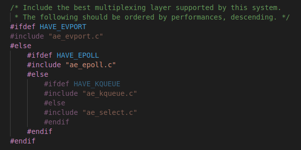
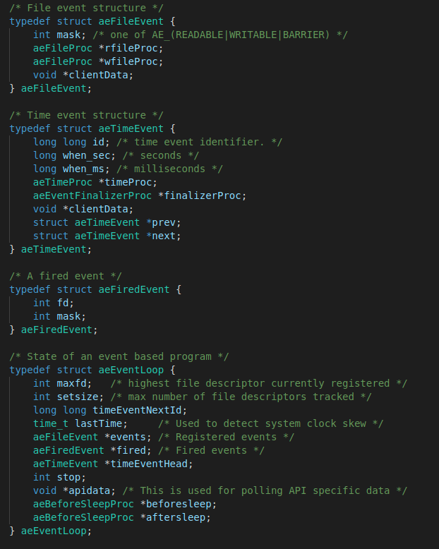

## 客户端与服务端的代码实现     
### 事件驱动机制的实现     
redis用到的事件驱动机制是自己实现的EventLoop，就是一个循序，在里面不断的处理文件事件和定时器事件，redis简单粗暴的就处理这两种事件，文件事件是和不同客户端的通信，定时器事件主要是设定的一些定时事件包括持久化机制。   
- 设计思想     
  redis的事件驱动机制主要处理的就是文件事件和定时器事件，文件事件主要指和客户端你的交换，定时器事件是指redis服务器设定的一些事件，向=像RDB和AOF重写。redis采用的是EventLoop机制实现的，顶层的文件事件是看不同的服务器平台采用不同的IO复用模型，有select,epoll,evport,kqueue。分别对应的ae_select.c,ae_epoll.c,ae_evport.c和ae_kqueue.c四个源文件，里面实现了一系列函数，函数名都一样，只是基于的模型不一样，统一了接口。由于本机器上实现的是epoll所以后面我会以ae_epoll.c源文件解析    

- 源码解析       
  **ae_epoll.c源文件**     
  ```
  typedef struct aeApiState {
  int epfd;
  struct epoll_event *events;
  } aeApiState;
  ```    
  我么知道epoll模型都会有一个epfd，表明一个创建的epoll模型，然后会向这个epfd中加入或者删除，修改，监听某个描述符的某个事件，redis的事件驱动就封装了这样一个结构，epfd表示用到的epoll模型。events则是一个数组，里面用于保存触发的事件       
  ```
  static int aeApiCreate(aeEventLoop *eventLoop)   #创建一个在eventlool里面的epoll模型   
  static int aeApiResize(aeEventLoop *eventLoop, int setsize) #调整epoll模型最大接收触发事件的尺寸   
  static void aeApiFree(aeEventLoop *eventLoop)  #释放epoll模型    
  static int aeApiAddEvent(aeEventLoop *eventLoop, int fd, int mask) #往epoll模型中加入某个描述符需要监听的事件   
  static void aeApiDelEvent(aeEventLoop *eventLoop, int fd, int delmask)  #epoll模型中某个描述符取消监听某个事件   
  static int aeApiPoll(aeEventLoop *eventLoop, struct timeval *tvp) #epoll模型调用epoll_wait()返回触发事件的结果   
  static char *aeApiName(void) #返回所用的顶层IO复用模型的名字   
  ```    
  其他3个IO复用模型都有相同的接口，然后根据使用redis的不同平台所用的模型是不一样的，在编译的时候就决定了    
       
  这里可以看到有使用优先级的情况，我们这里所用的是epoll模型    

  **ae.h和ae.c源文件**    
     
  可以看到四个数据结构分别是     
  1.aeFileEvent:指的是文件事件，也就是描述符顶层epoll模型需要关注的事件，mask包括可读可写，还有一个BARRIER是在写之后读，redis默认的如果一个文件描述符既有可读可写，先读后写。然后就是两个事件处理函数可读，可写处理，还有一个数据clientData表明加入事件处理函数的参数    
  2.aeTimeEvent:指的是定时器事件，id事件的唯一标识，when_sec,when_ms，表明何时该事件处理，一个是事件处理回调函数timePro，还有一个是事件处理完毕回调函数finalizerProc,同样的有一个clientData表示参数，prev,next指针可以看出定时器事件是用一个双向链表拼接的   
  3.aeFiredEvent:这个主要是文件事件被触发之后保存fd和mask数据结构    
  4.aeEventLoop:整个主结构，eventLoop的核心结构，maxfd是当前被处理的最大的文件描述符，setsize是当前最大数量的文件描述符能被同时追踪。timeEventNextId是定时器事件的唯一标识符Id的生成，lastTime是上一次执行一次EventLoop的时间，events就是注册需要监听的事件数组，fired就是触发的事件数组，timeEventHead指向定时器事件的头部指针，stop表明eventloop是否停止，apidata就是封装的epoll模型，beforesleep，aftersleep是在每一次eventloop是否需要调用函数做相应的事情。    

  ```
  aeEventLoop *aeCreateEventLoop(int setsize)  #创建一个eventloop并初始化好，包括为aeFileEvent和aeFiredEvent分配数组空间    
  int aeGetSetSize(aeEventLoop *eventLoop) #得到该eventloop处理的最大监听连接数    
  int aeResizeSetSize(aeEventLoop *eventLoop, int setsize) #调整最大连接数，不会破坏以前已经加入的受监听的描述符   
  void aeDeleteEventLoop(aeEventLoop *eventLoop) #释放整个eventloop    
  void aeStop(aeEventLoop *eventLoop)  #停止整个事件循环   
  int aeCreateFileEvent(aeEventLoop *eventLoop, int fd, int mask, aeFileProc *proc, void *clientData) #向该eventloop中加入某个描述符需要监听的事件，以及事件发生的处理函数    
  void aeDeleteFileEvent(aeEventLoop *eventLoop, int fd, int mask) #取消监听某个文件事件     
  int aeGetFileEvents(aeEventLoop *eventLoop, int fd)  #得到某个描述符需要监听的事件   
  static void aeGetTime(long *seconds, long *milliseconds) #得到当前时间，加入到seconds和milliseconds中   
  static void aeAddMillisecondsToNow(long long milliseconds, long *sec, long *ms) #向当前时间加入milliseconds，其实就是定时器事件定时多少秒用到，相对当前多少秒加入到sec和ms中   
  long long aeCreateTimeEvent(aeEventLoop *eventLoop, long long milliseconds,aeTimeProc *proc, void *clientData, aeEventFinalizerProc *finalizerProc)#创建一个定时器事件，总是加入到定时器事件的表头   
  int aeDeleteTimeEvent(aeEventLoop *eventLoop, long long id) #删除某个定时器事件   
  static aeTimeEvent *aeSearchNearestTimer(aeEventLoop *eventLoop) #搜寻定时器事件中最早一个事件  
  static int processTimeEvents(aeEventLoop *eventLoop)  #比当前时间早的定时器事件都执行处理    
  int aeProcessEvents(aeEventLoop *eventLoop, int flags) #复杂的一个函数，处理事件，根据flags不同有不同的效果
  ###
  首先我们知道redis主要处理两类事件一个是文件事件一个是定时器事件，文件事件就是客户端的连接，定时器事件就是定时执行持久化操作。我么还知道epoll模型可以等待一段时间返回，或者立即返回，然后看
  是否有事件被触发了，还可以一直阻塞知道有事件触发。    
  ###
  int aeProcessEvents(aeEventLoop *eventLoop, int flags)
  {
    int processed = 0, numevents;
    // 如果既没有文件事件也没有定时器事件就直接返回，一般是不可能出现的，虽然没有客户端连接，但也有持久化这个定时器操作  
    /* Nothing to do? return ASAP */
    if (!(flags & AE_TIME_EVENTS) && !(flags & AE_FILE_EVENTS)) return 0;

    /* Note that we want call select() even if there are no
     * file events to process as long as we want to process time
     * events, in order to sleep until the next time event is ready
     * to fire. */
     // 如果有文件事件或者说有定时器事件但需要等待一段时间，才会进入这个函数，否则直接处理定时器事件    
    if (eventLoop->maxfd != -1 ||
        ((flags & AE_TIME_EVENTS) && !(flags & AE_DONT_WAIT))) {
        int j;
        aeTimeEvent *shortest = NULL;
        struct timeval tv, *tvp;
        // 如果有定时器事件，而且需要等待一段时间，那么redis到底等待多少时间呢，也即是说epoll模型要阻塞多长时间呢，其实这个是由定时器最早发生的一个事件距离当前时间决定的    
        // 因为定时器事件必须在一定时间执行，为了尽可能的监听到客户端，这个等待时间就定在最早一个定时器要发生的时间，在这段时间我们可以尽最大可能监听客户端    
        if (flags & AE_TIME_EVENTS && !(flags & AE_DONT_WAIT))
            shortest = aeSearchNearestTimer(eventLoop);
        // 当有定时器事件时我们就epoll阻塞事件就是最早开始的定时器事件时间距离当前时间
        if (shortest) {
            long now_sec, now_ms;

            aeGetTime(&now_sec, &now_ms);
            tvp = &tv;

            /* How many milliseconds we need to wait for the next
             * time event to fire? */
            long long ms =
                (shortest->when_sec - now_sec)*1000 +
                shortest->when_ms - now_ms;

            if (ms > 0) {
                tvp->tv_sec = ms/1000;
                tvp->tv_usec = (ms % 1000)*1000;
            } else {
                tvp->tv_sec = 0;
                tvp->tv_usec = 0;
            }
        // 没有定时器事件，如果设置不等待就把阻塞时间tvp设置为0，epoll就不等待立即返回，否则就一直等待客户端指到有事件触发    
        } else {
            /* If we have to check for events but need to return
             * ASAP because of AE_DONT_WAIT we need to set the timeout
             * to zero */
            if (flags & AE_DONT_WAIT) {
                tv.tv_sec = tv.tv_usec = 0;
                tvp = &tv;
            } else {
                /* Otherwise we can block */
                tvp = NULL; /* wait forever */
            }
        }

        /* Call the multiplexing API, will return only on timeout or when
         * some event fires. */
        numevents = aeApiPoll(eventLoop, tvp);

        /* After sleep callback. */
        if (eventLoop->aftersleep != NULL && flags & AE_CALL_AFTER_SLEEP)
            eventLoop->aftersleep(eventLoop);
        // 依次处理文件事件，默认的是如果同时可读可写，先处理读事件再处理写事件，当设置的AE_BARRIER时，可以先处理写事件再处理读事件   
        for (j = 0; j < numevents; j++) {
            aeFileEvent *fe = &eventLoop->events[eventLoop->fired[j].fd];
            int mask = eventLoop->fired[j].mask;
            int fd = eventLoop->fired[j].fd;
            int fired = 0; /* Number of events fired for current fd. */

            /* Normally we execute the readable event first, and the writable
             * event laster. This is useful as sometimes we may be able
             * to serve the reply of a query immediately after processing the
             * query.
             *
             * However if AE_BARRIER is set in the mask, our application is
             * asking us to do the reverse: never fire the writable event
             * after the readable. In such a case, we invert the calls.
             * This is useful when, for instance, we want to do things
             * in the beforeSleep() hook, like fsynching a file to disk,
             * before replying to a client. */
            int invert = fe->mask & AE_BARRIER;

	    /* Note the "fe->mask & mask & ..." code: maybe an already
             * processed event removed an element that fired and we still
             * didn't processed, so we check if the event is still valid.
             *
             * Fire the readable event if the call sequence is not
             * inverted. */
            if (!invert && fe->mask & mask & AE_READABLE) {
                fe->rfileProc(eventLoop,fd,fe->clientData,mask);
                fired++;
            }

            /* Fire the writable event. */
            if (fe->mask & mask & AE_WRITABLE) {
                if (!fired || fe->wfileProc != fe->rfileProc) {
                    fe->wfileProc(eventLoop,fd,fe->clientData,mask);
                    fired++;
                }
            }

            /* If we have to invert the call, fire the readable event now
             * after the writable one. */
            if (invert && fe->mask & mask & AE_READABLE) {
                if (!fired || fe->wfileProc != fe->rfileProc) {
                    fe->rfileProc(eventLoop,fd,fe->clientData,mask);
                    fired++;
                }
            }

            processed++;
        }
    }
    /* Check time events */
    // 最后处理定时器事件   
    if (flags & AE_TIME_EVENTS)
        processed += processTimeEvents(eventLoop);

    return processed; /* return the number of processed file/time events */
  }

  int aeWait(int fd, int mask, long long milliseconds) #阻塞某段时间等待某个描述符事件触发   
  void aeMain(aeEventLoop *eventLoop) #主循环函数每次循环都会调用aeProcessEvents(eventLoop, AE_ALL_EVENTS|AE_CALL_AFTER_SLEEP)，从这里可以看到flags=总是等待的需要等待一段时间的    
  char *aeGetApiName(void) #获得底层模型   
  void aeSetBeforeSleepProc(aeEventLoop *eventLoop, aeBeforeSleepProc *beforesleep) #设置循环前函数   
  void aeSetAfterSleepProc(aeEventLoop *eventLoop, aeBeforeSleepProc *aftersleep) #设置循环后函数   
  ```    

- 总结   
  redis的事件循环主要是处理文件事件和定时器事件，这两者redis是如何保证好的进行的呢？我们可以假设当前距离某个最早的定时器事件在3s之后发生，那么epoll模型会阻塞3秒看这3秒有没有事件需要处理，如果有，就直接处理我们知道此时还没有到达定时器事件。所以会处理文件事件。如果在3s内还没有文件事件需要处理，那么也就刚好到最早的定时器事件的时间了，最后就处理定时器事件。    

### 与客户端的网络连接    
包括anet.h好anet.c是对网络的一些函数的封装和networking.c是对客户端的创建，并接收客户端的命令，并回复数据     

- 设计思想   
  这里redis对底层的网络函数做了一层自己的封装，对于每个与服务器连接的客户端都有一个client结构体来表示该客户端的所有信息，后续操作包括读取命令，回复命令都是基于该客户端的    

- 源码分析    
  **anet.h和anet.c**     
  anet.c里面的函数都比较简单是一些套接字选项的设置    
  ```
  int anetNonBlock(char *err, int fd) #套接字设置为非阻塞的
  int anetBlock(char *err, int fd) #套接字设置为阻塞的   
  int anetKeepAlive(char *err, int fd, int interval) #套接字设置keepAlive选项   
  int anetEnableTcpNoDelay(char *err, int fd) #socket 设置TCP_NODELAY 属性，禁用 Nagle 算法
  int anetDisableTcpNoDelay(char *err, int fd) 
  int anetSetSendBuffer(char *err, int fd, int buffsize) #设置sendbuffer选项的值  
  int anetTcpKeepAlive(char *err, int fd) #启用keepAlive选项    
  int anetSendTimeout(char *err, int fd, long long ms) #设置超时   
  int anetResolve(char *err, char *host, char *ipbuf, size_t ipbuf_len) #解析地址，包括主机名和数字型ip   
  int anetResolveIP(char *err, char *host, char *ipbuf, size_t ipbuf_len) #解析地址，只能是数字型ip
  static int anetCreateSocket(char *err, int domain) #创建一个套接字   
  int anetTcpConnect(char *err, char *addr, int port) #普通连接到某个地址和端口   
  int anetTcpNonBlockConnect(char *err, char *addr, int port) #创建非阻塞套接字连接到某个地址和端口   
  int anetTcpNonBlockBindConnect(char *err, char *addr, int port,char *source_addr) #绑定某个地址非阻塞连接到某个地址和端口  
  int anetRead(int fd, char *buf, int count) #读数据   
  int anetWrite(int fd, char *buf, int count) #写数据   
  static int anetListen(char *err, int s, struct sockaddr *sa, socklen_t len, int backlog) #某个套接字转化为监听套接字并监听  
  int anetTcpServer(char *err, int port, char *bindaddr, int backlog) #创建一个服务套接字并绑定地址开启监听   
  int anetTcp6Server(char *err, int port, char *bindaddr, int backlog) #创建只支持IPV6的套接字并绑定地址开启监听   
  int anetTcpAccept(char *err, int s, char *ip, size_t ip_len, int *port) #监听套接字上接收accept()函数的封装   
  int anetPeerToString(int fd, char *ip, size_t ip_len, int *port) #得到对端地址和端口号   
  int anetFormatAddr(char *buf, size_t buf_len, char *ip, int port) #将地址和端口以固定形式写入buf中  
  int anetFormatPeer(int fd, char *buf, size_t buf_len) #将对端地址以固定形式写入buf中[ip]:port   
  int anetFormatSock(int fd, char *fmt, size_t fmt_len) #将套接字的本地地址和端口格式化写入fmt中   
  ```    
  anet.c源码比较简单，就是对socket的一些常用选项的封装还有，listen()函数，accept()函数等的封装     

  **networking.c源码分析**   
  networking主要就是客户端的创建和读取命令然后回复命令的实现   
  ```
  client *createClient(int fd) #该函数会创建一个客户端结构，并把该fd设置为非阻塞的启动TCPNoDelay，然后会创建一个可读的文件事件，并注册到事件循环中   
                                绑定回调函数readQueryFromClient，然后会初始化client结构各个数据成员   
  int prepareClientToWrite(client *c) #该函数用于判断是否可以向该客户端写数据
  int _addReplyToBuffer(client *c, const char *s, size_t len) #底层api,向客户端的c->buf中加入数据，缓冲要写给该客户端的数据   
  void _addReplyObjectToList(client *c, robj *o) #将要写入的对象加入到c->reply链表中，可以看出每个client有两个输出缓冲区一个是数组buf,一个是链表  
  void _addReplySdsToList(client *c, sds s) #将要写入客户端的sds字符串加入链表   
  void _addReplyStringToList(client *c, const char *s, size_t len) #将要写入客户端的普通字符串加入链表  
  void addReply(client *c, robj *obj) #高级API,将要回复客户端的对象加入输出缓冲区  
  void addReplySds(client *c, sds s) #回复一个sds字符串  
  void addReplyString(client *c, const char *s, size_t len) #回复一个字符串  
  void addReplyError(client *c, const char *err) #回复错误   
  然后就是血多addReply,将要回复的内容加入到输出缓冲区   
  void copyClientOutputBuffer(client *dst, client *src)  #复制一个客户端的输出缓冲区，包括buf数组和reply链表   
  int clientHasPendingReplies(client *c) #判断一个客户端输出缓冲区是否有内容，以便实际向对应的socket写入数据   
  static void acceptCommonHandler(int fd, int flags, char *ip) #接收处理函数，会创建一个client结构来表示客户端  
  void acceptTcpHandler(aeEventLoop *el, int fd, void *privdata, int mask) #真正的accept()函数接收处理函数fd是监听socket,接收到会返回一个socket叫cfd，然后上一个函数利用cfd创建一个客户端结构    
  static void freeClientArgv(client *c)  #释放客户端参数   
  void disconnectSlaves(void)  #断开所以从机的连接   
  void unlinkClient(client *c) #将某个客户端从全局已连接客户端移除   
  void freeClient(client *c #释放某个客户端  
  void freeClientAsync(client *c) #异步释放客户端，将该客户端加入一个需要去释放的客户端列表   
  void freeClientsInAsyncFreeQueue(void) #异步的清空客户端
  int writeToClient(int fd, client *c, int handler_installed)   #实际的将输出缓冲区的数据发送给客户端   
  int handleClientsWithPendingWrites(void) #处理客户端有pendingWrites的
  void resetClient(client *c)   #重置某个客户端  
  ```  
  一个完整的解析请求处理请求过程：    
  **1.接收数据**          
  Redis服务器收到客户端的请求数据后，就会触发socket描述符上的可读事件，从而调用其回调函数readQueryFromClient。    
  在readQueryFromClient中，调用read读取客户端的请求，并缓存到redisClient结构中的输入缓存querybuf中，该输入缓存会根据接收到的数据长度动态扩容。接下来对收到的请求数据进行解析，并执行相应的命令处理函数。    
  ```
  void readQueryFromClient(aeEventLoop *el, int fd, void *privdata, int mask) {
    client *c = (client*) privdata;
    int nread, readlen;
    size_t qblen;
    UNUSED(el);
    UNUSED(mask);

    readlen = PROTO_IOBUF_LEN;
    /* If this is a multi bulk request, and we are processing a bulk reply
     * that is large enough, try to maximize the probability that the query
     * buffer contains exactly the SDS string representing the object, even
     * at the risk of requiring more read(2) calls. This way the function
     * processMultiBulkBuffer() can avoid copying buffers to create the
     * Redis Object representing the argument. */
    if (c->reqtype == PROTO_REQ_MULTIBULK && c->multibulklen && c->bulklen != -1
        && c->bulklen >= PROTO_MBULK_BIG_ARG)
    {
        ssize_t remaining = (size_t)(c->bulklen+2)-sdslen(c->querybuf);

        if (remaining < readlen) readlen = remaining;
    }

    qblen = sdslen(c->querybuf);
    if (c->querybuf_peak < qblen) c->querybuf_peak = qblen;
    c->querybuf = sdsMakeRoomFor(c->querybuf, readlen);
    nread = read(fd, c->querybuf+qblen, readlen);
    if (nread == -1) {
        if (errno == EAGAIN) {
            return;
        } else {
            serverLog(LL_VERBOSE, "Reading from client: %s",strerror(errno));
            freeClient(c);
            return;
        }
    } else if (nread == 0) {
        serverLog(LL_VERBOSE, "Client closed connection");
        freeClient(c);
        return;
    } else if (c->flags & CLIENT_MASTER) {
        /* Append the query buffer to the pending (not applied) buffer
         * of the master. We'll use this buffer later in order to have a
         * copy of the string applied by the last command executed. */
        c->pending_querybuf = sdscatlen(c->pending_querybuf,
                                        c->querybuf+qblen,nread);
    }

    sdsIncrLen(c->querybuf,nread);
    c->lastinteraction = server.unixtime;
    if (c->flags & CLIENT_MASTER) c->read_reploff += nread;
    server.stat_net_input_bytes += nread;
    if (sdslen(c->querybuf) > server.client_max_querybuf_len) {
        sds ci = catClientInfoString(sdsempty(),c), bytes = sdsempty();

        bytes = sdscatrepr(bytes,c->querybuf,64);
        serverLog(LL_WARNING,"Closing client that reached max query buffer length: %s (qbuf initial bytes: %s)", ci, bytes);
        sdsfree(ci);
        sdsfree(bytes);
        freeClient(c);
        return;
    }

    /* Time to process the buffer. If the client is a master we need to
     * compute the difference between the applied offset before and after
     * processing the buffer, to understand how much of the replication stream
     * was actually applied to the master state: this quantity, and its
     * corresponding part of the replication stream, will be propagated to
     * the sub-slaves and to the replication backlog. */
    if (!(c->flags & CLIENT_MASTER)) {
        processInputBuffer(c);
    } else {
        size_t prev_offset = c->reploff;
        processInputBuffer(c);
        size_t applied = c->reploff - prev_offset;
        if (applied) {
            replicationFeedSlavesFromMasterStream(server.slaves,
                    c->pending_querybuf, applied);
            sdsrange(c->pending_querybuf,applied,-1);
        }
    }
  }
  ```
  该函数中，首先设置每次read读取的最大字节数readlen为REDIS_IOBUF_LEN(16k)。然后得到输入缓存c->querybuf当前长度qblen，也就是已接收到的客户端请求数据的长度。根据qblen更新c->querybuf_peak的值，该属性记录了输入缓存c->querybuf的最大长度。     
  接下来为c->querybuf扩容，使其能容纳readlen个字节；然后就调用read，最多读取readlen个字节。读取的内容追加到c->querybuf尾部。    
  如果read返回值nread为-1，若errno等于EAGAIN，说明暂无数据，置nread为0；否则记录错误信息到日志，释放客户端结构redisClient，并关闭链接，然后直接返回；    
  如果read返回0，说明客户端关闭连接，此时记录信息到日志，释放客户端结构redisClient，并关闭链接，然后直接返回；   
  read返回非0，说明读取到了数据。判断当前输入缓存c->querybuf的长度是否大于阈值server.client_max_querybuf_len(1G)。若超过阈值，则记录当前客户端信息，以及c->querybuf中前64个字节到日志中，然后释放客户端结构redisClient，并关闭链接，然后直接返回；    
  最后，调用processInputBuffer解析收到的数据，并在读取到完整的一条命令请求之后，执行相应的命令处理函数。    
  **2.解析处理客户端命令**         
  Redis服务器收到客户端的请求数据后，调用processInputBuffer函数解析输入缓存redisClient->querybuf中的数据。在得到一条完整的命令请求数据后，就调用processCommand函数处理执行相应的命令。   
  ```
  void processInputBuffer(client *c) {
    server.current_client = c;
    /* Keep processing while there is something in the input buffer */
    while(sdslen(c->querybuf)) {
        /* Return if clients are paused. */
        if (!(c->flags & CLIENT_SLAVE) && clientsArePaused()) break;

        /* Immediately abort if the client is in the middle of something. */
        if (c->flags & CLIENT_BLOCKED) break;

        /* CLIENT_CLOSE_AFTER_REPLY closes the connection once the reply is
         * written to the client. Make sure to not let the reply grow after
         * this flag has been set (i.e. don't process more commands).
         *
         * The same applies for clients we want to terminate ASAP. */
        if (c->flags & (CLIENT_CLOSE_AFTER_REPLY|CLIENT_CLOSE_ASAP)) break;

        /* Determine request type when unknown. */
        if (!c->reqtype) {
            if (c->querybuf[0] == '*') {
                c->reqtype = PROTO_REQ_MULTIBULK;
            } else {
                c->reqtype = PROTO_REQ_INLINE;
            }
        }

        if (c->reqtype == PROTO_REQ_INLINE) {
            if (processInlineBuffer(c) != C_OK) break;
        } else if (c->reqtype == PROTO_REQ_MULTIBULK) {
            if (processMultibulkBuffer(c) != C_OK) break;
        } else {
            serverPanic("Unknown request type");
        }

        /* Multibulk processing could see a <= 0 length. */
        if (c->argc == 0) {
            resetClient(c);
        } else {
            /* Only reset the client when the command was executed. */
            if (processCommand(c) == C_OK) {
                if (c->flags & CLIENT_MASTER && !(c->flags & CLIENT_MULTI)) {
                    /* Update the applied replication offset of our master. */
                    c->reploff = c->read_reploff - sdslen(c->querybuf);
                }

                /* Don't reset the client structure for clients blocked in a
                 * module blocking command, so that the reply callback will
                 * still be able to access the client argv and argc field.
                 * The client will be reset in unblockClientFromModule(). */
                if (!(c->flags & CLIENT_BLOCKED) || c->btype != BLOCKED_MODULE)
                    resetClient(c);
            }
            /* freeMemoryIfNeeded may flush slave output buffers. This may
             * result into a slave, that may be the active client, to be
             * freed. */
            if (server.current_client == NULL) break;
        }
    }
    server.current_client = NULL;
  }
  ```  
  该函数中，只要c->querybuf不为空，就一直循环处理。在该循环中：     
  首先，根据客户端的当前状态标志c->flags，判断是否需要继续解析处理，比如：    
  如果当前客户端不是SLAVE节点，并且客户端处于阻塞状态，则直接返回；    
  如果客户端标志c->flags包含REDIS_BLOCKED，则直接返回；      
  如果客户端标志c->flags包含REDIS_CLOSE_AFTER_REPLY，则直接返回。该标志表明发生了异常，服务器不再需要处理客户端请求，在回复客户端错误消息后直接关闭链接。     
  接下来，如果c->reqtype为0，说明刚要开始处理一条请求（第一次处理c->querybuf中的数据，或刚处理完一条完整的命令请求）。如果数据c->querybuf的首字节为'*'，说明该请求会跨越多行（包含多个”\r\n”），则置c->reqtype为EDIS_REQ_MULTIBULK；否则说明该请求为单行请求，置c->reqtype为REDIS_REQ_INLINE；     
  如果c->reqtype为REDIS_REQ_INLINE，则调用processInlineBuffer解析单行请求，如果c->reqtype为EDIS_REQ_MULTIBULK，则调用processMultibulkBuffer解析多行请求。这两个函数的返回值如果不是REDIS_OK，则说明尚未收到一条完整的请求，需要退出循环，函数返回后接着读取剩余的数据；      
  如果这两个函数返回为REDIS_OK，则说明已经收到并解析好了一条完整的请求，命令的参数已经分解到数组c->argv中，c->argc表示参数个数。     
  如果c->argc为0，则无需处理，直接调用resetClient重置客户端状态，也就是释放c->argv数组中的元素，置c->argc、c->reqtype和c->multibulklen为0，置c->bulklen为-1等。然后接着处理c->querybuf中剩下的内容；     
  如果c->argc非0，则调用processCommand处理该命令，调用相应的命令处理函数。处理成功后，调用resetClient重置客户端状态。然后接着处理c->querybuf中剩下的内容。    
  函数processInlineBuffer和processMultibulkBuffer分别解析客户端的单行请求和多行请求。这两个函数返回REDIS_OK，说明已经收到并解析好了一条完整的请求，命令的参数已经分解到数组c->argv中，c->argc表示参数个数。     
  如果这俩函数返回REDIS_ERR，要么说明收到的客户端命令请求尚不完整，这其实不是错误，这种情况下函数返回后，服务器需要继续接收客户端请求；要么说明客户端发来的请求不符合统一请求协议的格式要求，这种情况下调用setProtocolError删除c->querybuf相应的内容，并且将客户端的标志位c->flags增加REDIS_CLOSE_AFTER_REPLY标记，从而在回复客户端错误信息后直接关闭连接。     
  processMultibulkBuffer函数要比processInlineBuffer稍微复杂一些，直接看一下processMultibulkBuffer的实现：    
  ```
  int processMultibulkBuffer(client *c) {
    char *newline = NULL;
    long pos = 0;
    int ok;
    long long ll;

    if (c->multibulklen == 0) {
        /* The client should have been reset */
        serverAssertWithInfo(c,NULL,c->argc == 0);

        /* Multi bulk length cannot be read without a \r\n */
        newline = strchr(c->querybuf,'\r');
        if (newline == NULL) {
            if (sdslen(c->querybuf) > PROTO_INLINE_MAX_SIZE) {
                addReplyError(c,"Protocol error: too big mbulk count string");
                setProtocolError("too big mbulk count string",c,0);
            }
            return C_ERR;
        }

        /* Buffer should also contain \n */
        if (newline-(c->querybuf) > ((signed)sdslen(c->querybuf)-2))
            return C_ERR;

        /* We know for sure there is a whole line since newline != NULL,
         * so go ahead and find out the multi bulk length. */
        serverAssertWithInfo(c,NULL,c->querybuf[0] == '*');
        ok = string2ll(c->querybuf+1,newline-(c->querybuf+1),&ll);
        if (!ok || ll > 1024*1024) {
            addReplyError(c,"Protocol error: invalid multibulk length");
            setProtocolError("invalid mbulk count",c,pos);
            return C_ERR;
        }

        pos = (newline-c->querybuf)+2;
        if (ll <= 0) {
            sdsrange(c->querybuf,pos,-1);
            return C_OK;
        }

        c->multibulklen = ll;

        /* Setup argv array on client structure */
        if (c->argv) zfree(c->argv);
        c->argv = zmalloc(sizeof(robj*)*c->multibulklen);
    }

    serverAssertWithInfo(c,NULL,c->multibulklen > 0);
    while(c->multibulklen) {
        /* Read bulk length if unknown */
        if (c->bulklen == -1) {
            newline = strchr(c->querybuf+pos,'\r');
            if (newline == NULL) {
                if (sdslen(c->querybuf) > PROTO_INLINE_MAX_SIZE) {
                    addReplyError(c,
                        "Protocol error: too big bulk count string");
                    setProtocolError("too big bulk count string",c,0);
                    return C_ERR;
                }
                break;
            }

            /* Buffer should also contain \n */
            if (newline-(c->querybuf) > ((signed)sdslen(c->querybuf)-2))
                break;

            if (c->querybuf[pos] != '$') {
                addReplyErrorFormat(c,
                    "Protocol error: expected '$', got '%c'",
                    c->querybuf[pos]);
                setProtocolError("expected $ but got something else",c,pos);
                return C_ERR;
            }

            ok = string2ll(c->querybuf+pos+1,newline-(c->querybuf+pos+1),&ll);
            if (!ok || ll < 0 || ll > server.proto_max_bulk_len) {
                addReplyError(c,"Protocol error: invalid bulk length");
                setProtocolError("invalid bulk length",c,pos);
                return C_ERR;
            }

            pos += newline-(c->querybuf+pos)+2;
            if (ll >= PROTO_MBULK_BIG_ARG) {
                size_t qblen;

                /* If we are going to read a large object from network
                 * try to make it likely that it will start at c->querybuf
                 * boundary so that we can optimize object creation
                 * avoiding a large copy of data. */
                sdsrange(c->querybuf,pos,-1);
                pos = 0;
                qblen = sdslen(c->querybuf);
                /* Hint the sds library about the amount of bytes this string is
                 * going to contain. */
                if (qblen < (size_t)ll+2)
                    c->querybuf = sdsMakeRoomFor(c->querybuf,ll+2-qblen);
            }
            c->bulklen = ll;
        }

        /* Read bulk argument */
        if (sdslen(c->querybuf)-pos < (size_t)(c->bulklen+2)) {
            /* Not enough data (+2 == trailing \r\n) */
            break;
        } else {
            /* Optimization: if the buffer contains JUST our bulk element
             * instead of creating a new object by *copying* the sds we
             * just use the current sds string. */
            if (pos == 0 &&
                c->bulklen >= PROTO_MBULK_BIG_ARG &&
                sdslen(c->querybuf) == (size_t)(c->bulklen+2))
            {
                c->argv[c->argc++] = createObject(OBJ_STRING,c->querybuf);
                sdsIncrLen(c->querybuf,-2); /* remove CRLF */
                /* Assume that if we saw a fat argument we'll see another one
                 * likely... */
                c->querybuf = sdsnewlen(NULL,c->bulklen+2);
                sdsclear(c->querybuf);
                pos = 0;
            } else {
                c->argv[c->argc++] =
                    createStringObject(c->querybuf+pos,c->bulklen);
                pos += c->bulklen+2;
            }
            c->bulklen = -1;
            c->multibulklen--;
        }
    }

    /* Trim to pos */
    if (pos) sdsrange(c->querybuf,pos,-1);

    /* We're done when c->multibulk == 0 */
    if (c->multibulklen == 0) return C_OK;

    /* Still not ready to process the command */
    return C_ERR;
  }
  ```
  redisClient结构中的multibulklen属性，记录正在解析的一条完整的命令请求中，尚未处理的命令参数的个数。如果c->multibulklen为0，说明当前要解析的是命令请求的开头，格式为"*<n>\r\n"。   
  这种情况下，首先找到c->querybuf中的第一个'\r'的位置newline，如果c->querybuf中找不到'\r'，说明收到的客户端的请求尚不完整，直接返回REDIS_ERR。并且如果c->querybuf目前长度超过64k的话，则反馈给客户端错误信息："Protocol error: too big mbulk count string"，然后调用setProtocolError为客户端标志位c->flags增加REDIS_CLOSE_AFTER_REPLY标记；直接返回REDIS_ERR；     
  然后如果(newline-(c->querybuf))大于((signed)sdslen(c->querybuf)-2)，说明收到的客户端请求尚不完整（缺少'\n'），直接返回REDIS_ERR；      
  接下来就开始解析该行，该行内容的正确格式是"*<n>\r\n"，其中<n>是一个表明接下来包含多少个字符串的整数。调用string2ll解析得到其中的整数ll，如果解析失败，或者ll大于1M，则反馈给客户端信息"Protocol error: invalid multibulk length"，然后，调用setProtocolError为客户端标志位c->flags增加REDIS_CLOSE_AFTER_REPLY标记，返回REDIS_ERR；       
  然后使pos记为c->querybuf下一行首地址的索引；     
  如果ll小于等于0，则直接清除c->querybuf中刚刚解析的行，直接返回REDIS_OK；然后将ll赋值到c->multibulklen中。然后根据c->multibulklen的值申请数组c->argv的空间，其数组长度就是c->multibulklen。     
  得到c->multibulklen的值后，接下来开始依次处理命令请求中的每一个字符串行：     
  redisClient结构中的bulklen属性，记录接下来要解析的命令请求行中，包含的字符串的长度。如果c->bulklen为-1，说明当前要解析的，是字符串的长度行，格式为"$<n>\r\n"。     
  这种情况下，处理过程与c->multibulklen为0时的解析过程类似，不在赘述。解析完后，下一行中包含的字符串长度存储在ll中，ll最大为512M，否则反馈给客户端错误信息："Protocol error: invalid bulk length"，并且调用setProtocolError为客户端标志位c->flags增加REDIS_CLOSE_AFTER_REPLY标记，返回REDIS_ERR；     
  然后使pos记为c->querybuf下一行首地址的索引；     
  如果字符串长度ll大于等于32k，为了后续创建字符串对象时避免复制大块内存，直接使用c->querybuf创建字符串对象。因此直接将c->querybuf中pos之前的内容删除，置pos为0，并且必要情况下为c->querybuf扩容。最后将ll赋值到c->bulklen中；     
  接下来开始解析c->querybuf中的字符串行，格式为"xxxx\r\n"；     
  如果(sdslen(c->querybuf)-pos)小于((unsigned)(c->bulklen+2))，说明收到的客户端请求中，字符串行尚不完整，直接退出循环，返回REDIS_ERR；      
  否则，如果同时满足以下三个条件：      
  pos == 0；      
  c->bulklen >= REDIS_MBULK_BIG_ARG；     
  (signed) sdslen(c->querybuf) ==c->bulklen+2)；      
  说明，当前c->querybuf中，不多不少正好包含的是一个大于32k的大字符串行，这种情况下，为了避免拷贝大块内存，直接使用c->querybuf创建字符串对象，并存储到c->argv中；然后重新创建c->querybuf，并为其扩容为c->bulklen+2，这样可以容纳在后续遇到的大字符串（Assume that if we saw a fat argument we'll see another one likely...）；      
  如果不满足上面的条件，则创建字符串对象，将c->querybuf+pos的内容复制到该字符串对象中；     
  处理完一个完整的字符串行后，重置c->bulklen为-1，并且c->multibulklen--；然后循环处理下一个字符串行；      
  跳出循环后，首先删除已解析的内容，如果c->multibulklen为0，说明已经完整的收到并解析了客户端的一个跨多行的命令请求，返回REDIS_OK，表示可以开始处理该命令了；否则，返回REDIS_ERR，继续接收客户端请求；      
  **3.回复客户端：**         
  服务器执行完相应的命令处理函数之后，就会调用addReply类的函数将要回复给客户端的信息写入客户端输出缓存。这些函数包括addReply，addReplySds，addReplyError，addReplyStatus等。    
  这些函数首先都会调用prepareClientToWrite函数，注册socket描述符上的可写事件，然后将回复信息写入到客户端输出缓存中。    
  redisClient结构中有两种客户端输出缓存，一种是静态大小的数组(buf)，一种是动态大小的列表(reply)。追加回复信息时，首先尝试将信息追加到数组buf中，如果其空间不足，则将信息在追加到reply中。     
  调用函数_addReplyToBuffer向c->buf中添加数据，如果该函数返回REDIS_ERR，说明添加失败，则调用_addReplyStringToList，将数据添加到c->reply中。其他addReply类的函数也是类似的处理，不再赘述。       
  每次向客户端输出缓存追加新数据之前，都要调用函数prepareClientToWrite。因Redis中不同类型的客户端需要不同的处理：有些客户端（比如加载AOF文件时的伪客户端）无需追加新数据，这种情况下，该函数直接返回REDIS_ERR；有些客户端（比如Lua客户端）需要追加新数据，但无需注册socket描述符上的可写事件；有些客户端（普通客户端）需要追加数据，并注册socket描述符上的可写事件；     
  因此，调用prepareClientToWrite函数返回REDIS_ERR，则表示无需向输出缓存追加新数据，只有返回REDIS_OK时才需要向输出缓存中追加新数据。      
  prepareClientToWrite函数的代码如下：      
  ```
  int prepareClientToWrite(client *c) {
    /* If it's the Lua client we always return ok without installing any
     * handler since there is no socket at all. */
    if (c->flags & (CLIENT_LUA|CLIENT_MODULE)) return C_OK;

    /* CLIENT REPLY OFF / SKIP handling: don't send replies. */
    if (c->flags & (CLIENT_REPLY_OFF|CLIENT_REPLY_SKIP)) return C_ERR;

    /* Masters don't receive replies, unless CLIENT_MASTER_FORCE_REPLY flag
     * is set. */
    if ((c->flags & CLIENT_MASTER) &&
        !(c->flags & CLIENT_MASTER_FORCE_REPLY)) return C_ERR;

    if (c->fd <= 0) return C_ERR; /* Fake client for AOF loading. */

    /* Schedule the client to write the output buffers to the socket only
     * if not already done (there were no pending writes already and the client
     * was yet not flagged), and, for slaves, if the slave can actually
     * receive writes at this stage. */
    if (!clientHasPendingReplies(c) &&
        !(c->flags & CLIENT_PENDING_WRITE) &&
        (c->replstate == REPL_STATE_NONE ||
         (c->replstate == SLAVE_STATE_ONLINE && !c->repl_put_online_on_ack)))
    {
        /* Here instead of installing the write handler, we just flag the
         * client and put it into a list of clients that have something
         * to write to the socket. This way before re-entering the event
         * loop, we can try to directly write to the client sockets avoiding
         * a system call. We'll only really install the write handler if
         * we'll not be able to write the whole reply at once. */
        c->flags |= CLIENT_PENDING_WRITE;
        listAddNodeHead(server.clients_pending_write,c);
    }

    /* Authorize the caller to queue in the output buffer of this client. */
    return C_OK;
  }
  ```  
  如果当前客户端是Lua客户端，直接返回REDIS_OK，而无需注册socket描述符上的可写事件，因为根本没有socket描述符；       
  如果客户端为Master节点，除非设置REDIS_MASTER_FORCE_REPLY标志，否则这种客户端不接收回复，因此直接返回REDIS_ERR；       
  如果客户端的socket描述符小于等于0，说明是加载AOF文件时的伪客户端，直接返回REDIS_ERR；         
  如果是普通客户端，或者是在从节点需要接收数据时，如果此前从未注册过socket上的可写事件，则调用aeCreateFileEvent注册socket描述符c->fd上的可写事件，事件回调函数为sendReplyToClient；最后直接返回REDIS_OK；           
  当TCP输出缓冲区有一定剩余空间时，socket描述符上的可写事件就会触发，从而调用事件回调函数sendReplyToClient,然后调用writeToClient。该函数调用write，将输出缓存中的数据发送出去。函数的代码如下：    
  ```       
  int writeToClient(int fd, client *c, int handler_installed) {
    ssize_t nwritten = 0, totwritten = 0;
    size_t objlen;
    sds o;

    while(clientHasPendingReplies(c)) {
        if (c->bufpos > 0) {
            nwritten = write(fd,c->buf+c->sentlen,c->bufpos-c->sentlen);
            if (nwritten <= 0) break;
            c->sentlen += nwritten;
            totwritten += nwritten;

            /* If the buffer was sent, set bufpos to zero to continue with
             * the remainder of the reply. */
            if ((int)c->sentlen == c->bufpos) {
                c->bufpos = 0;
                c->sentlen = 0;
            }
        } else {
            o = listNodeValue(listFirst(c->reply));
            objlen = sdslen(o);

            if (objlen == 0) {
                listDelNode(c->reply,listFirst(c->reply));
                continue;
            }

            nwritten = write(fd, o + c->sentlen, objlen - c->sentlen);
            if (nwritten <= 0) break;
            c->sentlen += nwritten;
            totwritten += nwritten;

            /* If we fully sent the object on head go to the next one */
            if (c->sentlen == objlen) {
                listDelNode(c->reply,listFirst(c->reply));
                c->sentlen = 0;
                c->reply_bytes -= objlen;
                /* If there are no longer objects in the list, we expect
                 * the count of reply bytes to be exactly zero. */
                if (listLength(c->reply) == 0)
                    serverAssert(c->reply_bytes == 0);
            }
        }
        /* Note that we avoid to send more than NET_MAX_WRITES_PER_EVENT
         * bytes, in a single threaded server it's a good idea to serve
         * other clients as well, even if a very large request comes from
         * super fast link that is always able to accept data (in real world
         * scenario think about 'KEYS *' against the loopback interface).
         *
         * However if we are over the maxmemory limit we ignore that and
         * just deliver as much data as it is possible to deliver.
         *
         * Moreover, we also send as much as possible if the client is
         * a slave (otherwise, on high-speed traffic, the replication
         * buffer will grow indefinitely) */
        if (totwritten > NET_MAX_WRITES_PER_EVENT &&
            (server.maxmemory == 0 ||
             zmalloc_used_memory() < server.maxmemory) &&
            !(c->flags & CLIENT_SLAVE)) break;
    }
    server.stat_net_output_bytes += totwritten;
    if (nwritten == -1) {
        if (errno == EAGAIN) {
            nwritten = 0;
        } else {
            serverLog(LL_VERBOSE,
                "Error writing to client: %s", strerror(errno));
            freeClient(c);
            return C_ERR;
        }
    }
    if (totwritten > 0) {
        /* For clients representing masters we don't count sending data
         * as an interaction, since we always send REPLCONF ACK commands
         * that take some time to just fill the socket output buffer.
         * We just rely on data / pings received for timeout detection. */
        if (!(c->flags & CLIENT_MASTER)) c->lastinteraction = server.unixtime;
    }
    if (!clientHasPendingReplies(c)) {
        c->sentlen = 0;
        if (handler_installed) aeDeleteFileEvent(server.el,c->fd,AE_WRITABLE);

        /* Close connection after entire reply has been sent. */
        if (c->flags & CLIENT_CLOSE_AFTER_REPLY) {
            freeClient(c);
            return C_ERR;
        }
    }
    return C_OK;
  }
  ```    
  当追加要发送的数据到输出缓存时，首先尝试将其添加到c->buf中；如果c->buf空间不足，则追加到c->reply中。如果使用的是c->buf，则c->bufpos表示其中缓存的数据总量，c->sentlen表示其中已发送的数据量；如果使用的是c->reply，则c->reply_bytes表示列表c->reply中，保存的所有sds字符串占用的内存总字节数，c->sentlen表示列表中的正在发送数据的单块缓存元素中，已发送的数据量。   
  函数中的totwritten表示本函数当前已发送的数据量；    
  在函数中，如果c->bufpos大于0，或者listLength(c->reply)大于0，说明缓存中有数据要发送，进入循环，调用write发送数据，write返回值nwritten小于等于0时，要么是TCP输出缓存无空间，要么是发生了错误，因此直接跳出循环。     
  在循环中：如果c->bufpos大于0，说明使用的缓存是c->buf。因此调用write，将c->buf中的剩余数据（c->bufpos- c->sentlen个字节）发送出去。如果write返回值nwritten小于等于0时，直接跳出循环；否则，将nwritten增加到c->sentlen和totwritten中，继续下一轮循环写入。如果c->buf中的数据已全部发送出去，则重置c->bufpos和c->sentlen为0，表示清空缓存c->buf；     
  否则的话，表示使用的缓存是列表c->reply。得到其头结点中保存的字符串对象o，然后得到该字符串的长度objlen，以及该字符串占用的内存objmem。接着调用write，将o->ptr中未发送的数据（objlen - c->sentlen个字节）全部发送出去。如果write返回值nwritten小于等于0时，直接跳出循环；否则，将nwritten增加到c->sentlen和totwritten中，继续下一轮循环写入。如果c->sentlen等于objlen，说明当前节点的数据已经全部发送完成，直接删除该节点，并重置c->sentlen为0，并从c->reply_bytes中减去objmem；       
  接下来，将本次已发送的字节数totwritten加到server.stat_net_output_bytes中。     
  因本函数是可写事件的回调函数，为了避免该函数执行时间过长，而影响其他事件的处理。因此这里限制该函数最大发送的字节数为REDIS_MAX_WRITE_PER_EVENT(64k)，一旦已发送的字节数totwritten超过了该值，并且在没设置最大内存限制，或者尚未超过设置的最大内存限制的条件下，直接退出循环，停止发送。      
  退出循环后，如果write出错，并且errno为EAGAIN，说明TCP输出缓存无空间了，这种情况不是错误，直接置nwritten = 0即可；否则需要记录错误日志，并且调用freeClient释放redisClient，关闭与客户端的连接    
  最后，如果缓存中所有的数据都已经发送完成，则置c->sentlen为0，并且删除socket描述符c->fd上的可写事件；如果客户端标志c->flags中设置了REDIS_CLOSE_AFTER_REPLY，则调用freeClient释放redisClient，关闭与客户端的连接。     

- 总结    
  Redis服务器是典型的一对多服务器程序，通过使用由IO多路复用技术实现的文件事件处理器，Redis服务器使用单线程单进程的方式来处理命令请求，并与多个客户端进行网络通信。     
  

   

  


