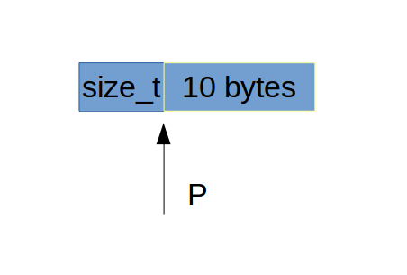
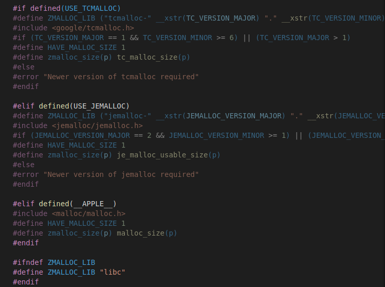
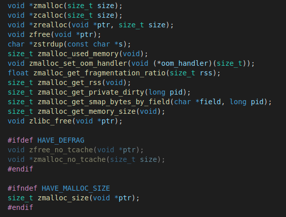
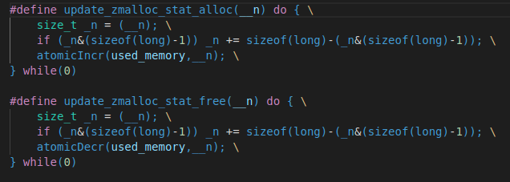
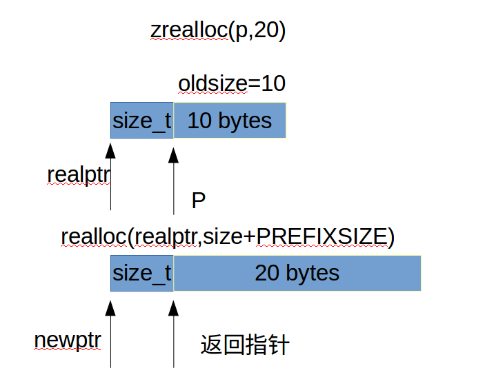
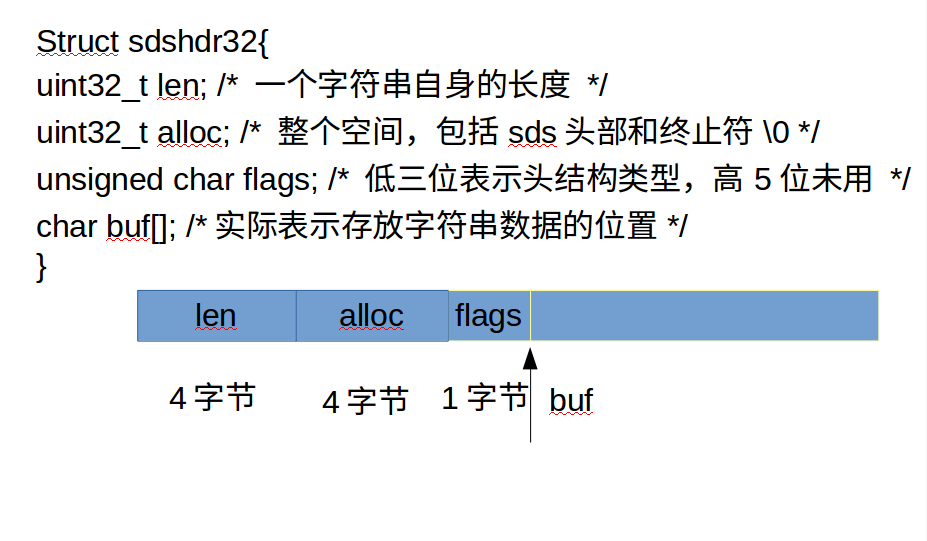
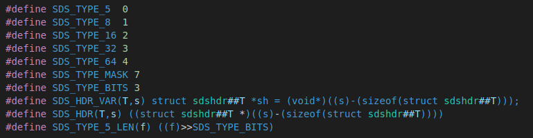

## redis数据结构实现源码解析    
整个redisd的数据类型包括各种对象的实现都是基于该篇所讲的数据结构所实现的，作者充分考虑的应用需要和节约内存所以实现了许多数据结构，里面的许多细节很令人佩服我将依次分析各个数据结构的底层实现，并会插以图和表的形式方便理解。     

### 1.zmalloc.h和zmalloc.c     
redis为了方便内存管理和使用，自己对malloc,free函数进行了封装。     

- 设计思想     
  我们知道传统的malloc,free，当我们得到一个动态分配的内存的指针，实际上并不知道该指针指向的内存是多少，也就是说给你一个指针，你知道它指向某个动态分配内存空间，但你不知道具体分配了多少，redis为了清楚每个动态内存的指针，所以采取了"[prefix][user really use]"的形式封装了malloc。prefix是一个固定的size_t类型大小，记录了你指针分配的内存大小，也就是上面的2段总和，最后的"user really use"是暴露给外界的也就是跟正常一样用户申请大小。例如我们用zmalloc函数申请一个10字节大小的空间，下面是真正的内存布局。     
         
  当我们申请10字节内存时，实际申请了sizeof(size_t)+10字节的内存，然后将10保存在size_t中，然后对外返回指针p,当我们拿到了指针p，往前读size_t字节所对应的值就是p所指向的10字节大小，也就知道了任意一个由redis动态分配的内存指针所指向的字节数。      
  但在有些平台本身就是实现了该功能，所以我们经常能够看到这样的宏定义     
       
  其中就是某些平台可以通过某些自带的函数实现相应的功能，所以定义了一个宏HAVE_MALLOC_SIZE,表示如果该平台是否实现了这一功能，Linux下是没有该功能的。     

- 源码分析     
  头文件有以下函数声明          
      

  zmalloc.c文件函数实现细节     
      
  这两个宏定义是为了更新一个zmalloc中维护的全局变量**used_memory**，该变量表示当前redis通过自带malloc函数从内存中分配总的内存空间。另外redis的used_memory记载的内存总是以sizeof(long)长度字节对齐，也就是每一次分配得到的内存都是long类型长度的整数倍。这可能是因为malloc函数底层实现估计也是以long长度对齐分配给用户，所以used_memory更可能是记载从内存实际得到的内存。            
  ```
  static void zmalloc_default_oom(size_t size) #out of memeory的默认处理函数，会退出程序     
  void *zmalloc(size_t size) #对::malloc()函数的封装，申请内存失败会调用默认的out of memory处理函数     
  void *zcalloc(size_t size) #对::calloc(num,size)函数的封装，calloc表示申请num块，size大小的连续内存，并置为0     
  void *zrealloc(void *ptr, size_t size) #对::realloc()函数的封装，realloc会尝试在原来内存位置扩大或者缩小内存，若不能，则会重新分配一块内存，并把旧内存数据拷贝到新内存处。     
  size_t zmalloc_size(void *ptr) #返回的是该指针分配大小，对应着全局静态变量used_memory中加入每一次分配内存大小     
  void zfree(void *ptr) #释放对应的内存，同时也会更新全局静态变量used_memory,从中减去相应内存     
  char *zstrdup(const char *s)复制一个C风格字符串，最后返回由redis管理的指针     
  size_t zmalloc_used_memory(void) #返回全局静态变量used_memory的值，也就是整个内存分配的大小    
  void zmalloc_set_oom_handler(void (*oom_handler)(size_t)) #设置默认的out of memory处理函数   
  #下面是在linux下有个记录程序各种状态的文件/proc/       
  size_t zmalloc_get_rss(void) #rss表示某个进程的常驻内存集(resident set size)，返回该进程所占内存大小    
  float zmalloc_get_fragmentation_ratio(size_t rss) #内存碎片率，表示rss/used_memory大小     
  size_t zmalloc_get_smap_bytes_by_field(char *field, long pid) #获取/proc/pid/smaps中某一field字段的所表示字节大小    
  size_t zmalloc_get_private_dirty(long pid) #获取rss中已改写的私有页面页面大小     
  ```    
  zrealloc()的原理图，假设新分配一个20字节大小的原指针为p的内存。其中realloc()底层会尝试在realptr分配所需字节，失败就重开一块内存，并把原指针指向的内存复制到新内存中，如图所示。   
       

- 总结    
  整个zmalloc，只是对原有的malloc，free的包装，最重要的就是加了一个PREFIX表示该指针所指向的分配的动态内存大小，这也是整个redis的内存基础，后续所有的内存都会基于此来构造各种数据结构。      

### 2.sds.h和sds.c    
Redis没有直接使用C语言传统的字符串表示（以空字符结尾的字符数组，以下简称C字 符串），而是自己构建了一种名为简单动态字符串（simple dynamic string，SDS）的抽象类型，并将SDS用作Redis的默认字符串表示。     
redis中的sds结构包括两部分一个是struct sdshdr,也就是sds header的缩写，就是字符串头部，还有一个是字符串本身。redis实现的sds实际上兼容了c字符串，同时也是二进制安全的，这一切都要归功于对sdshdr的设计，里面保存了这个字符串的重要信息。      
一个典型的sds字符串如下:      
      
一个字符串在内存中的布局类似于上面这样，针对不同的字符串长度redis为sds定义了5位，8位，16位，32位，64位5种表示字符串长度的sdshdr头部结构，其中的不同就是len,alloc所用表示字符串长度的字节数。上面是以sdshdr32位示例，也就是32位表示长度。     
其中len表示的是某个字符串的长度，alloc表示的是一开始分配用来表示字符串的长度，例如原来有个字符串长度为20，那么第一次构造sds则len,alloc都为20，又后来该sds表示的字符串长度为10，那么len就是10，alloc还是20。flags用来表示这个sdshdr头部是属于哪一种类型，8位，16位....等等，然后buf就是真正的指针指向字符串数据的开头，也是对完暴露的指针，对外的sds其实是char*的别名，其实也就是这里的buf指针。     

- 设计思想    
  redis设计sds，简单动态字符串是为了更方便的管理字符串，同时也可以提高效率。从上面的分析我们看到想要获得字符串的长度我们只需要O(1)复杂度就可以，相对传统C字符串效率提高，sds利用此种结构实现了另个分配策略，一个是空间预分配策略，另一个是惰性空间释放策略。空间预分配用于优化SDS的字符串增长操作：当SDS的API对一个SDS进行修改，并且需要对SDS进行空间扩展的时候，程序不仅会为SDS分配修改所必须要的空间，还会为SDS分配额外的未使用空间，当SDS的API需要缩短SDS保存的字符串时，程序并不立即使用内存重分配来回收缩短后多出来的字节，而是使用alloc-len大小将这些字节的数量记录起来，并等待将来使用。总之通过后面的源码我们能够体会到sds设计的漂亮之处。     

- 源码分析   
  **sds.h头文件**         
       
  这里定义了sds头部类型，掩码，SDS_HDR_VAR(T,s)这个宏主要是对给定的sds字符串定义一个变量sh,表示这个字符串的sdshdr结构指针，SDS_HDR(T,s)返回sdshdr指针。     
  ```
  static inline size_t sdslen(const sds s) #返回对应sdshdr结构中的len字段，表示字符串sds的长度     
  static inline size_t sdsavail(const sds s) #返回对应sdshdr结构中alloc-len，表示未用的表示字符串长度，一般用于字符串的扩大操作      
  static inline void sdssetlen(sds s, size_t newlen) #设置对应的sdshdr结构中len字段的值    
  static inline void sdsinclen(sds s, size_t inc) #设置对应的sdshdr结构中len字段值增加inc大小     
  static inline size_t sdsalloc(const sds s) #返回对应sdshdr结构中的alloc字段大小    
  static inline void sdssetalloc(sds s, size_t newlen) #设置对应的sdshdr结构中的alloc字段为newlen长度     
  ```    

  **sds.c源文件**   
  ```
  static inline int sdsHdrSize(char type) #返回sdshdr头部结构大小    
  static inline char sdsReqType(size_t string_size) #返回一个给定大小字符串所需要的头部类型     
  sds sdsnewlen(const void *init, size_t initlen) #通过一个给定的字符串指针和长度，返回一个sds字符串包括一个头长度+initlen+1      
  sds sdsempty(void) #创建一个空的0长度的sds字符串     
  sds sdsnew(const char *init) #通过一个给定的C风格字符串创建一个对应的sds字符串     
  sds sdsdup(const sds s) #复制一个给定的sds字符串，返回一个新的sds字符串    
  void sdsfree(sds s) #释放一个sds字符串整个空间    
  void sdsupdatelen(sds s) #更新某个sds的len属性，长度为第一个'\0'字符串所对应的长度     
  void sdsclear(sds s) #清空sds字符串，其实就是把len属性置为0，同时s[0]='\0'     
  sds sdsMakeRoomFor(sds s, size_t addlen) #根据某个sds字符串增加他的len属性    
  sds sdsRemoveFreeSpace(sds s) #移除free空间    
  size_t sdsAllocSize(sds s) #返回记录一个sds字符串所用的总空间包括hdrsize+alloc+1    
  void *sdsAllocPtr(sds s) #返回一个sds字符串的头指针，也就是最前面的指针    
  void sdsIncrLen(sds s, ssize_t incr) #增加len属性长度的值    
  sds sdsgrowzero(sds s, size_t len) #sds变为len长度的sds，并把空闲的字节置为0，内部调用了sdsMakeRoomFor()函数     
  sds sdscatlen(sds s, const void *t, size_t len) #在原有sds基础上增加某个字符串    
  sds sdscat(sds s, const char *t) #在某个sds字符串上增加C风格字符串    
  sds sdscatsds(sds s, const sds t) #在某个sds字符串上增加一个sds   
  sds sdscpylen(sds s, const char *t, size_t len) #sds复制某个字符串，覆盖了原来的sds字符串    
  sds sdscpy(sds s, const char *t) #复制某个字符串    
  int sdsll2str(char *s, long long value) #long long值转化为sds字符串   
  int sdsull2str(char *s, unsigned long long v) #无符号的long  long 值转化为sds字符串   
  sds sdsfromlonglong(long long value) #通过一个给定value值创建一个对应的sds字符串    
  sds sdscatvprintf(sds s, const char *fmt, va_list ap） # cat一个格式化风格字符串    
  sds sdscatprintf(sds s, const char *fmt, ...) #内部调用上面的函数，cat一个格式化风格字符串    
  sds sdscatfmt(sds s, char const *fmt, ...) #cat格式化字符串,不过格式都是自定义的如下所示:  
   %s - C String
   %S - SDS string
   %i - signed int
   %I - 64 bit signed integer (long long, int64_t)
   %u - unsigned int
   %U - 64 bit unsigned integer (unsigned long long, uint64_t)
   %% - Verbatim "%" character.    
  sds sdstrim(sds s, const char *cset) #移除某个sds字符串两端的cset子字符串    
  void sdsrange(sds s, ssize_t start, ssize_t end) #sds字符串截取[start,end]范围的字符串    
  void sdstolower(sds s) #将sds字符串全部变为小写    
  void sdstoupper(sds s) #将sds字符串全部变为大写   
  int sdscmp(const sds s1, const sds s2) #比较两个字符串完全相等为0，部分相等，s1>s2为1，小于则为-1   
  sds *sdssplitlen(const char *s, ssize_t len, const char *sep, int seplen, int *count) #分隔某个字符串，提取各个部分，返回一个sds数组   
  sds sdscatrepr(sds s, const char *p, size_t len) #sds字符串cat一个包含转义字符的字符串   
  sds *sdssplitargs(const char *line, int *argc) #解析某一行字符串的参数为sds字符串    
  sds sdsmapchars(sds s, const char *from, const char *to, size_t setlen) #将sds中出现的from所对应的字符依次转化为to所对应的字符    
  sds sdsjoin(char **argv, int argc, char *sep) #返回一个sds由字符串数组和分隔符号组成    
  sds sdsjoinsds(sds *argv, int argc, const char *sep, size_t seplen) #和上面一样，只不过是字符数组变为了sds字符串数组   
  ``` 

- 总结   
  整个sds字符串的设计并不难，利用了一个头部的结构就实现了动态字符串，不仅可以动态调整字符串，还采用了预分配内存和惰性释放内存的策略，使得对字符串的各种操作相对于传统的C风格字符串在效率上面有一定的提高，同时sds字符串是兼容C风格字符串。考虑到数据库中有许许多多的地方用到字符串，所以sds结构的设计在一定程度上提高了数据库的效率。      

### 3.adlist.h和adlist.c   


  