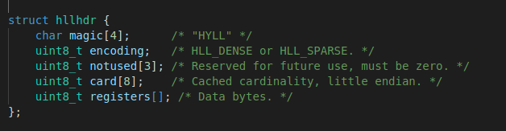

## redis数据结构实现源码解析    
整个redisd的数据类型包括各种对象的实现都是基于该篇所讲的数据结构所实现的，作者充分考虑的应用需要和节约内存所以实现了许多数据结构，里面的许多细节很令人佩服我将依次分析各个数据结构的底层实现，并会插以图和表的形式方便理解。     

### 1.zmalloc.h和zmalloc.c     
redis为了方便内存管理和使用，自己对malloc,free函数进行了封装。     

- 设计思想     
  我们知道传统的malloc,free，当我们得到一个动态分配的内存的指针，实际上并不知道该指针指向的内存是多少，也就是说给你一个指针，你知道它指向某个动态分配内存空间，但你不知道具体分配了多少，redis为了清楚每个动态内存的指针，所以采取了"[prefix][user really use]"的形式封装了malloc。prefix是一个固定的size_t类型大小，记录了你指针分配的内存大小，也就是上面的2段总和，最后的"user really use"是暴露给外界的也就是跟正常一样用户申请大小。例如我们用zmalloc函数申请一个10字节大小的空间，下面是真正的内存布局。     
         
  当我们申请10字节内存时，实际申请了sizeof(size_t)+10字节的内存，然后将10保存在size_t中，然后对外返回指针p,当我们拿到了指针p，往前读size_t字节所对应的值就是p所指向的10字节大小，也就知道了任意一个由redis动态分配的内存指针所指向的字节数。      
  但在有些平台本身就是实现了该功能，所以我们经常能够看到这样的宏定义     
       
  其中就是某些平台可以通过某些自带的函数实现相应的功能，所以定义了一个宏HAVE_MALLOC_SIZE,表示如果该平台是否实现了这一功能，Linux下是没有该功能的。     

- 源码分析     
  头文件有以下函数声明          
      

  zmalloc.c文件函数实现细节     
      
  这两个宏定义是为了更新一个zmalloc中维护的全局变量**used_memory**，该变量表示当前redis通过自带malloc函数从内存中分配总的内存空间。另外redis的used_memory记载的内存总是以sizeof(long)长度字节对齐，也就是每一次分配得到的内存都是long类型长度的整数倍。这可能是因为malloc函数底层实现估计也是以long长度对齐分配给用户，所以used_memory更可能是记载从内存实际得到的内存。            
  ```
  static void zmalloc_default_oom(size_t size) #out of memeory的默认处理函数，会退出程序     
  void *zmalloc(size_t size) #对::malloc()函数的封装，申请内存失败会调用默认的out of memory处理函数     
  void *zcalloc(size_t size) #对::calloc(num,size)函数的封装，calloc表示申请num块，size大小的连续内存，并置为0     
  void *zrealloc(void *ptr, size_t size) #对::realloc()函数的封装，realloc会尝试在原来内存位置扩大或者缩小内存，若不能，则会重新分配一块内存，并把旧内存数据拷贝到新内存处。     
  size_t zmalloc_size(void *ptr) #返回的是该指针分配大小，对应着全局静态变量used_memory中加入每一次分配内存大小     
  void zfree(void *ptr) #释放对应的内存，同时也会更新全局静态变量used_memory,从中减去相应内存     
  char *zstrdup(const char *s)复制一个C风格字符串，最后返回由redis管理的指针     
  size_t zmalloc_used_memory(void) #返回全局静态变量used_memory的值，也就是整个内存分配的大小    
  void zmalloc_set_oom_handler(void (*oom_handler)(size_t)) #设置默认的out of memory处理函数   
  #下面是在linux下有个记录程序各种状态的文件/proc/       
  size_t zmalloc_get_rss(void) #rss表示某个进程的常驻内存集(resident set size)，返回该进程所占内存大小    
  float zmalloc_get_fragmentation_ratio(size_t rss) #内存碎片率，表示rss/used_memory大小     
  size_t zmalloc_get_smap_bytes_by_field(char *field, long pid) #获取/proc/pid/smaps中某一field字段的所表示字节大小    
  size_t zmalloc_get_private_dirty(long pid) #获取rss中已改写的私有页面页面大小     
  ```    
  zrealloc()的原理图，假设新分配一个20字节大小的原指针为p的内存。其中realloc()底层会尝试在realptr分配所需字节，失败就重开一块内存，并把原指针指向的内存复制到新内存中，如图所示。   
       

- 总结    
  整个zmalloc，只是对原有的malloc，free的包装，最重要的就是加了一个PREFIX表示该指针所指向的分配的动态内存大小，这也是整个redis的内存基础，后续所有的内存都会基于此来构造各种数据结构。      

### 2.sds.h和sds.c    
Redis没有直接使用C语言传统的字符串表示（以空字符结尾的字符数组，以下简称C字 符串），而是自己构建了一种名为简单动态字符串（simple dynamic string，SDS）的抽象类型，并将SDS用作Redis的默认字符串表示。     
redis中的sds结构包括两部分一个是struct sdshdr,也就是sds header的缩写，就是字符串头部，还有一个是字符串本身。redis实现的sds实际上兼容了c字符串，同时也是二进制安全的，这一切都要归功于对sdshdr的设计，里面保存了这个字符串的重要信息。      
一个典型的sds字符串如下:      
      
一个字符串在内存中的布局类似于上面这样，针对不同的字符串长度redis为sds定义了5位，8位，16位，32位，64位5种表示字符串长度的sdshdr头部结构，其中的不同就是len,alloc所用表示字符串长度的字节数。上面是以sdshdr32位示例，也就是32位表示长度。     
其中len表示的是某个字符串的长度，alloc表示的是一开始分配用来表示字符串的长度，例如原来有个字符串长度为20，那么第一次构造sds则len,alloc都为20，又后来该sds表示的字符串长度为10，那么len就是10，alloc还是20。flags用来表示这个sdshdr头部是属于哪一种类型，8位，16位....等等，然后buf就是真正的指针指向字符串数据的开头，也是对完暴露的指针，对外的sds其实是char*的别名，其实也就是这里的buf指针。     

- 设计思想    
  redis设计sds，简单动态字符串是为了更方便的管理字符串，同时也可以提高效率。从上面的分析我们看到想要获得字符串的长度我们只需要O(1)复杂度就可以，相对传统C字符串效率提高，sds利用此种结构实现了另个分配策略，一个是空间预分配策略，另一个是惰性空间释放策略。空间预分配用于优化SDS的字符串增长操作：当SDS的API对一个SDS进行修改，并且需要对SDS进行空间扩展的时候，程序不仅会为SDS分配修改所必须要的空间，还会为SDS分配额外的未使用空间，当SDS的API需要缩短SDS保存的字符串时，程序并不立即使用内存重分配来回收缩短后多出来的字节，而是使用alloc-len大小将这些字节的数量记录起来，并等待将来使用。总之通过后面的源码我们能够体会到sds设计的漂亮之处。     

- 源码分析   
  **sds.h头文件**         
       
  这里定义了sds头部类型，掩码，SDS_HDR_VAR(T,s)这个宏主要是对给定的sds字符串定义一个变量sh,表示这个字符串的sdshdr结构指针，SDS_HDR(T,s)返回sdshdr指针。     
  ```
  static inline size_t sdslen(const sds s) #返回对应sdshdr结构中的len字段，表示字符串sds的长度     
  static inline size_t sdsavail(const sds s) #返回对应sdshdr结构中alloc-len，表示未用的表示字符串长度，一般用于字符串的扩大操作      
  static inline void sdssetlen(sds s, size_t newlen) #设置对应的sdshdr结构中len字段的值    
  static inline void sdsinclen(sds s, size_t inc) #设置对应的sdshdr结构中len字段值增加inc大小     
  static inline size_t sdsalloc(const sds s) #返回对应sdshdr结构中的alloc字段大小    
  static inline void sdssetalloc(sds s, size_t newlen) #设置对应的sdshdr结构中的alloc字段为newlen长度     
  ```    

  **sds.c源文件**   
  ```
  static inline int sdsHdrSize(char type) #返回sdshdr头部结构大小    
  static inline char sdsReqType(size_t string_size) #返回一个给定大小字符串所需要的头部类型     
  sds sdsnewlen(const void *init, size_t initlen) #通过一个给定的字符串指针和长度，返回一个sds字符串包括一个头长度+initlen+1      
  sds sdsempty(void) #创建一个空的0长度的sds字符串     
  sds sdsnew(const char *init) #通过一个给定的C风格字符串创建一个对应的sds字符串     
  sds sdsdup(const sds s) #复制一个给定的sds字符串，返回一个新的sds字符串    
  void sdsfree(sds s) #释放一个sds字符串整个空间    
  void sdsupdatelen(sds s) #更新某个sds的len属性，长度为第一个'\0'字符串所对应的长度     
  void sdsclear(sds s) #清空sds字符串，其实就是把len属性置为0，同时s[0]='\0'     
  sds sdsMakeRoomFor(sds s, size_t addlen) #根据某个sds字符串增加他的len属性    
  sds sdsRemoveFreeSpace(sds s) #移除free空间    
  size_t sdsAllocSize(sds s) #返回记录一个sds字符串所用的总空间包括hdrsize+alloc+1    
  void *sdsAllocPtr(sds s) #返回一个sds字符串的头指针，也就是最前面的指针    
  void sdsIncrLen(sds s, ssize_t incr) #增加len属性长度的值    
  sds sdsgrowzero(sds s, size_t len) #sds变为len长度的sds，并把空闲的字节置为0，内部调用了sdsMakeRoomFor()函数     
  sds sdscatlen(sds s, const void *t, size_t len) #在原有sds基础上增加某个字符串    
  sds sdscat(sds s, const char *t) #在某个sds字符串上增加C风格字符串    
  sds sdscatsds(sds s, const sds t) #在某个sds字符串上增加一个sds   
  sds sdscpylen(sds s, const char *t, size_t len) #sds复制某个字符串，覆盖了原来的sds字符串    
  sds sdscpy(sds s, const char *t) #复制某个字符串    
  int sdsll2str(char *s, long long value) #long long值转化为sds字符串   
  int sdsull2str(char *s, unsigned long long v) #无符号的long  long 值转化为sds字符串   
  sds sdsfromlonglong(long long value) #通过一个给定value值创建一个对应的sds字符串    
  sds sdscatvprintf(sds s, const char *fmt, va_list ap） # cat一个格式化风格字符串    
  sds sdscatprintf(sds s, const char *fmt, ...) #内部调用上面的函数，cat一个格式化风格字符串    
  sds sdscatfmt(sds s, char const *fmt, ...) #cat格式化字符串,不过格式都是自定义的如下所示:  
   %s - C String
   %S - SDS string
   %i - signed int
   %I - 64 bit signed integer (long long, int64_t)
   %u - unsigned int
   %U - 64 bit unsigned integer (unsigned long long, uint64_t)
   %% - Verbatim "%" character.    
  sds sdstrim(sds s, const char *cset) #移除某个sds字符串两端的cset子字符串    
  void sdsrange(sds s, ssize_t start, ssize_t end) #sds字符串截取[start,end]范围的字符串    
  void sdstolower(sds s) #将sds字符串全部变为小写    
  void sdstoupper(sds s) #将sds字符串全部变为大写   
  int sdscmp(const sds s1, const sds s2) #比较两个字符串完全相等为0，部分相等，s1>s2为1，小于则为-1   
  sds *sdssplitlen(const char *s, ssize_t len, const char *sep, int seplen, int *count) #分隔某个字符串，提取各个部分，返回一个sds数组   
  sds sdscatrepr(sds s, const char *p, size_t len) #sds字符串cat一个包含转义字符的字符串   
  sds *sdssplitargs(const char *line, int *argc) #解析某一行字符串的参数为sds字符串    
  sds sdsmapchars(sds s, const char *from, const char *to, size_t setlen) #将sds中出现的from所对应的字符依次转化为to所对应的字符    
  sds sdsjoin(char **argv, int argc, char *sep) #返回一个sds由字符串数组和分隔符号组成    
  sds sdsjoinsds(sds *argv, int argc, const char *sep, size_t seplen) #和上面一样，只不过是字符数组变为了sds字符串数组   
  ``` 

- 总结   
  整个sds字符串的设计并不难，利用了一个头部的结构就实现了动态字符串，不仅可以动态调整字符串，还采用了预分配内存和惰性释放内存的策略，使得对字符串的各种操作相对于传统的C风格字符串在效率上面有一定的提高，同时sds字符串是兼容C风格字符串。考虑到数据库中有许许多多的地方用到字符串，所以sds结构的设计在一定程度上提高了数据库的效率。      

### 3.adlist.h和adlist.c   
adlist是双端链表的结构，也就是说链表既可以往前也可以往后遍历。由于redis每个数据基本都是由堆分配，所以双端链表里提供了三个函数指针，复制某个节点，释放某个节点匹配某个节点。adlist也是基本数据结构也不是很难      
     
整个list由一个list头和多个listNode节点构成，list中head指向链表第一个节点，tai指向链表最后一个节点，dup,free,match分别是3个函数指针处理listNode,len表示list的长度，上图中为3，listNode中next指向下一节点，prev指向上一节点，value指针指向真正存放的节点数据。    

- 设计思想    
  adlist通用双端链表的设计和普通链表的设计的不同是可以向前和向后变量其他的也不是很复杂    

- 源码分析
  **adlist.h头文件**    
      
       
  adlist一些宏定义的函数也十分的简单明了     
  **adlist.c源文件**    
  ```
  list *listCreate(void) #创建一个空list，所以数据都为Null     
  void listEmpty(list *list) #清空所有的listNode节点，如果有free函数，则会清空value所指的数据    
  void listRelease(list *list) #清空所以list，包括头部和所有节点    
  list *listAddNodeHead(list *list, void *value) #头插法插入一个节点    
  list *listAddNodeTail(list *list, void *value) #尾插法插入一个节点    
  list *listInsertNode(list *list, listNode *old_node, void *value, int after) #插入某个节点old_node的后面或者前面    
  void listDelNode(list *list, listNode *node) #删除某个借点，有free，释放对应的value    
  listIter *listGetIterator(list *list, int direction) #返回一个list迭代器direction为遍历的方向    
  void listReleaseIterator(listIter *iter) #释放某个迭代器    
  void listRewind(list *list, listIter *li) #重置某个迭代器从头部开始   
  void listRewindTail(list *list, listIter *li) #重置某个迭代器从尾部开始    
  listNode *listNext(listIter *iter) #返回迭代器的next所指向的值，同时更新迭代器的值    
  list *listDup(list *orig) #完全复制一个list    
  listNode *listSearchKey(list *list, void *key) #通过某个key比较节点值，返回符合条件的节点    
  listNode *listIndex(list *list, long index) #返回某个索引对应的节点0为头结点，-1为最后一个节点   
  void listRotate(list *list) #将list最后一个节点移动头节点，轮转    
  void listJoin(list *l, list *o) #将o中的节点加入到l的尾部    
  ```

- 总结   
  adlist也就是双端通用节点，也比较简单，注意到节点中值是用value指向的，list中有3个函数指针，dup,是复制listNode中的值时候用的，free是释放listNode中的值所用的，match是listNode是匹配比较list中的值所用的。     

### 4.dict.h和dict.c    
Redis的字典底层是通过哈希表实现的，哈希表解决冲突的方式是地址链法。每个哈希表节点有一个next指针，多个哈希表节点通过next 指针构成一个单向链表。因为 dictEntry 节点组成的链表没有指向链表表尾的指针，所以为了速度考虑，总是将新节点添加到链表的表头位置（复杂度为O(1)）,排在其他已有节点前面。随着操作的不断执行，哈希表保存的键值对会逐渐的增多或减少，为了让哈希表的负载因子维持在一个合理的阈值之内，当哈希表的键值对的数量太多或太少时，对哈希表进行相应的扩展或收缩。   

- 设计思想  
  redis的字典结构设计是为整个redis的核心内容至于，key,value的键值对如何保存在内存中，哈希表如何rehash而不影响效率，如传统的都是一次hash，但某个哈希表有大量数据的时候一次hash会造成巨大的时间，redis采用了一个很聪明的做法，渐进式rehash。这是整个dict的关键，保证了在大数据情况下能保证rehash的效率    

- 源码分析    
  **dict.h头文件**   
      
  dictEntry,dictht,dict，dictType是整个dict的重要组成部分，dictTpye定义了很多字段所需要的函数的指针。dictEntry表示一个键值对，dictht表示一个哈希表，dict则表示一个字典    
      
  看dict结构中，type表示该dict所需要的一些函数，privdata表示该dict的一些私有数据，ht则指向两种dicthb，rehashidx表示rehash时的索引，-1表示并没有在rehash,iterators表示当前正在有几个该dict的迭代器在使用    
  dictht结构值，table则是一个数组每一个都是一个dictEntry指针，size，表示这个hashtable数组的长度也就是我们所理解的桶的数量，sizemask永远是size-1,用于得到对应dictEntry在数组中的索引，used表示当前hashtable中有几个dictEntry元素。    
  dictEntry结构则表示了一个key,value键值对对象，有key，value可以是数或者指针，还有一个next指针，key的hash值同一个的通过链表连起来。      

  ```
  typedef void (dictScanFunction)(void *privdata, const dictEntry *de) #typedef定义了一个scan键值对函数    
  typedef void (dictScanBucketFunction)(void *privdata, dictEntry **bucketref) #typedef定义了一个scan桶的函数    
  ```   
  一些常见的宏定义    
       

  **dict.c源文件**  
  ```
  static void _dictReset(dictht *ht) #重置哈希表参数为0      
  dict *dictCreate(dictType *type,void *privDataPtr) #给定dictType和privDataPtr创建一个dict     
  int _dictInit(dict *d, dictType *type,void *privDataPtr) #初始化一个dict,该函数被上面的调用    
  int dictResize(dict *d) #resize这个哈希表去最小的能包含当前元素的大小    
  int dictExpand(dict *d, unsigned long size) #扩展或者创建一个哈希表       
  static unsigned long _dictNextPower(unsigned long size) #返回大于等于size的最小的2次方，最小返回4    
  int dictRehash(dict *d, int n) #渐进式rehash，这里rehash步数为n,每一步就是找到一个不为空的桶，把他们rehash到第二个表中   
  int dictRehashMilliseconds(dict *d, int ms) #在ms时间内rehash，一次rehash100个bucket   
  static void _dictRehashStep(dict *d) #一次rehash一个桶   
  int dictAdd(dict *d, void *key, void *val) #dict加入一个键值对    
  dictEntry *dictAddRaw(dict *d, void *key, dictEntry **existing) #dict中加入一个dictEntry如果key已经存在，则existing返回对应的dictEntry    
  int dictReplace(dict *d, void *key, void *val) #dict代替某个键值对，如果key不存在则add一个新的键值对，如果key存在，则替换对应key的value值    
  dictEntry *dictAddOrFind(dict *d, void *key) #某个key，若是存在则返回对应的dictEntry,若是不存在则向dict中增加一个dictEntry并返回对应的dictEntry    
  static dictEntry *dictGenericDelete(dict *d, const void *key, int nofree) #删除某个dictEntry,nofree为true不释放对应dictEntry的key,value和dictEntry本身，为false则释放dictEntry和所对应的key,value    
  int dictDelete(dict *ht, const void *key) #删除对应的dictEntry    
  dictEntry *dictUnlink(dict *ht, const void *key) #只是将对应的dictEntry不连接到哈希表中，并没有删除它    
  void dictFreeUnlinkedEntry(dict *d, dictEntry *he) #删除未连接到哈希表中孤立的dictEntry    
  int _dictClear(dict *d, dictht *ht, void(callback)(void *)) #清空某个dictht   
  void dictRelease(dict *d) #清空整个dict    
  dictEntry *dictFind(dict *d, const void *key) #查找某个key对应的dictEntry    
  void *dictFetchValue(dict *d, const void *key) #提取某个key对应的value值   
  long long dictFingerprint(dict *d) #计算某个dict的指纹，也就是唯一标识，如果dict改动了那么所对应的指纹也就变了    
  static int _dictExpandIfNeeded(dict *d) #扩展dict如果需要   
  static long _dictKeyIndex(dict *d, const void *key, uint64_t hash, dictEntry **existing) #返回key所对应的索引，如果key已经存在那么返回-1    
  dictIterator *dictGetIterator(dict *d) #创建对应的dict的迭代器。只能用于dictNext()       
  dictIterator *dictGetSafeIterator(dict *d) #创建安全迭代器    
  dictEntry *dictNext(dictIterator *iter) #得到下一个dictEntry   
  void dictReleaseIterator(dictIterator *iter) #释放迭代器   
  dictEntry *dictGetRandomKey(dict *d) #返回一个随机的key对应的dictEntry    
  unsigned int dictGetSomeKeys(dict *d, dictEntry **des, unsigned int count)  #得到一些随机的dictEntry有可能会有重复的dictEntry   
  static unsigned long rev(unsigned long v) #反转位值   
  unsigned long dictScan(dict *d,
                       unsigned long v,
                       dictScanFunction *fn,
                       dictScanBucketFunction* bucketfn,
                       void *privdata)  #由于是渐进式rehash，这个函数保证能够遍历所以元素，虽然有少部分元素被重复遍历      

  dictEntry **dictFindEntryRefByPtrAndHash(dict *d, const void *oldptr, uint64_t hash) #通过hash值和对应的key找到对应的dictEntry   
  ```    
  rehash操作    
        

- 总结   
  整个dict的关键是渐进式rehash,为了避免键值对过多的 rehash（涉及到庞大的计算量） 对服务器性能造成影响，服务器不是一次将ht[0] 上的所有键值对 rehash 到 ht[1]，而是分多次、渐进式的将 ht[0] 里所有的键值对进行迁移。    
  渐进式hash 的步骤：     
  1.为ht[1]分配空间，让字典同时持有 ht[0] ht[1]    
  2.在字典中维持一个索引计数器变量 rehashidx，并将其设置为0，标识 rehash 开始    
  3.在 rehash 期间，每次对字典的添加、删除、查找或更新等，程序除了执行指定的操作外，还会将ht[0] 哈希表在 rehashidx 索引上的所有键值对 rehash 到 ht[1] 上，当rehash 完成后，程序将 rehashidx 值加一。     
  4.最终，ht[0]全部 rehash 到 ht[1] 上，这时程序将 rehashidx 值设置为 -1，标识 rehash 完成      
  渐进式rehash 将rehash 的工作均摊到每个添加、删除、查找和更新中，从而避免集中rehash带来的问题。

### 5.zskiplist   
zskiplist跳跃表结构是一种链表的扩展，为了加快访问效率所产生的一种数据结构    

- 设计思想   
  Redis使用跳跃表作为有序集合键的底层实现之一,如果一个有序集合包含的元素数量比较多,又或者有序集合中元素的成员是比较长的字符串时, Redis就会使用跳跃表来作为有序集合健的底层实现。从上面我们可以知道，跳跃表在链表的基础上增加了多级索引以提升查找的效率，但其是一个空间换时间的方案，必然会带来一个问题——索引是占内存的。原始链表中存储的有可能是很大的对象，而索引结点只需要存储关键值值和几个指针，并不需要存储对象，因此当节点本身比较大或者元素数量比较多的时候，其优势必然会被放大，而缺点则可以忽略。    
- 源码分析  
  **server.h头文件中的zskiplist结构**   
      
     
  header:指向跳跃表的表头节点，通过这个指针程序定位表头节点的时间复杂度就为O(1)   
  tail:指向跳跃表的表尾节点,通过这个指针程序定位表尾节点的时间复杂度就为O(1)    
  level:记录目前跳跃表内,层数最大的那个节点的层数(表头节点的层数不计算在内)，通过这个属性可以再O(1)的时间复杂度内获取层高最好的节点的层数。   
  length:记录跳跃表的长度,也即是,跳跃表目前包含节点的数量(表头节点不计算在内)，通过这个属性，程序可以再O(1)的时间复杂度内返回跳跃表的长度    
  层(level):    
    节点中用1、2、L3等字样标记节点的各个层,L1代表第一层,L代表第二层,以此类推。      
    每个层都带有两个属性:前进指针和跨度。前进指针用于访问位于表尾方向的其他节点,而跨度则记录了前进指针所指向节点和当前节点的距离(跨度越大、距离越远)。在上图中,连线上带有数字的箭头就代表前进指针,而那个数字就是跨度。当程序从表头向表尾进行遍历时,访问会沿着层的前进指针进行。      
    每次创建一个新跳跃表节点的时候,程序都根据幂次定律(powerlaw,越大的数出现的概率越小)随机生成一个介于1和32之间的值作为level数组的大小,这个大小就是层的“高度”。      
  后退(backward)指针：    
    节点中用BW字样标记节点的后退指针,它指向位于当前节点的前一个节点。后退指针在程序从表尾向表头遍历时使用。与前进指针所不同的是每个节点只有一个后退指针，因此每次只能后退一个节点。     
  分值(score):    
    各个节点中的1.0、2.0和3.0是节点所保存的分值。在跳跃表中,节点按各自所保存的分值从小到大排列。    
  成员对象(oj):    
    各个节点中的o1、o2和o3是节点所保存的成员对象。在同一个跳跃表中,各个节点保存的成员对象必须是唯一的,但是多个节点保存的分值却可以是相同的:分值相同的节点将按照成员对象在字典序中的大小来进行排序,成员对象较小的节点会排在前面(靠近表头的方向),而成员对象较大的节点则会排在后面(靠近表尾的方向)。     

       

  **t_zset.c源文件中以zsl开头的函数**    
  ```
  zskiplistNode *zslCreateNode(int level, double score, sds ele) #创建一个skiplistNode一共有多少级由外部的参数level决定，同时该节点包含了score和ele    
  zskiplist *zslCreate(void) #创建一个跳跃表，包含一个头节点有32level,这个头节点相当于一个哨兵节点         
  void zslFreeNode(zskiplistNode *node) #释放某个skiplistNode，会先释放元素ele，然后释放节点本身    
  void zslFree(zskiplist *zsl) #释放整个节点的空间包括头结点，最后释放整个zsl   
  int zslRandomLevel(void) #返回位于1到最高的level之间包括两者的某一level,越大概率越低   
  zskiplistNode *zslInsert(zskiplist *zsl, double score, sds ele) #插入某个节点  
  void zslDeleteNode(zskiplist *zsl, zskiplistNode *x, zskiplistNode **update) #删除某个节点    
  int zslDelete(zskiplist *zsl, double score, sds ele, zskiplistNode **node) #上面函数被这个函数真正调用删除某个分数对应的节点    
  ```   
  插入某个节点，假设score是2,level是6
       
  插入该节点时，x为该节点，从图中可以看到从左到右原来的节点依次是，header,1,2,3。则update其实就是排在x左边每一level最近的一个节点,update[4]也就是level5层所以最大的小于该节点score，也就是header,update[3]就对应了第1个节点，update[2]对应第2个节点，update[1]对应第2个节点，update[0]对应第2个节点。rank[4]=0;rank[3]=1,rank[2]=2,rank[1]=2,rank[0]=2,     
       
  从上面可以看到跳跃表是一个有序的从小到大排序的集合，从高level向低level查找，可以加快查找速度     

- 总结    
  redis的跳跃表的实现异常精妙，其本质是一个有序链表。结合了概率学，利用内存换时间，使得链表查找达到了o(logn)的速度。媲美红黑树。不过使用的空间应该要多于红黑树。但是其实现比红黑树简单很多，不存在红黑树纷繁复杂的左旋，右旋的操作。    

###  6.hyperloglog.c    
hyperloglog是一个算法用于估计一组数据不重复的次数，作用是能够提供不精确的去重计数，试想一下一个网站每天有上百万乃至上亿次数的点击，如何计算有多少用户访问过，hyperloglog就是这样一个算法能够提供一个估计去重值。     

- 设计思想    
  hyperloglog算法就是利用了概率的思想去估算出现的次数，HyperLogLog算法时一种非常巧妙的近似统计大量去重元素数量的算法，它内部维护了16384个桶来记录各自桶的元素数量，当一个元素过来，它会散列到其中一个桶。当元素到来时，通过 hash 算法将这个元素分派到其中的一个小集合存储，同样的元素总是会散列到同样的小集合。这样总的计数就是所有小集合大小的总和。使用这种方式精确计数除了可以增加元素外，还可以减少元素。一个HyperLogLog实际占用的空间大约是 13684 * 6bit / 8 = 12k 字节。但是在计数比较小的时候，大多数桶的计数值都是零。如果 12k 字节里面太多的字节都是零，那么这个空间是可以适当节约一下的。Redis 在计数值比较小的情况下采用了稀疏存储，稀疏存储的空间占用远远小于 12k 字节。相对于稀疏存储的就是密集存储，密集存储会恒定占用 12k 字节。   

- 源码分析   
  **hyperloglog.c源文件**    
  不管是密集型结构还是稀疏性结构都有一个hyperloglog的header如下所示：    
      
  魔幻字符“HYLL”，表示一个hyperloglog的标识，encoding则表示这个结构是稀疏性还是密集型结构。后3个字节保留使用，之后的8个字节，card[8],则是出于一个考虑，如果在一个hyperloglog中加入了一个数据，但该数据并没有影响组合估算的基数，那么我们就不需要去重新计算基数，这样省了许多时间，在数据很庞大的时候，大概率我们是不需要去重新计算的，最高位如果为0表示数据是有效的，基数没有被更新，为1则需要去重新计算基数。   

  - 密集型结构   
    registers也称为桶，密集型结构就是2的14次方，也即是16384个连续的6bit表示，16384个桶，占内存为12KB，因为用桶是为了计算每个桶所估算的数据，假设只有一个桶的话，如果出现了一个形如0x000000000000....1这样那么估算的基数就很大，如果有多个桶的话一个桶6位，最多63个数据，这样的话可以更进一步的减少估算误差，使估算稳定性更高。     

  - 稀疏性结构   
    稀疏性结构的 出现是因为这么多桶很大概率会出现好多是数据为0的桶，所以采用了如下所示的表示方法：    
    ZERO形式的编码形如00xxxxxx,一个字节表示的由后6位生成的数字加1，表示连续多少个桶数据为0   
    XZERO形式的编码形如01xxxxxx yyyyyyyy,两个字节，后面14位计算，表示多少个桶连续数据为0   
    VAL形式的编码形如1vvvvvxx,一个字节，其中5位用来表示桶的数据的值value，xx两位用来表示有多少个连续的桶值为value,最大表示1-4个连续的值1-32。     
  
  稀疏性结构在一定条件下会转化为密集型结构       

  一些低级别函数的宏定义     
      
  ```
  #左边是低位右边是高位    
  #define HLL_DENSE_GET_REGISTER(target,p,regnum)  #储存在密集型结构中regnum位置的桶的值到target中，假设第一个字节为0x1000001 第二个字节为0x10100101        
                                                   #那么regnum 0 对应的就是第一个字节的低6位也就是1，regnum 1对应的就是第一个字节的高两位作为低位，第二个字节的低四位作为高位组成的6位数就是010110也就是22        
  #define HLL_DENSE_SET_REGISTER(p,regnum,val) #设置在密集型结构中regnum位置的桶的值   
  ```     
  下面就是一些函数说明        
  ```
  uint64_t MurmurHash64A (const void * key, int len, unsigned int seed) #返回一个key的hash值用的是MurmurHash2,64位版本    
  int hllPatLen(unsigned char *ele, size_t elesize, long *regp)  #返回一个给定元素的在桶的索引和模式pattern"00001"从低位到高为第一个1出现的位数包括第一个1。     
  int hllDenseSet(uint8_t *registers, long index, uint8_t count) #给index索引桶设置值为count,如果返回1表示该桶最大值改变了，则缓冲去估算的基数要重新计算，返回0否则不需要     
  int hllDenseAdd(uint8_t *registers, unsigned char *ele, size_t elesize) #上面几个函数的调用先计算hash值然后计算桶index和count,最后调用hllDenseSet()函数，返回1表明估计基数值修改    
  double hllDenseSum(uint8_t *registers, double *PE, int *ezp) #计算桶计算的调和平均值   

  int hllSparseToDense(robj *o) #转化这个稀疏性结构为密集型结构，都是字符串sds流    
  int hllSparseSet(robj *o, long index, uint8_t count) #向hyperloglog稀疏性中加如这个值，可能转化为密集型，如果当稀疏性表示的值不能覆盖count,或者稀疏性结构字节大小大于某个临界值hll_sparse_max_bytes    
  int hllSparseAdd(robj *o, unsigned char *ele, size_t elesize) #添加一个ele元素，先计算索引和count,然后调用hllSparseSet()函数添加进稀疏性结构    
  double hllSparseSum(uint8_t *sparse, int sparselen, double *PE, int *ezp, int *invalid) #计算稀疏性结构的调和平均值      

  double hllRawSum(uint8_t *registers, double *PE, int *ezp) #原生数据求和     
  uint64_t hllCount(struct hllhdr *hdr, int *invalid) #依据hllhdr结构中的encoding为密集型，还是稀疏型还是原生型计算count数     
  int hllAdd(robj *o, unsigned char *ele, size_t elesize) #加入某个元素到hyperloglog算法中    
  int hllMerge(uint8_t *max, robj *hll) #合并每个桶中的最大值，将每个桶最大值写入对应max中   
  
  ```
     
  从这里就可以判断一个给定的hash值应该属于哪个桶值为多少，这里属于索引为10的桶count值为4   

- 总结   
  hyperloglog以字符串流的形式存储数据，分为稀疏性和密集型，密集型固定需要12KB的内存空间保存16384的内存结构，不论是稀疏性还是密集型都能够起到估算基数的作用，稀疏型是采用连续多少个0或者连续几个值为xxx,这样的字节编码起到压缩数据的作用，更大大的减小了空间。总之虽然hyperloglog看起来很高深，其实在看完源码之后也就明白了，是如何做到12KB估算统计几百万乃至上亿的数据 。     
   


  