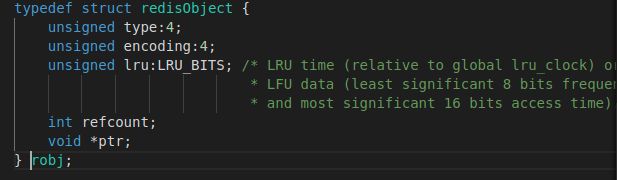
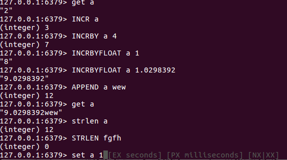
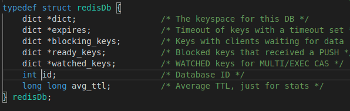

## redis对象的实现     
主要包括以下几个部分     
1.各种redis对象，包括string对象，list对象，set对象，hash对象，zset对象     
2.各种键对象的实现     

### 1.object.c      
- 设计思想   
  redis有各种数据结构，然而 Redis 并没有直接使用这些数据结构来实现键值对的数据库，而是在这些数据结构之上又包装了一层 RedisObject（对象），RedisObject 有五种对象：字符串对象、列表对象、哈希对象、集合对象和有序集合对象。通过不同类型的对象，Redis 可以在执行命令之前，根据对象的类型来判断一个对象是否可以执行给定的命令。我们可以针对不同的使用场景，为对象设置不同的实现，从而优化内存或查询速度。    

- 源码分析    
  
  **object.c源文件**   
        
  object抽象出来了这么一个结构，我们看看各字段的含义    
  type:    
  type 记录了对象的类型，所有的类型如下，其中键一定是字符串对象，值是5种对象中的任一种      
  |类型常量|对象名称|
  |:----|:----|
  |OBJ_STRING|字符串对象|  
  |OBJ_LIST|列表对象|
  |OBJ_SET|集合对象|
  |OBJ_HASH|哈希对象|
  |OBJ_ZSET|有序集合对象|   
  ptr:      
  指向对象的底层实现数据结构      

  encoding:     
  encoding 表示 ptr 指向的具体数据结构，即这个对象使用了什么数据结构作为底层实现,encoding主要有以下几种     

  |编码常量|编码常量所对应的底层数据结构|
  |:----|:----|
  |OBJ_ENCODING_RAW|简单动态字符串|  
  |OBJ_ENCODING_EMBSTR|embstr编码的简单动态字符串|
  |OBJ_ENCODING_INT|long类型的整数|  
  |OBJ_ENCODING_QUICKLIST|quicklist对应的快速列表|  
  |OBJ_ENCODING_ZIPLIST|ziplist对应的压缩列表| 
  |OBJ_ENCODING_HT|dict对应的字典结构|
  |OBJ_ENCODING_INTSET|intset对应的整数集合|
  |OBJ_ENCODING_SKIPLIST|包含skiplist和dict两种结构|    
  
  每种对象类型可能底层实现有多种数据结构，下面是对象和数据结构之间的关系     

  |类型|编码|对象|
  |:----|:----|:----|
  |OBJ_STRING|OBJ_ENCODING_RAW|使用简单字符串实现的字符串对象|
  |OBJ_STRING|OBJ_ENCODING_EMBSTR|使用embstr编码简单字符串实现的字符串对象|
  |OBJ_STRING|OBJ_ENCODING_INT|使用整数值实现的字符串对象|  
  |OBJ_LIST|OBJ_ENCODING_QUICKLIST|使用快速列表实现的列表对象|
  |OBJ_LIST|OBJ_ENCODING_ZIPLIST|使用压缩列表实现的列表对象|
  |OBJ_SET|OBJ_ENCODING_HT|使用字典实现的集合对象|  
  |OBJ_SET|OBJ_ENCODING_INTSET|使用整数集合实现的集合对象|
  |OBJ_HASH|OBJ_ENCODING_ZIPLIST|使用压缩列表实现的哈希对象|
  |OBJ_ZSET|OBJ_ENCODING_SKIPLIST|使用跳跃表和字典两种结构实现的有序集合对象|
  |OBJ_ZSET|OBJ_ENCODING_ZIPLIST|使用压缩列表实现的有序集合对象|   

  refcount:    
  refcount 表示引用计数，由于 C 语言并不具备内存回收功能，所以 Redis 在自己的对象系统中添加了这个属性，当一个对象的引用计数为0时，则表示该对象已经不被任何对象引用，则可以进行垃圾回收了。    

  lru:    
  表示对象最后一次被命令程序访问的时间     

  ```
  ###############字符串对象##################
  robj *createObject(int type, void *ptr) #创建对象底层数据结构采用OBJ_ENCODING_RAW   
  robj *makeObjectShared(robj *o) #设置对象的refcount为OBJ_SHARED_REFCOUNT表示为共享对象    
  robj *createRawStringObject(const char *ptr, size_t len) #创建底层为OBJ_ENCODING_RAW的字符串对象    
  robj *createEmbeddedStringObject(const char *ptr, size_t len) #创建底层为OBJ_ENCODING_EMBSTR的字符串对象，embstr编码其实就是object结构和string内存连在一起，一次分配两个内存    
  robj *createStringObject(const char *ptr, size_t len) #如果字符串长度小于等于BJ_ENCODING_EMBSTR_SIZE_LIMIT则采用embstr编码的字符串，否则原生字符串对象     
  robj *createStringObjectFromLongLong(long long value) #某个long long值，先看是否可以用共享对象，再看能否变为OBJ_ENCODING_INT字符串，最后不行才将数抓为字符串，存入对象    
  robj *createStringObjectFromLongDouble(long double value, int humanfriendly) #long double转化为字符串构建字符串对象    
  robj *dupStringObject(const robj *o) #复制某个字符串对象    
  void incrRefCount(robj *o)  #如果不是共享对象增加refcount计数   
  void decrRefCount(robj *o)  #如果不是共享对象，减少refcount计数，减为0时释放ptr指针所指向的对象数据    
  robj *tryObjectEncoding(robj *o) #试着将OBJ_ENCODING_RAW或者OBJ_ENCODING_EMBSTR字符串对象编码为OBJ_ENCODING_INT实现的对象，或者把OBJ_ENCODING_RAW转化为OBJ_ENCODING_EMBSTR，或者最差将OBJ_ENCODING_RAW字符串的空余位置压缩    
  robj *getDecodedObject(robj *o) #试着把OBJ_ENCODING_INT实现的字符串，创建为一个新的以OBJ_ENCODING_RAW或者OBJ_ENCODING_EMBSTR实现的字符串对象    
  int compareStringObjects(robj *a, robj *b) #二进制方式比较字符串对象    
  int collateStringObjects(robj *a, robj *b) #strcoll方式比较字符串对象    
  size_t stringObjectLen(robj *o) #得到字符串对象长度       
  int getDoubleFromObject(const robj *o, double *target) # 从字符串中得到double值   
  char *strEncoding(int encoding) #将对象的encoding转化为字符串    
  ```    

- 总结    
  该object.c中的部分源码只是为了让我们对redisObjetc结构描述对象有一个完整的认识，后续的各种键值对象的实现在后续值对象中会提到      

### 写在中间     
目前当我依照前面数据结构的阅读顺序读完底层的数据结构实现时至该文档该处，我迷茫了一个下午感觉后面有点看不懂，后来我一直不知道t_string.c这样的源文件到底是干啥的，也不知道后面该如何阅读源码，索性我硬着头皮把t_string.c看完了，也从中摸索处redis是如何实现输入命令之类的来达到效果的，当我去看t_string.c这个代码的函数实现时，里面有许多addReply()这样一类的函数，还出现了client这个数据结构。在这里我向要说一下我的看法，但我们追踪struct client结构的时候我们会发现这个结构恐怖了一串看不懂的，后来我就猜测这个结构应该是每一个客户端与redis服务器直接建立连接而创建的一个描述这个客户端的结构。同时我们会发现这个客户端会有两个非常重要的参数(我大概只知道这两个)c->db和c->argv,慢慢看t_string.c源代码，发现其实每次你在客户端发送一个命令时，argv其实就是命令行参数数组，而每个参数又被抽象为了一个redisObject。我们可以看c->argv的源码是 **robj  \*\*argv**,这不就表明这是一个参数数组，数组每个元素是一个对象指针，所以向下面       
   
这样的其实就是将每一次客户端的命令行参数经过通信到客户端应该会有一个client对象，其中的argv就是表示这些参数的对象（具体的通信，整个的client我也不清楚，只是猜测，到后面源码阅读越深再在后续补充解释）显然argc就是一次命令行参数的个数。还有一个c->db数据库的缩写?是的请看下面的结构     
    
可以看到redisDb对象表明一个数据库，其实更像是传统意义上的一张表，其实一个完整的redis数据库是由多个这样的对象组成的其中的id就是索引，我们接着看其中有的都是字典，我们猜测dict里面不就是每个entry保存的就是key，value嘛，所以我推断，我们插入一个键值对，键对象就是由该redisDb中的dict中的某个entry中的key所指向，值对象就是由对应的value指向。当然每个redisDb中键不能重复，但我们可以有多个对象啊，这样我们在插入或者查找各种操作的时候就需要指明是哪一个redisDb。       
还有一个我们总是看到**addReply(client*c)**这样的形式总有一个参数客户端，所以这个应该是向发送命令的客户端回应一个响应，然后客户端能够输出对应的东西。     
我们假设在客户端输入了以下命令    
> set name yang  

1.客户端打包一个类似的命令通过某种协议到redis服务端    
2.服务端初始化好对应的client对象，里面包含了各种信息   
3.然后服务端会依据这个处理这个请求，也就是解析argv的参数    
4.解析过程中经常会调用addReply()这样的函数也就是给客户端相应的相应    
5.客户端依据响应显示在终端    

以上也仅仅是我个人的猜测，其中的很多细节我也不是很清楚，但这也就给我可以接着看明白t_string.c这样的源文件，我知道这个源文件就是依据客户端对字符串对象的各种操作命令的解析。例如set等，很高兴，能坚持看下去，后续应该会对整个框架更熟悉，现在至少能看懂这几个源文件。     

最后我强烈建议看t_string.c,t_list.c源文件的时候可以一边在客户端敲对应命令看对应效果，一边看对应命令的源代码，这样很容易理解有些命令底层到底干了什么，效率如何。    

### 2.t_string.c      
这个源文件是客户端关于字符串对象的一些列操作命令的源代码，我们经常会说字符串键，列表键，哈希键等，其实这里并不是说一个键值对，key是列表对象，哈希对象，恰恰相反，所有的key都是一个字符串对象，而value可以是列表对象，哈希对象，字符串对象。所以这里的t_string.c就是我们将value以字符串对象的形式存在数据库中，其实也就是存在dict的哈希表中的entry中的value里。     

- 设计思想   
  针对字符串对象可以有不同的命令，redis在客户端与服务端之间抽象出来了一个client对象，这个对象涵盖了一个客户端与服务端交互的所所有信息。      
  有四种flag在设置时候分别是    
  1.OBJ_SET_NX  只有在key没有存在时才可以对该key的操作有效      
  2.OBJ_SET_XX  只有在key存在时某次对key的操作才有效    
  3.OBJ_SET_EX  redis里面的key是可以设置过期时间的，这个flag表明过期时间以秒计算   
  4.OBJ_SET_PX  key过期时间以毫秒计算     

- 源码分析   
  **t_string.c源文件**    
  ```
  static int checkStringLength(client *c, long long size) #检查某个字符串对象的长度若是大于512MB则会返回错误   
  void setGenericCommand(client *c, int flags, robj *key, robj *val, robj *expire, int unit, robj *ok_reply, robj *abort_reply) #set命令的同用函数，其他函数会调用这个函数    
  void setCommand(client *c) #SET命令的源码，设置key,value根据命令行参数  
  void setnxCommand(client *c) #SETNX命令，当数据库中key不存在时该命令才有效     
  void setexCommand(client *c) #SETEX命令，设置某个key的过期时间为多少秒之后   
  void psetexCommand(client *c) #PSETEX命令，设置某个key过期时间为毫秒   
  int getGenericCommand(client *c) #得到某个key的值    
  void getCommand(client *c) #GET命令，给到某个key的值   
  void getsetCommand(client *c) #GETSET命令，得到某个key现在值，然后设置新值    
  void setrangeCommand(client *c) #SETRANGE命令设置某个key的值往右偏移多少    
  void getrangeCommand(client *c) #GETRANGE命令，得到对应value的[start,end]对应的字符串   
  void mgetCommand(client *c) #MGET命令，得到多个key对应的多个值   
  void msetCommand(client *c) #MSET命令，设置多个key，若key存在则修改对应的值   
  void msetnxCommand(client *c) #MSETNX命令，设置多个key，每个key都不能已经存在，否则执行该命令    
  void incrCommand(client *c) #INCR命令，对应字符串若是数字加1    
  void decrCommand(client *c) #DERC命令，对应字符串若是数字减1   
  void incrbyCommand(client *c) #INCRBY命令，对应的字符串若是数字加对应的数  
  void decrbyCommand(client *c) #DECRBY命令，对应的字符串若是数字减对应的数  
  void incrbyfloatCommand(client *c) #INCRBYFLOAT命令，对应字符串若是数字加对应浮点数    
  void appendCommand(client *c) #APPEND命令，在key对应value字符串后面追加一个新字符串    
  void strlenCommand(client *c) #STRLEN命令，返回key对应的字符串长度   
  ```   

- 总结   
  
  redis的命令是忽略大小写的，在客户端有提示命令使用，tab键还能补全命令，十分友好     
  |命令|使用方法|作用|
  |:----|:----|:------|
  |SET|set key value [EX seconds] [PX milliseconds] [NX] [XX]|设置[key,value],包括过期时间，没有就是永久有效|   
  |SETNX|setnx key value|当key不存在时该命令才有效果|  
  |SETEX|setex key seconds value|设置某个key过期时间为seconds秒之后|
  |PSETEX|psetex key milliseconds value|设置某个key过期为millseconds毫秒之后|   
  |GET|get key|得到某个key的值|
  |GETSET|getset key value|得到某个key的值然后设置新值|    
  |SETRANGE|setrange key offset value|将某个key的value往右边偏移offset字节，左边字节补充为0|   
  |GETRANGE|getrange key start end|得到某个key的值字符串的[start,end]索引范围对应的值|    
  |MGET|mget key [key ...]|得到多个key对应的多个值，若key不存在返回字符nil表示不存在|   
  |MSET| mset key value [key value ...]|设置多个key，value|
  |MSETNX|msetnx key value [key value ...]|设置多个key，value，每个key都不能已经存在|   
  |INCR|incr key|若是对应的字符串是数字可以加1|
  |DECR|decr key|若是对应的字符串是数字减1|
  |INCRBY|incrby key increment|若是对应字符串是数字增加increment|
  |DECRBY|decrby key decrement|若是对应字符串是数字减去decrement|
  |INCRBYFLOAT|incrbyfloat key increment|若是对应字符串增加浮点数大小increment|  
  |APPEND|append key value|在原先key对应的字符串追加字符串，若key不存在，该key对应的值就是value|   
  |STRLEN|strlen key|返回key对应字符串的长度|      

### 3.t_list.c    
这里是关于列表的命令底层实现，我们可以看到列表底层实现默认采取的是快速列表quicklist,快去列表的实现其实就相当于一个双端列表加压缩列表，实际数据存储在压缩列表的entry中     

- 设计思想    
  redis对于列表就是存储一系列的值，可以按索引，取出来或者push，pop操作这个源文件就是对qiucklist.c源文件里的各种函数的调用封装，最后打包成对列表的操作   

- 源码分析   
  **t_list.c源文件**   
  ```
  ###############################list API##################################
  void listTypePush(robj *subject, robj *value, int where) #向list中的头或者尾巴，也就是quicklist中加入一个对象value    
  robj *listTypePop(robj *subject, int where) #向list对应的quicklist中的头或者尾巴弹出对应对象   
  unsigned long listTypeLength(const robj *subject) #返回整个list也就是quicklist中entry个数    
  listTypeIterator *listTypeInitIterator(robj *subject, long index,unsigned char direction) #list从某处初始化一个迭代器，listTypeIterator就是对quciklist迭代器的包装    
  void listTypeReleaseIterator(listTypeIterator *li) #释放迭代器对象   
  int listTypeNext(listTypeIterator *li, listTypeEntry *entry) #获取迭代器的值并向下移动迭代器，listTypeEntry其实就是quicklistEntry的包装    
  robj *listTypeGet(listTypeEntry *entry) #获取该entry的值包装为对象   
  void listTypeInsert(listTypeEntry *entry, robj *value, int where) #向list中某个entry前或者后插入value   
  int listTypeEqual(listTypeEntry *entry, robj *o) #比较list的某个entry和obj对象   
  void listTypeDelete(listTypeIterator *iter, listTypeEntry *entry)  #删除迭代器所指的值   
  void listTypeConvert(robj *subject, int enc) #将某个压缩列表subject对象，转化为quicklist对象   
  ```   
  ```
  #################################list命令函数####################################
  void pushGenericCommand(client *c, int where) #push命令依据方向在前或者后插入    
  void lpushCommand(client *c)  #LPUSH命令，list最前面插入一个value   
  void rpushCommand(client *c)  #RPUSH命令，list最后面插入一个value   
  void pushxGenericCommand(client *c, int where) #pushx命令已经前后方向插入，key必须存在  
  void lpushxCommand(client *c) #LPUSHX命令，对应的key必须存在，然后在对应列表前面插入，不存在则不作任何操作   
  void rpushxCommand(client *c) #RPUSHX命令，对应的key必须存在，然后在对应列表后面插入，不存在则不作任何操作    
  void linsertCommand(client *c) #LINSERT命令，在对应的字符串前或者后面插入value    
  void llenCommand(client *c) #LLEN命令，返回对应列表的元素个数   
  void lindexCommand(client *c) #LINDEX命令。返回列表对应索引的元素   
  void lsetCommand(client *c) #LSET命令，设置列表某个索引的值为新值   
  void popGenericCommand(client *c, int where) #为pop命令，弹出最前面或者最后面的一个元素值   
  void lpopCommand(client *c)  #LPOP命，令弹出列表最前面的元素的值   
  void rpopCommand(client *c)  #RPOP命令，弹出列表最后面的元素值  
  void lrangeCommand(client *c) #LRANGE命令，返回某一个索引范围内的元素值   
  void ltrimCommand(client *c) #LTRIM命令，截断列表的值
  void lremCommand(client *c) #移除某个值的元素个数    
  void rpoplpushCommand(client *c) #RPOPLPUSH命令，从某个列表最后面弹出，插入到另一个列表的最左边     
  ```   
  ```
  #################################list阻塞命令################################   
  void blpopCommand(client *c) #BLPOP命令。阻塞型的pop，若对应的key对应的列表最前面没有元素则在一定时间内等待数据   
  void brpopCommand(client *c) #BRPOP命令，若对应的key对应的列表最后面没有元素则在一定时间内等待数据    
  void brpoplpushCommand(client *c) #BRPOPLPUSH命令，若对应的source列表没有数据，则会在一定时间内等待数据   
  ```
  redis在blpop命令处理过程时，首先会去查找key对应的list，如果存在，则pop出数据响应给客户端。否则将对应的key push到blocking_keys数据结构当中，对应的value是被阻塞的client。当下次push命令发出时，服务器检查blocking_keys当中是否存在对应的key，如果存在，则将key添加到ready_keys链表当中，同时将value插入链表当中并响应客户端。     
  服务端在每次的事件循环当中处理完客户端请求之后，会遍历ready_keys链表，并从blocking_keys链表当中找到对应的client，进行响应，整个过程并不会阻塞事件循环的执行。所以， 总的来说，redis server是通过ready_keys和blocking_keys两个链表和事件循环来处理阻塞事件的。
- 总结   
  列表的操作命令底层其实就是操作quicklist    
  |命令|使用方法|作用|
  |:----|:----|:------|
  |LPUSH| lpush key value [value ...]|在key对应列表最前面依次插入value，若key对应列表不存在，则创建列表|   
  |RPUSH|rpush key value [value ...]|在key对应列表最后面依次插入value，若key对应列表不存在，则创建列表|    
  |LPUSHX| lpush key value|对应的key必须存在才会在key对应的列表最前面插入value|
  |RPUSHX|rpush key value|对应的key必须存在才会在key对应的列表最前面插入value|    
  |LINSERT|linsert key BEFORE|AFTER pivot value|在key对应的列表中字符串pivot的前或者后插入value|     
  |LLEN| llen key|返回对应列表元素个数|   
  |LINDEX|lindex key index|返回列表对应索引的元素支持负号反向|    
  |LSET|lset key index value|设置列表对应的索引为新值不能超出索引范围|
  |LPOP|lpop key|弹出key对应列表的最前面元素的值|  
  |RPOP|rpop key|弹出key对应列表的最后面元素的值| 
  |LRANGE|lrange key start stop|返回key对应列表的[start,stop]索引范围内的值|     
  |LTRIM|ltrim key start stop|保留key对应列表的[start,stop]索引范围内的值，其它的全部删除|   
  |LREM| lrem key count value|移除key对应列表的值为value的元素个数为count个，count为负表明从尾部开始移除|   
  |RPOPLPUSH|rpoplpush source destination|从source列表的最后面pop掉元素插入destination最前面，dst列表不存在则创建|    
  |BLPOP|blpop key [key ...] timeout|若key对应的列表没有数据则在一定时间内等待数据然后执行lpop操作|   
  |BRPOP|brpop key [key ...] timeout|若key对应的列表没有数据则在一定时间内等待数据然后执行rpop操作|    
  |BRPOPLPUSH|brpoplpush source destination timeout|若source对应的列表没有数据则在一定时间内等待数据，然后执行rpoplpush操作|    
  

     


  

   

  


   


   


