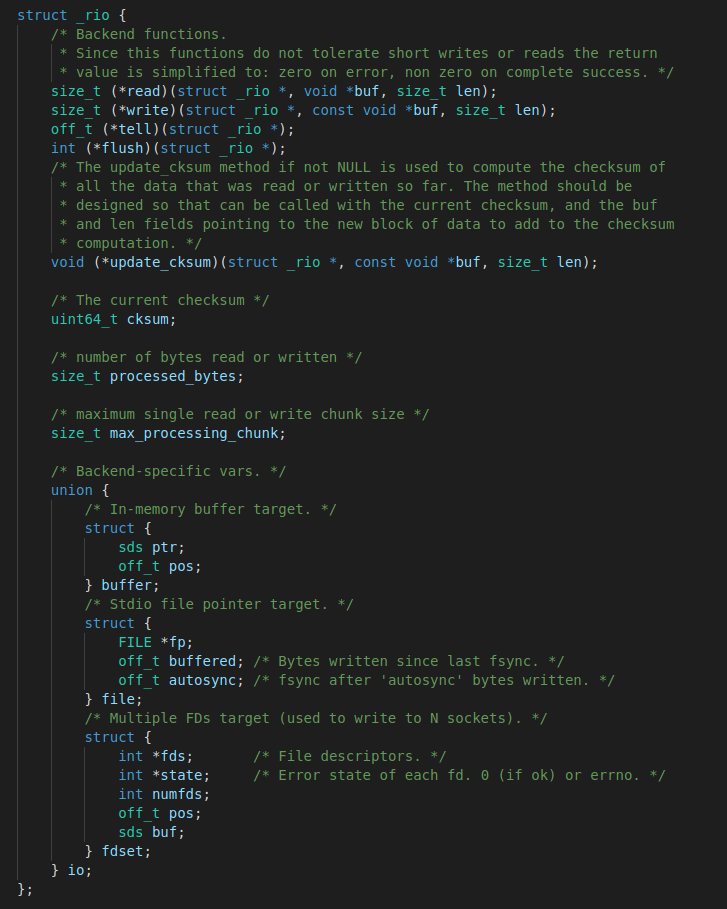

## redis的其他文件      
一些封装类的代码实现：          
+ bio.c background I/O的意思，开启后台线程用的 
+ latency.c 延迟类 
+ migrate.c 命令迁移类，包括命令的还原迁移等 
+ pqsort.c 排序算法类 
+ rio.c redis定义的一个I/O类  
+ syncio.c 用于同步Socket和文件I/O操作   

### rio.h和rio.c     
Redis中涉及到多种io，如socket与file，为了统一对它们的操作，redis设计了一个抽象层，即rio，使用rio可以实现将数据写入到不同的底层io，但是接口相同。rio的实现在rio.h与rio.c源文件中，支持内存、文件、socket集合三类底层io。     

- 设计思想   
  struct rio中声明了统一的io操作接口，并且包含一个底层io对象的union结构。使用不同的底层io初始化rio实例后，调用rio的抽象接口即会调用对应底层io的实现。以面向对象的思想即是，rio为抽象类，它拥有三个子类:buffer、file及fdset，这三个子类实现了抽象类声明的接口。使用者可以使用它们的父类rio进行编程，实现多态性。     

- 源码分析    
  **rio.h头文件**       
        
  一个完整的IO结构就是如上面所示      
  read,write,tell,flush四个函数指针，分别表明读，写，告诉当前处理io对象处理的位置，flush刷新缓冲到io对象中     
  update_cksum函数指针则封装了校验和      
  chsum则表示该对象当前处理过数据的字节的校验和    
  processed_bytes表示当前该对象已经处理过的字节数     
  max_processing_chunk表示一次最多处理的字节数      
  下面一个结构体封装了一个rio对象底层对应的是内存，文件还是，socket集合      
  ```
  static inline size_t rioWrite(rio *r, const void *buf, size_t len) #上层的函数表示对该rio对象进行写操作    
  static inline size_t rioRead(rio *r, void *buf, size_t len)  #表示对该rio对象的读操作     
  static inline off_t rioTell(rio *r) #表示该io当前处理数据的位置（进度）   
  static inline int rioFlush(rio *r) #表示刷新该rio对象，文件则是写入到磁盘     
  ```     
  **rio.c源文件**     
  ```
  ******************************BUFFER IO 的底层实现*******************************
  static size_t rioBufferWrite(rio *r, const void *buf, size_t len)  #针对buffer io的写，其实就是写如一个sds指定的内存         
  static size_t rioBufferRead(rio *r, void *buf, size_t len) #针对buffer io的读，从sds指定的内存写到buf指向的地方    
  tatic off_t rioBufferTell(rio *r) #返回当前处理的数据位置    
  static int rioBufferFlush(rio *r) #BUFFER IO 的刷新没必要，本身就是最新数据    
  static const rio rioBufferIO = {
    rioBufferRead,
    rioBufferWrite,
    rioBufferTell,
    rioBufferFlush,
    NULL,           /* update_checksum */
    0,              /* current checksum */
    0,              /* bytes read or written */
    0,              /* read/write chunk size */
    { { NULL, 0 } } /* union for io-specific vars */
  }; #一个静态的BUFFER对象   
  void rioInitWithBuffer(rio *r, sds s) #buffer io的初始化函数，该对象初始化后就会关联一个s指向内存，后续对该rio对象操作都是针对s内存       
  ```  
  ```
  *********************************FILE IO 的底层实现*********************************
  static size_t rioFileWrite(rio *r, const void *buf, size_t len) #文件io的写是写入到某个文件中，底层调用fwrite()函数，当设置了autosync值，一旦写入到内核的数据buffered值大于等于    
                                                                  #这个临界值时，会调用fflush()函数，写入数据到文件磁盘并设置buffered为0      
  static size_t rioFileRead(rio *r, void *buf, size_t len) #从文件中读入数据    
  static off_t rioFileTell(rio *r) #告诉当前读或者写的位置，底层调用ftello()    
  static int rioFileFlush(rio *r) #刷新内内核缓冲区到文件磁盘中    
  static const rio rioFileIO = {
    rioFileRead,
    rioFileWrite,
    rioFileTell,
    rioFileFlush,
    NULL,           /* update_checksum */
    0,              /* current checksum */
    0,              /* bytes read or written */
    0,              /* read/write chunk size */
    { { NULL, 0 } } /* union for io-specific vars */
  };    
  void rioInitWithFile(rio *r, FILE *fp) #初始化一个文件，一旦成功，任何对该对象的操作都会反应到文件中                                                           
  ```    
  ```
  static size_t rioFdsetWrite(rio *r, const void *buf, size_t len)  #对socket集合写操作，只要有一个成功就算成功会采用分次数一次最多1024字节处理   
  static size_t rioFdsetRead(rio *r, void *buf, size_t len) #不支持对多个socket集合的读    
  static off_t rioFdsetTell(rio *r) #告诉当前处理数据的位置    
  static int rioFdsetFlush(rio *r) #因为每个sockets集合的rio对象底层都有一个sds的缓存，flush操作基数清空这个sds    
  static const rio rioFdsetIO = {
    rioFdsetRead,
    rioFdsetWrite,
    rioFdsetTell,
    rioFdsetFlush,
    NULL,           /* update_checksum */
    0,              /* current checksum */
    0,              /* bytes read or written */
    0,              /* read/write chunk size */
    { { NULL, 0 } } /* union for io-specific vars */
  };   
  void rioInitWithFdset(rio *r, int *fds, int numfds)    #初始化函数会为fd集合和state分配内存，也会新建一个sds来作为字符串的缓冲。一旦该对象初始化成功，对该对象的写操作，会转化为对每一个socket进行写操作   
  void rioFreeFdset(rio *r) #释放sockets集合rio对象的初始化分配的内存     
  ```    
  ```
  ********************************高级API**************************************
  size_t rioWriteBulkCount(rio *r, char prefix, long count)  #写一个带前缀的形如"*<count>\r\n"的字符串到对应的rio对象中   
  size_t rioWriteBulkString(rio *r, const char *buf, size_t len) #写一个"$<count>\r\n<payload>\r\n"的字符串二进制安全的到rio对象中   
  size_t rioWriteBulkLongLong(rio *r, long long l) #写一个形如"$<count>\r\n<payload>\r\n"字符串到rio对象中    
  size_t rioWriteBulkDouble(rio *r, double d) #写一个"$<count>\r\n<payload>\r\n"的double字符串到rio对象中  
  ```   

- 总结    
  rio是一层封装对内存对象或者文件对象，或者sockets集合对象，我们初始化一个rio对象就可以对这个对象进行读，写，获取操作offset和刷新操作      


