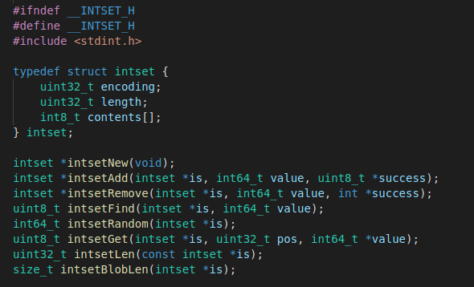
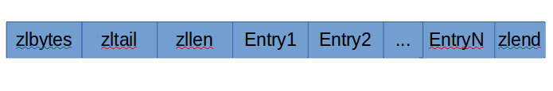
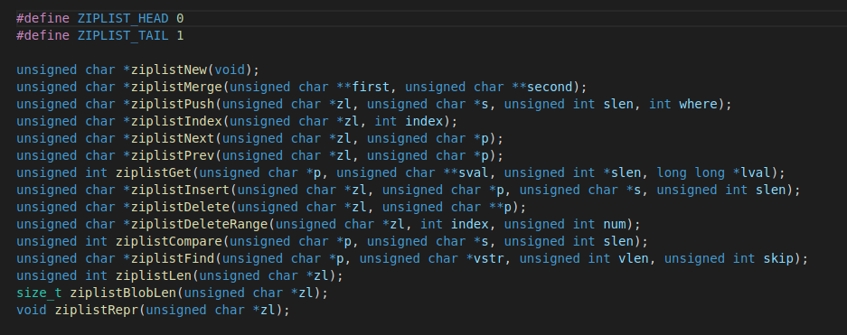
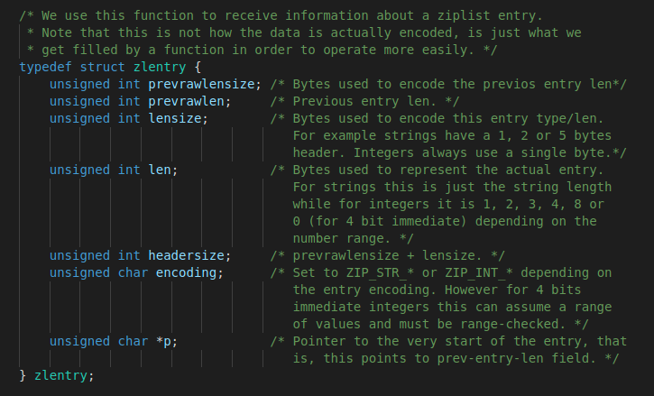
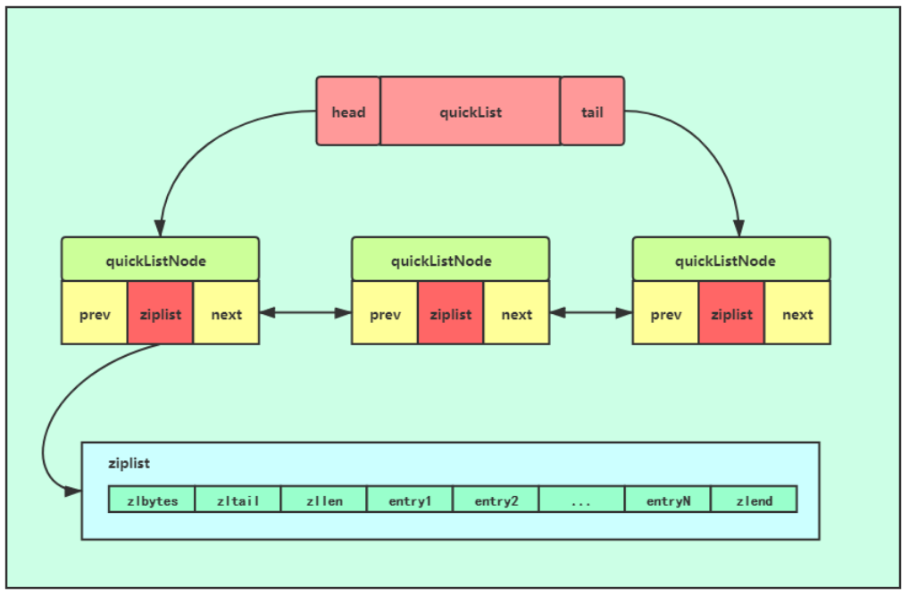
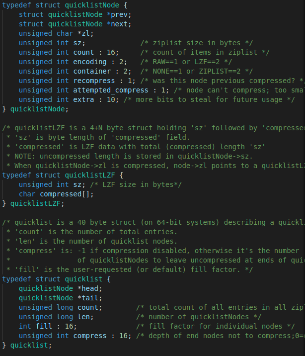
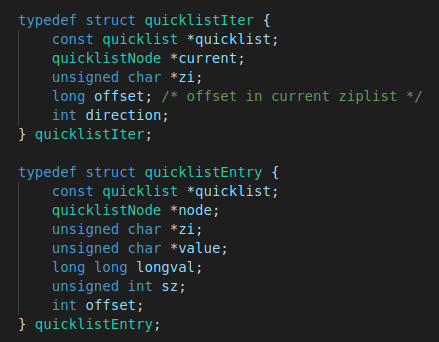

## redis内存编码结构的实现    
redis有许多底层的数据结构是针对某些整数，在redis中，intset主要用于保存整数值，由于其底层是使用数组来保存数据的，因而当对集合进行数据添加时需要对集合进行扩容和迁移操作，但这种扩容和迁移只支持当向的操作，有小数据到大数据。ziplist是一种连续，无序的数据结构。压缩列表是 Redis 为了节约内存而开发的， 由一系列特殊编码的连续内存块组成的顺序型（sequential）数据结构。     

### 1.intset.h和intset.c    
intset顾名思义，是由整数组成的集合。实际上，intset是一个由整数组成的有序集合，从而便于在上面进行二分查找，用于快速地判断一个元素是否属于这个集合。它在内存分配上与ziplist有些类似，是连续的一整块内存空间，而且对于大整数和小整数（按绝对值）采取了不同的编码，尽量对内存的使用进行了优化。    

- 设计思想     
  intset一个很重要的考虑就是当数字需要的时候才用更大的数据表示，例如一开始都是int_16，当int_16无法保存某个数据时会扩展为int_32。这也是intset为节约内存而考虑的一种延迟扩张策略，能够有效的节约内存。     

- 源码分析    
  **intset.h头文件**      
      
  可以看到intset又是连续内存，encoding字样表明保存数据是采用int_16,int_32还是int_64。length则为数组的长度，contents则是柔性数组        
  **intset.c源文件**      
  ```
  static uint8_t _intsetValueEncoding(int64_t v) #返回某个数属于哪个encoding编码范围     
  static int64_t _intsetGetEncoded(intset *is, int pos, uint8_t enc) #返回给定位置的给定编码的值    
  static int64_t _intsetGet(intset *is, int pos) #返回某个intset给定位置处的值    
  intset *intsetNew(void) #创建一个空的intset    
  static intset *intsetResize(intset *is, uint32_t len)  #resize这个intset,此时的encoding和对应数据都没有改变     
  static uint8_t intsetSearch(intset *is, int64_t value, uint32_t *pos) #查找某个值是否在intset中，返回1表示在，并且pos给出位置，采用二分查找   
  static intset *intsetUpgradeAndAdd(intset *is, int64_t value) #加入一个数并更新编码，编码从小变大，例如int_16到int_32         
  static void intsetMoveTail(intset *is, uint32_t from, uint32_t to) #把从from开始到末尾的数据移动到to位置上    
  intset *intsetAdd(intset *is, int64_t value, uint8_t *success) #插入一个值，成功则succsee返回1，失败success返回0表示值已经存在    
  intset *intsetRemove(intset *is, int64_t value, int *success) #移除某个值，成功则为1，失败则为0   
  uint8_t intsetFind(intset *is, int64_t value) #查找某个值是否属于该intset   
  int64_t intsetRandom(intset *is) #返回该intset的一个随机值   
  uint8_t intsetGet(intset *is, uint32_t pos, int64_t *value) #value处返回给定位置的值，如果位置超出范围返回0，正常返回1    
  uint32_t intsetLen(const intset *is) #返回intset数组长度    
  size_t intsetBlobLen(intset *is) #返回intset整个对象的字节大小    
  ```

- 总结    
  intset其实就是一个保存数的有序数组数大小按从小到到排序，当加入一个数超过原来的编码范围，会为整个数扩展成新编码。同时每次加入或者删除某个数时，intset都会保持内存紧凑，内存刚好容量对应数量的值。    


### 2.ziplist.h和ziplist.c    
压缩列表是redis为了保存不同数据而自定义的一种极致压缩内存保存数据的结构，设计的十分优美   

- 设计思想   
  ziplist是一种连续，无序的数据结构。压缩列表是 Redis 为了节约内存而开发的， 由一系列特殊编码的连续内存块组成的顺序型（sequential）数据结构。     
      
  |  属性 |   类型 |   长度 |         用途         |
  | :-----:  |   :----: | :----:  |          :----        |
  |zlbytes|uint_32t|4B|记录整个压缩列表占用的内存字节数：在对压缩列表进行内存重分配，或者计算zlend的位置时使用|
  |zltail|uint_32t|4B|记录压缩列表表尾节点距离压缩列表的起始地址有多少字节：通过这个偏移量，程序无须遍历整个压缩列表就可以确定表尾节点的地址。|   
  |zllen|uint_16t|2B|记录了压缩列表包含的节点数量： 当这个属性的值小于UINT16_ MAX （65535）时， 这个属性的值就是压缩列表包含节点的数量；当这个值等于 UINT16_MAX 时， 节点的真实数量需要遍历整个压缩列表才能计算得出。|  
  |EntryX|列表节点|不定|压缩列表包含的各个节点，节点的长度由节点保存的内容决定。|    
  |zlend|uint_8t|1B|特殊值 0xFF （十进制 255 ），用于标记压缩列表的末端。|   
  
  
- 源码分析   
  **ziplist.h头文件**  
       
  整个头文件并不复杂只是定义了一些函数    
  **ziplist.c源文件**  
  entry结构   
       
  一个压缩列表可以包含任意多个节点（entry）， 每个节点可以保存一个字节数组或者一个整数值（小整数值或者长度比较短的字符串）。    
  1）节点的 previous_entry_length 属性以字节为单位， 记录了压缩列表中前一个节点的长度     

    (1)如果前一节点的长度小于 254 字节， 那么 previous_entry_length 属性的长度为 1 字节： 前一节点的长度就保存在这一个字节里面。例如：值为0x05     
    (2)如果前一节点的长度大于等于 254 字节， 那么 previous_entry_length 属性的长度为 5 字节： 其中属性的第一字节会被设置为 0xFE （十进制值 254）， 而之后的四个字节则用于保存前一节点的长度。例如：值为0xFE00002766；0xFE表明这是一个5字节长的属性，之后的四个字节 0x00002766（10086）才是前一节点的实际长度。    
  2）节点的 encoding 属性记录了节点的 content 属性所保存数据的类型以及长度：     
  一字节(00)、两字节(01)或者五字节长(10)， 值的最高位为 00 、 01 或者 10 的是字节数组编码： 这种编码表示节点的 content 属性保存着字节数组， 数组的长度由编码除去最高两位之后的其他位记录；
  一字节长， 值的最高位以 11 开头的是整数编码： 这种编码表示节点的 content 属性保存着整数值， 整数值的类型和长度由编码除去最高两位之后的其他位记录    

  |字节数组编码|编码长度|content属性保存的值|   
  |:---:|:---:|:----|
  |00bbbbbb|1B|长度小于等于63 字节的字节数组|   
  |01bbbbbb xxxxxxxx|2B|长度小于等于16 383 字节的字节数组|  
  |10______ aaaaaaaa bbbbbbbb cccccccc dddddddd |5B|长度小于等于4294967295的字节数组|   

  |整数编码|编码长度|content属性保存的值|  
  |:---:|:---:|:----|
  |11000000|1B|int16_t 类型的整数|
  |11010000|1B|int32_t 类型的整数|
  |11100000|1B|int64_t 类型的整数|
  |11110000|1B|24 位有符号整数|
  |11111110|1B|8 位有符号整数|
  |1111xxxx|1B|使用这一编码的节点没有相应的content 属性，因为编码本身的xxxx 四个位已经保存了一个介于0 和12 之间的值，所以它无须content 属性|    
  
     
  将entry抽象出一个结构来，其中prerawlensize表示字节用来表示prevlen，也就是previous_entry_length本身需要的大小，prevrawlen表示前一个entry大小，lensize表示该entry用来表示该entry编码长度，len表示该编码长度表示的值，headersize就是prevrawlensize+lensize也就是一个entry的头部大小，encoding就是编码字符可以判断content属于哪一种编码内容，p指针指向每一个entry的最开始     
  ```
  unsigned int zipIntSize(unsigned char encoding)  #根据某个encoding返回存储一个整数需要的content属性字节数   
  unsigned int zipStoreEntryEncoding(unsigned char *p, unsigned char encoding, unsigned int rawlen) #根据rawlen长度也就是content长度返回需要的encoding属性的长度，并把属性加入到p指针处    
  #define ZIP_DECODE_LENGTH(ptr, encoding, lensize, len) #根据ptr所指的encoding，返回对应的encoding和lensize,len    
  unsigned int zipStorePrevEntryLength(unsigned char *p, unsigned int len) #根据指定长度len，将previous_entry_length属性填写完毕    
  #define ZIP_DECODE_PREVLEN(ptr, prevlensize, prevlen) #依据指针ptr指向解析处对应的prevlensize和prevlen   
  int zipPrevLenByteDiff(unsigned char *p, unsigned int len) #当前若是前一个entry长度变为len,那么返回存储previous_entry_length属性大小的变化    
  nsigned int zipRawEntryLength(unsigned char *p) #f返回当前entry总长度   
  int zipTryEncoding(unsigned char *entry, unsigned int entrylen, long long *v, unsigned char *encoding) #试着把某个字符串型数看看能不能转化为entry,能返回encoding类型和整数v    
  void zipSaveInteger(unsigned char *p, int64_t value, unsigned char encoding) #根据encoding类型把某个数存到指针p处   
  int64_t zipLoadInteger(unsigned char *p, unsigned char encoding)  #根据encoding返回某个指针处对应的整数    
  void zipEntry(unsigned char *p, zlentry *e) #根据某个entry指针，解析数据到zlentry结构体中   
  ```   
  下面是很重要的API    
  ```
  unsigned char *ziplistNew(void) #新建一个ziplist    
  unsigned char *ziplistResize(unsigned char *zl, unsigned int len) #重新变化大小   
  unsigned char *__ziplistCascadeUpdate(unsigned char *zl, unsigned char *p) #当有新entry加入之后，我们需要去更新prevlen这个属性，这里就是根据需要调整整个结构变为紧凑型    
  unsigned char *__ziplistDelete(unsigned char *zl, unsigned char *p, unsigned int num) #删除从p开始的num个entry    
  unsigned char *__ziplistInsert(unsigned char *zl, unsigned char *p, unsigned char *s, unsigned int slen) #在p插入一个项目，项目由s指向的slen长度字节   
  unsigned char *ziplistMerge(unsigned char **first, unsigned char **second)  #合并两个ziplist，second会跟在first后面   
  unsigned char *ziplistPush(unsigned char *zl, unsigned char *s, unsigned int slen, int where) #在头部或者尾部push一个entry，内容由s指针指向的slen长度字节决定    
  unsigned char *ziplistIndex(unsigned char *zl, int index) #返回索引为index的entry指针    
  unsigned char *ziplistNext(unsigned char *zl, unsigned char *p) #返回p指向的entry的下一个entry    
  unsigned char *ziplistPrev(unsigned char *zl, unsigned char *p) #返回p指向的entry的上一个entry   
  unsigned int ziplistGet(unsigned char *p, unsigned char **sstr, unsigned int *slen, long long *sval) #返回p所指向的entry的内容属性，是字符串则写入sstr,整数则写入sval    
  unsigned char *ziplistInsert(unsigned char *zl, unsigned char *p, unsigned char *s, unsigned int slen)  #在p指针处插入entry   
  unsigned char *ziplistDelete(unsigned char *zl, unsigned char **p) #删除*p所指向的entry     
  unsigned char *ziplistDeleteRange(unsigned char *zl, int index, unsigned int num) #删除索引index开始的num个entry    
  unsigned int ziplistCompare(unsigned char *p, unsigned char *sstr, unsigned int slen) #比较p指向的entry和字符串sstr指向的slen字节长度的字符串   
  unsigned char *ziplistFind(unsigned char *p, unsigned char *vstr, unsigned int vlen, unsigned int skip) #从p指针开始每skip个entry寻找某个entry和vstr指针指向的vlen长度的字符串     
  unsigned int ziplistLen(unsigned char *zl) #返回ziplist的长度，但长度小于UINT16_MAX，可以直接返回，大于的话需要从头遍历计算所有   
  size_t ziplistBlobLen(unsigned char *zl) #返回整个ziplist占用的字节数   
  void ziplistRepr(unsigned char *zl) #打印整个ziplist的完整信息     
  ```   

- 总结    
  整个ziplist设计的很巧妙，包括整个的ziplist的布局，由头部和entry和尾部3部分组成，
  每个entry又由previous_entry_length和encoding和content这3个属性构成，整个ziplist是由特殊编码规则编写的连续内存存放不同数据类型和长度的包含entry的数组。    


### 3.quicklist.h和quicklist.c       
之前我们讲过双端列表和压缩列表，他们是Redis List(列表)对象的底层实现方式。但是考虑到链表的附加空间相对太高，prev和next指针就要占去16个字节(64bit 系统的指针是8个字节)，另外每个节点的内存都是单独分配，会加剧内存的碎片化，影响内存管理效率。因此Redis3.2版本开始对列表数据结构进行了改造，使用 quicklist 代替了 ziplist 和 linkedlist。quicklist是由ziplist组成的双向链表，链表中的每一个节点都以压缩列表ziplist的结构保存着数据，而ziplist有多个entry节点，保存着数据。相当与一个quicklist节点保存的是一片数据，而不再是一个数据。     

- 设计思想   
  quicklist宏观上是一个双向链表，因此，它具有一个双向链表的有点，进行插入或删除操作时非常方便，虽然复杂度为O(n)，但是不需要内存的复制，提高了效率，而且访问两端元素复杂度为O(1)。quicklist微观上是一片片entry节点，每一片entry节点内存连续且顺序存储。利用压缩列表的连续内存性质，在存储同样的数量的元素时，相对于双端列表内存分片率会大大下降，但压缩列表的插入删除速度又相对于双端列表慢，所以这里需要在节约内存和速度之间选择一个平衡。     

- 源码解析    
  **quicklist.h头文件**    
      
     
  ```
  prev:前一个节点指针。
  next:下一个节点指针。
  zl:数据指针。如果当前节点的数据没有压缩，那么它指向一个ziplist结构；否则，它指向一个quicklistLZF结构。
  sz: 表示zl指向的ziplist的总大小（包括zlbytes, zltail, zllen, zlend和各个数据项）。需要注意的是：如果ziplist被压缩了，那么这个sz的值仍然是压缩前的ziplist大小。
  count: 表示ziplist里面包含的数据项个数。这个字段只有16bit。稍后我们会一起计算一下这16bit是否够用。
  encoding: 表示ziplist是否压缩了（以及用了哪个压缩算法）。目前只有两种取值：2表示被压缩了（而且用的是LZF压缩算法），1表示没有压缩。
  container: 是一个预留字段。本来设计是用来表明一个quicklist节点下面是直接存数据，还是使用ziplist存数据，或者用其它的结构来存数据（用作一个数据容器，所以叫container）。但是，在目前的实现中，这个值是一个固定的值2，表示使用ziplist作为数据容器。
  recompress: 当我们使用类似lindex这样的命令查看了某一项本来压缩的数据时，需要把数据暂时解压，这时就设置recompress=1做一个标记，等有机会再把数据重新压缩。
  attempted_compress: 这个值只对Redis的自动化测试程序有用。我们不用管它。
  extra: 其它扩展字段。目前Redis的实现里也没用上。
  ```    
  ```
  quicklistLZF结构表示一个被压缩过的ziplist。其中：   
  sz: 表示压缩后的ziplist大小。
  compressed: 是个柔性数组（flexible array member），存放压缩后的ziplist字节数组。
  ```  
  ```
  head: 指向头节点（左侧第一个节点）的指针。
  tail: 指向尾节点（右侧第一个节点）的指针。
  count: 所有ziplist数据项的个数总和。
  len: quicklist节点的个数。
  fill: 16bit，ziplist大小设置，存放list-max-ziplist-size参数的值。
  compress: 16bit，节点压缩深度设置，存放list-compress-depth参数的值。

  fill成员对应的配置：list-max-ziplist-size  -2 
  当数字为负数，表示以下含义：
  -1 每个quicklistNode节点的ziplist字节大小不能超过4kb。（建议）
  -2 每个quicklistNode节点的ziplist字节大小不能超过8kb。（默认配置）
  -3 每个quicklistNode节点的ziplist字节大小不能超过16kb。（一般不建议）
  -4 每个quicklistNode节点的ziplist字节大小不能超过32kb。（不建议）
  -5 每个quicklistNode节点的ziplist字节大小不能超过64kb。（正常工作量不建议）
  当数字为正数，表示：ziplist结构所最多包含的entry个数。最大值为 215215。

  compress成员对应的配置：list-compress-depth  0
  后面的数字有以下含义：
  0 表示不压缩。（默认）
  1 表示quicklist列表的两端各有1个节点不压缩，中间的节点压缩。
  2 表示quicklist列表的两端各有2个节点不压缩，中间的节点压缩。
  3 表示quicklist列表的两端各有3个节点不压缩，中间的节点压缩。
  以此类推，最大为 216216。
  ```    
     
  quicklist也定义了自己的迭代器struct quicklistIter和保存每个节点的信息的结构struct quciklistEntry      
  ```
  quicklist:指向所属的quicklist的指针
  node:指向所属的quicklistNode节点的指针
  zi:指向当前ziplist结构的指针
  value:指向当前ziplist结构的字符串vlaue成员
  longval:指向当前ziplist结构的整数value成员
  sz:保存当前ziplist结构的字节数大小
  offset:保存相对ziplist的偏移量

  quicklist:指向所属的quicklist的指针
  current:指向当前迭代的quicklist节点的指针
  zi:指向当前quicklist节点中迭代的ziplist
  offset:当前ziplist结构中的偏移量      /* offset in  ziplist */
  direction:迭代方向
  ``` 

  **quicklist.c源文件**    
  quicklist.c源码的操作基本都是根据以上结构去调整位置  
  ```
  int quicklistPushHead(quicklist *quicklist, void *value, size_t sz) #向quicklist中头部插入一个entry，如果头部本身的quicklistNode可以插入则加入这个ziplist中，否则字节创建一个quicklistNode加入其中    
  int quicklistPushTail(quicklist *quicklist, void *value, size_t sz) #向尾部插入一个entry，同理如果可以插入最后一个节点那么就加入其中的ziplist中，不行就在尾部新建一个quicklistNode加入其中   
  void quicklistAppendZiplist(quicklist *quicklist, unsigned char *zl) #根据已有的ziplist向quicklist尾部加入一个节点   
  quicklist *quicklistAppendValuesFromZiplist(quicklist *quicklist,unsigned char *zl) #将已有的ziplist中的每一个entry提取出来加入到quicklist的尾部    
  REDIS_STATIC int quicklistDelIndex(quicklist *quicklist, quicklistNode *node,unsigned char **p) #删除quicklist节点上的某个p指向的entry    
  void quicklistDelEntry(quicklistIter *iter, quicklistEntry *entry) #删除某个被entry表示的元素    
  int quicklistReplaceAtIndex(quicklist *quicklist, long index, void *data,int sz)  #替代某个idx索引位置处的值为data    
  void quicklistInsertBefore(quicklist *quicklist, quicklistEntry *entry,void *value, const size_t sz) #在某个entry之前插入    
  void quicklistInsertAfter(quicklist *quicklist, quicklistEntry *entry,void *value, const size_t sz) #在某个entry之后插入    
  int quicklistDelRange(quicklist *quicklist, const long start,const long count) #删除从start索引开始count个entry   
  quicklistIter *quicklistGetIterator(const quicklist *quicklist, int direction) #获得一个quicklist的迭代器    
  int quicklistNext(quicklistIter *iter, quicklistEntry *entry) #获得迭代器的下一个值   
  quicklist *quicklistDup(quicklist *orig) #完全复制原来的quicklist   
  int quicklistIndex(const quicklist *quicklist, const long long idx,quicklistEntry *entry) #获取索引为idx的entry   
  void quicklistRotate(quicklist *quicklist) #移动尾部的元素到头部   
  int quicklistPopCustom(quicklist *quicklist, int where, unsigned char **data,
                       unsigned int *sz, long long *sval,
                       void *(*saver)(unsigned char *data, unsigned int sz)) # 从quicklist的头节点或尾节点的ziplist中pop出一个entry，分该entry保存的是字符串还是整数。如果字符串的话，需要传入一个函数指针，这个函数叫_quicklistSaver()，真正的pop操作还是在这两个函数基础上在封装了一次，来操作拷贝字符串的操作。
  int quicklistPop(quicklist *quicklist, int where, unsigned char **data,unsigned int *sz, long long *slong) #从最前面一个元素或者最后面一个元素弹出   
  void quicklistPush(quicklist *quicklist, void *value, const size_t sz,int where) #在最前面一个entry或者最后面一个entry插入一个数据    
  ```  

- 总结   
  quicklist是Redis3.2版本以后针对链表和压缩列表进行改造的一种数据结构，是zipList和linkedList的混合体，相对于链表它压缩了内存,进一步的提高了效率。看懂整个内存布局就明白它的设计思想和用途了。    


  
 


  
  