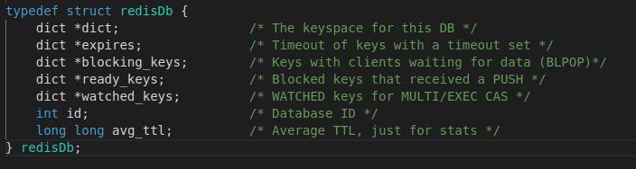
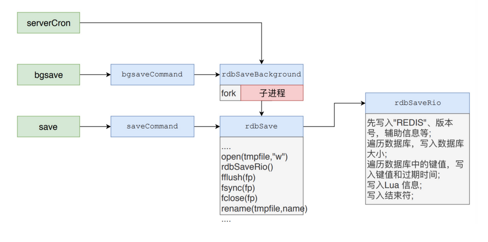
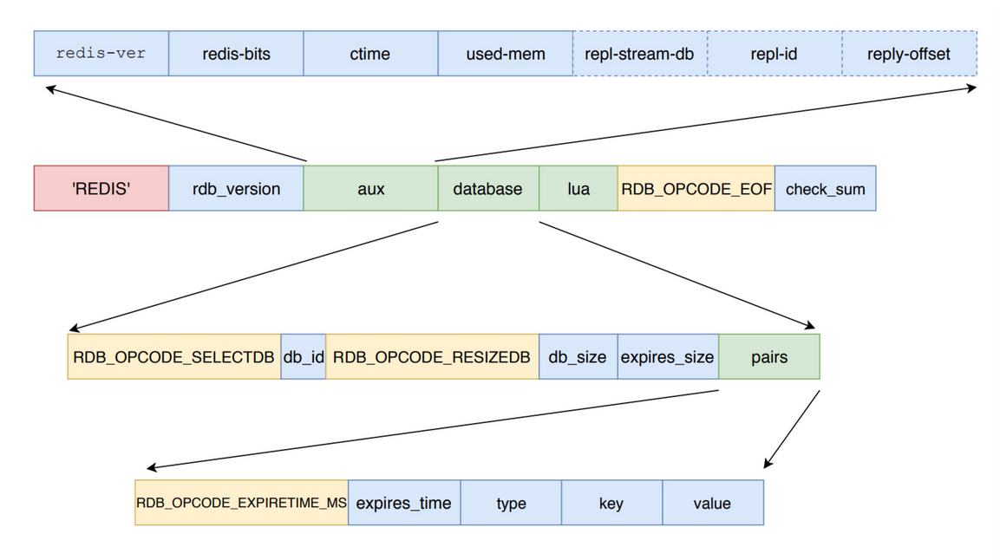
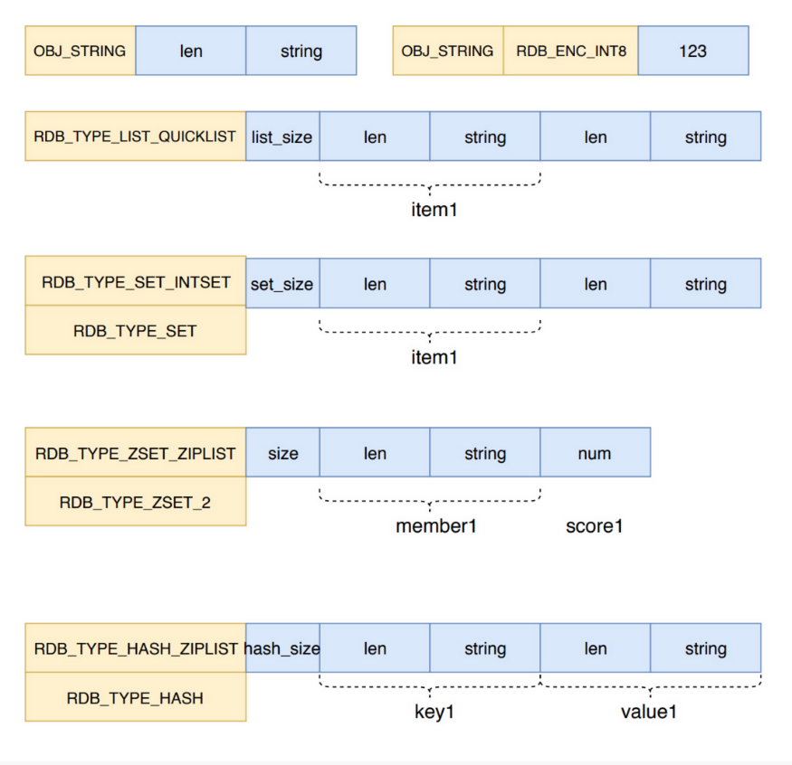

## redis数据库的实现    
redis数据库的实现其实就是一个大字典，每个db都是一个大的字典存储着我们常说的key,value    

### 1.db.c    
db.c主要介绍了redis的数据库的操作命令，也就是最外层的一个大字典的key，value的操作。    

- 设计思想   
  redisDb结构表示了一个数据库，可以看到里面不仅仅只有一个dict,而是有多个dict，其中的主要字典是dict，其他还有处理设置键过期的key，还有处理列表阻塞命令等的key     
      
  这里主要关注dict和expires表示的是主字典和存储过期key-when的字典      
  id表示当前数据库的索引，因为redis有一个数组表示多个数据库    
  avg_ttl表示的是当前数据库的key平均过期时间     

- 源码分析   
  **db.c源文件**     
  首先要讲一下redis存在一个淘汰策略，就是当内存中达到最大内存时如果开启了数据淘汰策略，也即是内存写满了的情况下到底该先删除哪些key。     
  LRU,最近最少使用，传统LRU需要一个哈希表和双向链表，但如果加入一个双向链表是需要消耗内存的，redis为了减少内存消耗采用了**近似LRU算法**。我们可以看到每个对象中都有一个lru数据，这个如果是在LRU淘汰策略下就表示一个24位的表示毫秒的时间戳。来表示最近访问时间。LRU近似算法如下：    
  
  1.首次淘汰：随机抽样选出【最多N个数据】放入【待淘汰数据池 evictionPoolEntry】   
  - 数据量N：由 redis.conf 配置的 maxmemory-samples 决定，默认值是5，配置为10 将非常接近真实LRU效果，但是更消耗CPU；     
  - samples：n.样本；v.抽样；     

  2.再次淘汰：随机抽样选出【最多N个数据】，只要数据比【待淘汰数据池 evictionPoolEntry】中的【任意一条】数据的 lru 小，则将该数据填充至 【待淘汰数据池】；      
  - evictionPoolEntry 的容容量是 EVPOOL_SIZE = 16；     
  - 详见 源码 中 evictionPoolPopulate 方法的注释；   
3.执行淘汰： 挑选【待淘汰数据池】中 lru 最小的一条数据进行淘汰；     

  ==============================================================             
  另外一种淘汰策略是**LFU**,最不经常使用     
  如果一条数据仅仅是突然被访问（有可能后续将不再访问），在 LRU 算法下，此数据将被定义为热数据，最晚被淘汰。但实际生产环境下，我们很多时候需要计算的是一段时间下key的访问频率，淘汰此时间段内的冷数据。LFU 算法相比 LRU，在某些情况下可以提升 数据命中率，使用频率更多的数据将更容易被保留。      
  LFU 使用 Morris counter 概率计数器，仅使用几比特就可以维护 访问频率，Morris算法利用随机算法来增加计数，在 Morris 算法中，计数不是真实的计数，它代表的是实际计数的量级。     
  redis采用的是对象字段lru被分为两部分，前16位表示系统时间单位为分钟，后8位最大为255表示使用频率注意不是使用次数。访问频率会随着时间衰减，也就是前面的16位存储的时间与当前时间比较，相差越大衰减的越大。    
  
  LFU 的核心配置：

  - lfu-log-factor：counter 增长对数因子，调整概率计数器 counter 的增长速度，      
  - lfu-log-factor值越大 counter 增长越慢；lfu-log-factor 默认10。     
    lfu-decay-time：衰变时间周期，调整概率计数器的减少速度，单位分钟，默认1。N 分钟未访问，counter 将衰减 N/lfu-decay-time，直至衰减到0；     
    若配置为0：表示每次访问都将衰减 counter；

  ================================================================     
  ```
  void updateLFU(robj *val) #更新LFU，也就是上面提到的LFU淘汰策略       
  robj *lookupKey(redisDb *db, robj *key, int flags) #查找key，其中回调用更新LFU    
  void dbAdd(redisDb *db, robj *key, robj *val) #往数据库中加入一个key，value   
  void dbOverwrite(redisDb *db, robj *key, robj *val) #重写数据库某个key的值为新value    
  void setKey(redisDb *db, robj *key, robj *val) #上面两个函数的封装，数据库某个key对应为value    
  robj *dbRandomKey(redisDb *db) #返回一个随机的key对象   
  int dbSyncDelete(redisDb *db, robj *key) #同步删除key，value已经expires字典中的key   
  int dbDelete(redisDb *db, robj *key) #根据数据库的配置采用同步删除或者惰性删除   
  long long emptyDb(int dbnum, int flags, void(callback)(void*)) #清空某个索引的数据库，-1则清空所以数据库   
  int selectDb(client *c, int id) #切换到，某一数据库       
  ```   
  ```
  *********************************操作数据库命令API*******************************************
  int getFlushCommandFlags(client *c, int *flags)  #解析清空数据库的的操作flag      
  void flushdbCommand(client *c) #清空当前数据库  
  void flushallCommand(client *c) #清空所有数据库   
  void delGenericCommand(client *c, int lazy) #删除数据库某个key    
  void delCommand(client *c) #del直接删除key，value   
  void unlinkCommand(client *c) #惰性删除key对应的value   
  void existsCommand(client *c) #返回key在数据库中存在的个数    
  void selectCommand(client *c) #切换当前操作哪一个数据库    
  void randomkeyCommand(client *c) #返回随机的key   
  void keysCommand(client *c) #查找满足某个pattern的所有key   
  void scanGenericCommand(client *c, robj *o, unsigned long cursor)  #扫描数据库命令   
  void dbsizeCommand(client *c) #返回数据库的键值对个数   
  void lastsaveCommand(client *c) #返回lastsave的时间   
  void typeCommand(client *c) #返回键对应的值的类型   
  void shutdownCommand(client *c) #何种方式关闭服务器  
  void renameGenericCommand(client *c, int nx) #重命名某个key  
  void moveCommand(client *c) #移动某个key到某个数据中   
  void swapdbCommand(client *c) #交换两个数据库的数据   

  ```  

- 总结    
  |命令|使用方法|作用|
  |:----|:----|:------|
  |FLUSHDB|flushdb [ASYNC]|采用同步还是异步的方式清空当前数据库|   
  |FLUSHALL|flushall [ASYNC]|采用异步还是同步的方式清空所有数据库|   
  |DEL|del key [key ...]|直接删除数据库中对应的key，value|  
  |UNLINK|unlink key [key ...]|惰性删除key对应的value|   
  |EXISTS|exists key [key ...]|返回数据库中某些key存在的个数|   
  |SELECT|select index|切换到当前操作索引对应的数据库|   
  |RANDOMKEY|randomkey|返回数据库某个随机的key|   
  |KEYS|keys pattern|返回满足某一pattern的所以key|  
  |SCAN|scan cursor [MATCH pattern] [COUNT count]|扫描遍历当前数据库|   
  |DBSIZE|dbsize|返回当前数据库键值对的个数|  
  |LASTSAVE|lastsave|返回上次保存的时间|   
  |TYPE|type key|返回某个键对应的值的类型| 
  |SHUTDOWN| shutdown [NOSAVE|SAVE]|保存或者不保存的方式关闭数据库|   
  |RENAME|rename key newkey|重命名某个存在的key为newkey|   
  |RENAMENX|renamenx key newkey|在新的key不存在时才重命名|  
  |MOVE|move key db|移动某个key到数据库db中|   
  |SWAPDB|swapdb db1 db2|交换数据库的数据|     

### notify功能    
redis的通知功能是基于订阅发布的所实现的，听起来好像一脸懵逼，让我慢慢到来。       
**为什么要有通知功能？**       
其实主要源于我们想要关注某个key，接下来有哪些事，例如某个客户端存储了一个key，value，然后它需要持续关注这个key，可能另外一个客户端修改了这个key，删除了这个key等等，那么该客户端就key订阅一个东西用来关注这个key的改动，当有改动，redis服务器就会推送信息给该客户端，这也就是所谓了键空间，主要的是关注某个key。        
还有另外一种情况，就是某个客户端想要关注对数据库的某些操作特别感兴趣，例如DEL命令，该客户端关注所以DEL命令的实施，所以该客户端对这个事件，这个动作感兴趣，也可以订阅一个东西来关注这个，当redis服务器DEL命令产生就可以向该客户端推送相关信息。这也就是所谓的键事件。     

- 设计思想    
  我们知道一个redis服务器可能有多个客户端，那么它是如何实现上面的功能的呢，这就不得不说pubsub机制了，还有一个channel，这里大概说一下，其实就是维护了一个字典和一个列表。当某个客户端订阅某个channel，其实就是一个字符串，只不过是特殊含义的字符串，也即是一开始说的键空间和键事件。都会加入到一个全局的专门用来处理通知功能的字典，字典的key就是这里的channel名字，value就是一个列表，表示订阅这个channle的客户端。redis服务器全局不断的维护这个表，然后每次命令都调用**notifyKeyspaceEvent(int type, char *event, robj *key, int dbid)**这个函数，实现发布，从而完成了一整个的通知机制。    

- 源码分析    
  **pubsub.c源文件**    
  该文件就是订阅发布的实现，其实就是维护了一个字典和一个列表，针对普通的channel,还有patter匹配模式的channel的实现   
  ``` 
  #################################pubsub低价API######################## 
  typedef struct pubsubPattern {
    client *client;
    robj *pattern;          
  } pubsubPattern;    
  #我们知道一个channel就是一个字符串，例如mychannel，而pattern其实就是一个带有匹配的例如my*这样的可以匹配任何my开头的channel，上面结构就表明了一个pattern    
  void freePubsubPattern(void *p) #释放这个pubsubPattern结构   
  int listMatchPubsubPattern(void *a, void *b) #判断两个pattern是否完全相等，包括客户端都要相同    
  int clientSubscriptionsCount(client *c) #客户端定义的channel和pattern总数    
  int pubsubSubscribeChannel(client *c, robj *channel) #客户端订阅一个channel,首先会加入c->pubsub_channels客户端自己的一个特殊字典中，然后会加入到全局的字典中这样整个服务器就可以知道哪些客户端订阅了哪些channel     
  int pubsubUnsubscribeChannel(client *c, robj *channel, int notify) #客户端取消订阅某个channel    
  int pubsubSubscribePattern(client *c, robj *pattern) #客户端订阅一个pattern，跟channel一样，不过是采用列表来保存pattern,客户端本地保存需要pattern不一样，全局列表因为pattern加入了客户端所以不同客户端肯定不一样     
  int pubsubUnsubscribePattern(client *c, robj *pattern, int notify) #取消订阅某个pattern    
  int pubsubUnsubscribeAllChannels(client *c, int notify) #取消订阅客户端所有的channel    
  int pubsubUnsubscribeAllPatterns(client *c, int notify) #取消订阅客户端所有的pattern   
  int pubsubPublishMessage(robj *channel, robj *message) #向某个channel发送消息，也是最重要的函数之一，首先会找到服务器全局的channels,找到该channel，然后向对应的客户端们发该消息，然后会找到全局的patten，找到匹配该channel的客户端发送消息      
  ```
  ```
  #############################PUBSUB命令API###############################
  void subscribeCommand(client *c) #客户端订阅一些channel 
  void unsubscribeCommand(client *c) #客户端取消订阅channel   
  void psubscribeCommand(client *c)   #客户端订阅pattern    
  void punsubscribeCommand(client *c)  #客户端取消订阅pattern   
  void publishCommand(client *c) #客户端向一个channel发布消息   
  void pubsubCommand(client *c) #pubsub命令可以实现一些关于channel,patter查看的子命令    
  ```
  **notify.c源文件**    
  该源文件就只有3个函数      
  ```
  int keyspaceEventsStringToFlags(char *classes) #判断某个字符串表示的属于哪一个事件是键空间还是键事件   
  sds keyspaceEventsFlagsToString(int flags) #和上面的相反，通过flag解析出对应的字符串   
  void notifyKeyspaceEvent(int type, char *event, robj *key, int dbid) #最重要的函数我们可以从好多命令中看到这个函数，因为我们的命令就是对键的一些操作，其中就会调用这个函数，将对应的事件通过channel发出去    
                                                                       #如果有客户端定义了该channel就会收到对应的消息        
                                                                       #__keyspace@<db>__:<key> <event>  键空间，如果某个客户端订阅了__keyspace@<db>__:<key> 这个channel,那么针对该键的各种操作如DEL，就会通知对应的客户端。（这里event就是各种操作例如DEL）     
                                                                       #__keyevent@<db>__:<event> <key>  键事件，如果有某个客户端订阅了__keyevent@<db>__:<event> 这个channel，那么出现该种动作的各个键都会通知客户端        
                                                                       #内部就是调用了pubsubPublishMessage()函数往某个channel发送消息     
  ```  
  这样不管你是关注键本身，还是动作(事件)本身都可以清楚的追踪，例如关注键，那么对键的各种操作你都会收到，如果关注的是事件，那么该事件操作的哪些键你都能知道。总而言之，redis很巧妙的利用了订阅发布这样一个机制实现了监控。但唯一的缺点是，当客户端消失一段时间又连上，期间发生的针对键的操作是无法追踪的。因为你客户端本身不在了，这个机制也就不会向你这个客户端发送任何东西。    
  

- 总结    
  |命令|使用方法|作用|
  |:----|:----|:------|
  |SUBSCRIBE|subscribe channel [channel ...]|客户端订阅channel|
  |UNSUBSCRIBE|unsubscribe channel [channel ...]|客户端取消订阅,没有channel参数，则表示取消所以channel|  
  |PSUBSCRIBE|psubscribe pattern [pattern ...]|客户端订阅pattern|   
  |PUNSUBSCRIBE|punsubscribe pattern [pattern ...]|客户端取消订阅pattern，没有参数表示取消所有pattern|   
  |PUBLISH|publish channel message|向某个channel上发布message|   
  |PUBSUB|pubsub subcommand [argument [argument ...]]|主要是一些查看当前数据库的订阅channel,pattern的命令|   
  |PUBSUB CHANNELS|pubsub channels [pattern] |查看当前数据库的符合pattern模式的channel,pattern可以为空，则显示所有channel| 
  |PUBSUB NUMSUB|pubsub numsub [[channel1] [channel2] ...]|查看订阅某个channel的客户端数|   
  |PUBSUB NUMPAT|pubsun numpat|查看服务器当前总的pattern数|     

### 2.RDB持久化     
因为Redis是内存数据库，它将自己的数据库状态储存在内存里面，所以如果不想办法将储存在内存中的数据库状态保存到磁盘里面，那么一旦服务器进程退出，服务器中的数据库状态也会消失不见，为了解决这个问题，Redis提供了RDB持久化功能，这个功能可以将Redis在内存中的数据库状态保存到磁盘里面，避免数据意外丢失，RDB持久化既可以手动执行，也可以根据服务器配置选项定期执行，该功能可以将某个时间点上的数据库状态保存到一个RDB文件。     

- 设计思想    
  RDB的实现是保存当前数据库存储的键值数据以特殊形式保存到二进制文件中，包括数据还有各种状态，然后在服务器下次启动时加载该文件恢复数据。       
  有两个Redis命令可以用于生成RDB文件，一个是SAVE，另一个是BGSAVE      
  SAVE：SAVE命令会阻塞Redis服务器进程，直到RDB文件创建完毕为止，在服务器进程阻塞期间，服务器不能处理任何命令请求        
  BGSAVE：和SAVE命令直接阻塞服务器进程的做法不同，BGSAVE命令会派生出一个子进程，然后由子进程负责创建RDB文件，服务器进程（父进程）继续处理命令请求      
       
  redis在执行save或者bgsave命令时的状态     
  > **SAVE命令执行时服务器的状态**
  > - 当SAVE命令执行时，Redis服务器会被阻塞，所以当SAVE命令正在执行时，客户端发送的所有命令请求都会被拒绝
  > - 只有在服务器执行完SAVE命令、重新开始接受命令请求之后，客户端发送的命令才会 被处理


  > **BGSAVE命令执行时服务器的状态**
  > - 因为BGSAVE命令的保存工作是由子进程执行的，所以在子进程创建RDB文件的过程中，服务器仍然可以继续处理客户端的命令请求，但在BGSAVE命令执行期间，服务器处理SAVE、BGSAVE、BGREWRITEAOF三个命令的方式会和平时有所不同  
  > - ①在BGSAVE命令执行期间，客户端发送的SAVE命令会被服务器拒绝，服务器禁止 SAVE命令和BGSAVE命令同时执行是为了避免父进程（服务器进程）和子进程同时执行两个 rdbSave调用，防止产生竞争条件
  > - ②在BGSAVE命令执行期间，客户端发送的BGSAVE命令会被服务器拒绝，因为同 时执行两个BGSAVE命令也会产生竞争条件
  > - **③BGREWRITEAOF和BGSAVE两个命令不能同时执行：**
  > 1.如果BGSAVE命令正在执行，那么客户端发送的BGREWRITEAOF命令会被延迟到 BGSAVE命令执行完毕之后执行  
  > 2.如果BGREWRITEAOF命令正在执行，那么客户端发送的BGSAVE命令会被服务器拒绝    
  > - 因为BGREWRITEAOF和BGSAVE两个命令的实际工作都由子进程执行，所以这两个命令在操作方面并没有什么冲突的地方，不能同时执行它们只是一个性能方面的考虑,并发出两个子进程，并且这两个子进程都同时执行大量的磁盘写入操作，这怎么想都不会是一个好主意

  RBD文件的载入是在服务器启动的时候完成的。RDB文件的载入工作是在服务器启动时自动执行的，所以Redis并没有专门用于载入RDB文件的命令，只要Redis服务器在启动时检测到RDB文件存在，它就会自动载入RDB文件服务器在载入RDB文件期间，会一直处于阻塞状态，直到载入工作完成为止。      

  > AOF持久化对RDB持久化的影响：   
  > - 如果服务器开启了AOF持久化功能，那么服务器会优先使用AOF文件来还原数据库状 态，那么就不会使用RDB文件了
  > - 只有在AOF持久化功能处于关闭状态时，服务器才会使用RDB文件来还原数据库状态   


- 源码分析    
  这次我们直接从最上层的命令函数开始看起一个一个函数来解析，先看看一个RDB文件到底是怎样分布的     
            
  ```
  **************************save命令实现函数*************************
  void saveCommand(client *c) {
    if (server.rdb_child_pid != -1) {
        addReplyError(c,"Background save already in progress");
        return;
    }
    rdbSaveInfo rsi, *rsiptr;  
    // 初始化rsi结构
    rsiptr = rdbPopulateSaveInfo(&rsi);  
    // 调用rdbsave()函数    
    if (rdbSave(server.rdb_filename,rsiptr) == C_OK) {
        addReply(c,shared.ok);
    } else {
        addReply(c,shared.err);
    }
  }
  ```   
  ```
  ***************************rdbsave()函数*******************
  int rdbSave(char *filename, rdbSaveInfo *rsi) {
    char tmpfile[256];
    char cwd[MAXPATHLEN]; /* Current working dir path for error messages. */
    FILE *fp;
    rio rdb;
    int error = 0;
    // 初始化一个临时文件    
    snprintf(tmpfile,256,"temp-%d.rdb", (int) getpid());
    fp = fopen(tmpfile,"w");
    if (!fp) {
        char *cwdp = getcwd(cwd,MAXPATHLEN);
        serverLog(LL_WARNING,
            "Failed opening the RDB file %s (in server root dir %s) "
            "for saving: %s",
            filename,
            cwdp ? cwdp : "unknown",
            strerror(errno));
        return C_ERR;
    }
    //将该文件绑定到一个rio对象，用于写     
    rioInitWithFile(&rdb,fp);  
    //实际写数据到磁盘     
    if (rdbSaveRio(&rdb,&error,RDB_SAVE_NONE,rsi) == C_ERR) {
        errno = error;
        goto werr;
    }
    //刷新到磁盘
    /* Make sure data will not remain on the OS's output buffers */
    if (fflush(fp) == EOF) goto werr;
    if (fsync(fileno(fp)) == -1) goto werr;
    if (fclose(fp) == EOF) goto werr;

    /* Use RENAME to make sure the DB file is changed atomically only
     * if the generate DB file is ok. */
    //将该临时文件重命名    
    if (rename(tmpfile,filename) == -1) {
        char *cwdp = getcwd(cwd,MAXPATHLEN);
        serverLog(LL_WARNING,
            "Error moving temp DB file %s on the final "
            "destination %s (in server root dir %s): %s",
            tmpfile,
            filename,
            cwdp ? cwdp : "unknown",
            strerror(errno));
        unlink(tmpfile);
        return C_ERR;
    }

    serverLog(LL_NOTICE,"DB saved on disk");
    server.dirty = 0;
    server.lastsave = time(NULL);
    server.lastbgsave_status = C_OK;
    return C_OK;

  werr:
    serverLog(LL_WARNING,"Write error saving DB on disk: %s", strerror(errno));
    fclose(fp);
    unlink(tmpfile);
    return C_ERR;
  }
  ```   
  int rdbSaveRio(rio *rdb, int *error, int flags, rdbSaveInfo *rsi) #实际的工作函数写内存数据到文件     
  **大致流程如下**    
  1.先写入 REDIS 魔法值，然后是 RDB 文件的版本( rdb_version )，额外辅助信息 ( aux )。辅助信息中包含了 Redis 的版本，内存占用和复制库( repl-id )和偏移量( repl-offset )等。    
  2.然后 rdbSaveRio 会遍历当前 Redis 的所有数据库，将数据库的信息依次写入。先写入 RDB_OPCODE_SELECTDB识别码和数据库编号，接着写入RDB_OPCODE_RESIZEDB识别码和数据库键值数量和待失效键值数量，最后会遍历所有的键值，依次写入。     
  3.在写入键值时，当该键值有失效时间时，会先写入RDB_OPCODE_EXPIRETIME_MS识别码和失效时间，然后写入键值类型的识别码，最后再写入键和值。    
  4.写完数据库信息后，还会把 Lua 相关的信息写入，最后再写入 RDB_OPCODE_EOF结束符识别码和校验值。 

  =================================================================

  rdbSaveRio在写键值时，会调用rdbSaveKeyValuePair 函数。该函数会依次写入键值的过期时间，键的类型，键和值。       
  根据对象的不同写入不同的值    
        

- 总结    
  总之redis在进行rdb持久化的过程其实就是一个数据库某个时间节点的快照，将当前状态的数据库数据按一定的格式写入到某一个文件中，可以看到当数据库数据量十分大时没进行一次RDB持久化会相对耗时     


  
  
  


  


